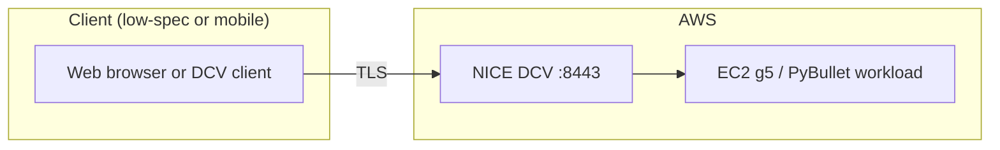
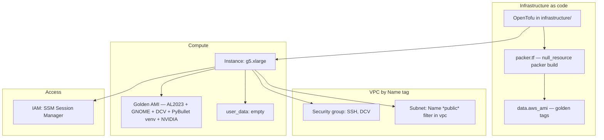
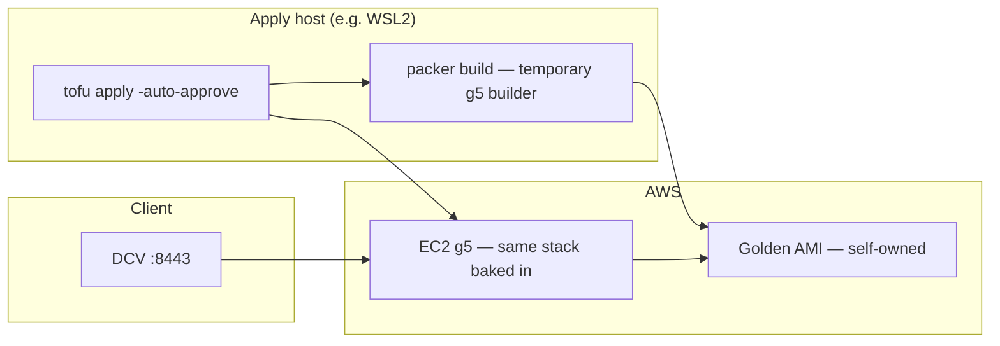
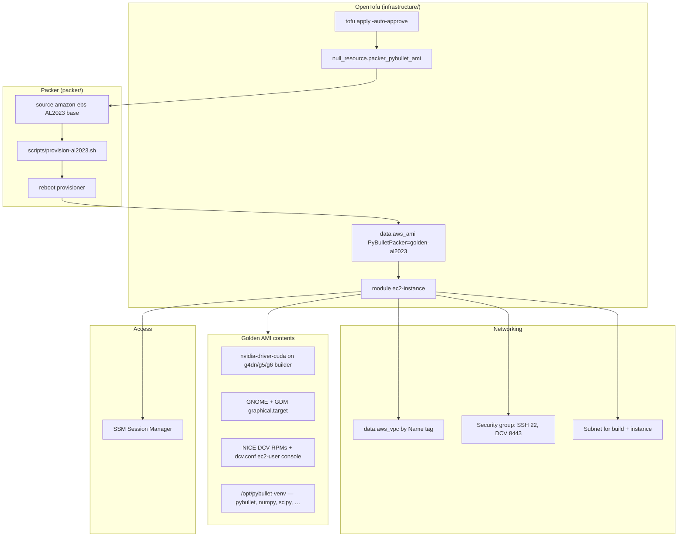

# aws-pybullet-environment

Infrastructure and tooling to run **PyBullet** physics simulation in **Amazon Web Services (AWS)**, so robotics and simulation work can be performed **remotely** from a **low-specification or portable client** (for example, a small laptop on Wi‑Fi) while the **GPU and CPU work** run on a **dedicated host in the cloud**. The goal is to separate **where you work** from **where the simulation runs**: a graphical desktop, DCV, and the PyBullet environment live on **EC2**; the client only needs a **browser** or the **NICE DCV** / **SSM** tooling.

**Production path:** **HashiCorp Packer** bakes **Amazon Linux 2023** with **NVIDIA drivers** (on **g4dn** / **g5** / **g6**-class builders), **GNOME**, **NICE/Amazon DCV**, and **`/opt/pybullet-venv`** (PyBullet stack) into a **golden AMI**. **OpenTofu** runs **`packer build`** from a **`null_resource`** **`local-exec`** (`infrastructure/packer.tf`), then selects the newest self-owned AMI by tags and launches **EC2** with **empty `user_data`**—nothing is installed at first boot on the instance.

**What is deployed today** (see `infrastructure/`): **`null_resource`** drives **Packer** (requires **Packer CLI** + **AWS credentials** on the apply host), **`data.aws_ami`** resolves the golden image, and the **ec2-instance** module runs a **GPU** instance (default **`g5.xlarge`**) with **SSM**, **DCV :8443**, and ingress from **`local.allowed_ingress_cidrs`**. The VPC is chosen by **`local.vpc_name`** → `data.aws_vpc`.

## Architecture (overview)



## Architecture (detailed)



## Architecture (Packer golden AMI — overview)



## Architecture (Packer golden AMI on AWS — detailed)



## Repository layout

| Path | Purpose |
|------|--------|
| `packer/pybullet-al2023.pkr.hcl` | **Packer** template: **amazon-ebs** builder on **AL2023**, **g5**-class build instance, tags for OpenTofu **`data.aws_ami`**. |
| `packer/scripts/provision-al2023.sh` | Shell provisioner: **NVIDIA**, **GNOME**, **DCV**, **`/opt/pybullet-venv`** (same intent as the former cloud-init script). |
| `infrastructure/packer.tf` | **`null_resource`** runs **`packer init`**, **`packer validate`**, **`packer build`**; **`data.aws_ami`** selects the newest golden AMI. |
| `.gitattributes` | Forces **LF** line endings for **`*.tf`** / **`*.pkr.hcl`** (avoids **`local-exec`** bash CRLF failures on Windows checkouts). |
| `infrastructure/provider.tf` | AWS provider, **S3 backend** (OpenTofu remote state); align **`profile`** with your CLI profile. |
| `infrastructure/local.tf` | **Instance** settings, **`packer_ami_id_override`**, **`allowed_ingress_cidrs`**, **`vpc_name`**, optional **`ec2_subnet_id`**, etc. |
| `infrastructure/data.tf` | **`data.aws_vpc`**, **`data.aws_subnets`** (public `Name` filter), account/region. |
| `infrastructure/compute.tf` | Wires the **ec2-instance** module with **`ami_id`** from Packer or override. |
| `infrastructure/outputs.tf` | **Public IP**, instance id, **`pybullet_golden_ami_id`**, **region**. |
| `infrastructure/modules/ec2-instance` | IAM (SSM), security group, instance; **`user_data`** defaults to **empty**; legacy **`user_data.sh`** is a no-op reference. |
| `src/` | Application and simulation code (to be expanded). |

### Packer + OpenTofu (golden AMI)

From **`infrastructure/`**, **`null_resource.packer_pybullet_ami`** runs **`packer init`**, **`packer validate`**, and **`packer build`** against **`packer/pybullet-al2023.pkr.hcl`**, passing **`vpc_id`**, **`subnet_id`** (same public-subnet rule as the EC2 module), **`region`**, and **`project_name`**. The resulting AMI is tagged **`Project=<project_name>`** and **`PyBulletPacker=golden-al2023`**; **`data.aws_ami.pybullet_golden`** selects the **newest** match in your account. The **ec2-instance** module uses that **`ami_id`** and **empty `user_data`**.

**Prerequisites on the apply host:** [**Packer**](https://developer.hashicorp.com/packer/install) CLI, **AWS CLI v2**, and IAM for **`local.aws_cli_profile`** (default **`personal`**) sufficient to **run temporary EC2** for the build (**`ec2:RunInstances`**, **`ec2:CreateImage`**, **`ec2:Describe*`**, **`iam:PassRole`** if you add instance profiles later, etc.). The Packer builder uses **`g5.xlarge`** so **NVIDIA** packages match **g4dn/g5/g6**-class instances.

**First-time / empty account:** If a full **`tofu plan`** errors because **no golden AMI** exists yet, run **`tofu apply -auto-approve -target=null_resource.packer_pybullet_ami[0]`** once (long build), then a **full** **`tofu apply -auto-approve`**. Alternatively set **`local.packer_ami_id_override`** in **`local.tf`** to an existing **`ami-…`** to **skip** Packer in OpenTofu.

**Rebuild triggers:** **`filesha256`** of **`packer/pybullet-al2023.pkr.hcl`** and **`packer/scripts/provision-al2023.sh`**. Changing them creates a **new** AMI; the next apply may **replace** the instance if **`data.aws_ami`** resolves to the newer image.

**IAM (apply principal):** The profile used for **`tofu apply`** must be allowed to start the **temporary** Packer builder (typical broad policies: **`PowerUserAccess`**, **`AdministratorAccess`**, or a custom policy with **`ec2:RunInstances`**, **`ec2:TerminateInstances`**, **`ec2:CreateImage`**, **`ec2:Describe*`**, **`ec2:CreateTags`**, **`ec2:CreateSnapshot`**, **`ec2:DeleteSnapshot`** for lifecycle, plus **`iam:CreateServiceLinkedRole`** if AWS creates EC2-linked roles on first use).

**Cost:** Each **`packer build`** runs a **g5.xlarge** for the duration of the install (often **30–60+ minutes**) and stores a new **AMI snapshot** (ongoing storage charges). Deregister unused AMIs and snapshots when iterating.

**State migration:** If an older revision of this repo had **`infrastructure/ecr.tf`** in state, **`tofu plan`** may propose **destroying** ECR resources—expected after the pivot. Review the plan before apply.

**Line endings:** Keep **`*.tf`** and **`*.pkr.hcl`** as **LF** (see **`.gitattributes`**) so **`local-exec`** bash scripts are not corrupted by CRLF.

After apply:

```bash
cd infrastructure
tofu output -raw pybullet_golden_ami_id
```

## TO-DO

Roadmap and status for **Packer**, **OpenTofu**, and **EC2** (single golden-AMI path). Anchor: **`#to-do`**.

### Documentation map

Search this file for these **exact** headings (outline / **Ctrl+F**):

| Heading | What you get |
|--------|----------------|
| **Architecture (overview)** | Client → DCV → EC2. |
| **Architecture (detailed)** | OpenTofu, Packer **`null_resource`**, golden **`data.aws_ami`**, empty **`user_data`**. |
| **Architecture (Packer golden AMI — overview)** | Apply host → **`packer build`** → AMI → EC2. |
| **Architecture (Packer golden AMI on AWS — detailed)** | Full component diagram (Packer + OpenTofu + VPC + AMI contents). |
| **Repository layout** | Paths and file roles. |
| **Packer + OpenTofu (golden AMI)** | Tags, subnet rule, **`packer_ami_id_override`**, IAM, cost, state migration, LF line endings. |
| **Deploy the stack** | **`tofu init`**, optional **`-target`** first apply, **`tofu apply`**, outputs. |
| **Prerequisites** | AWS profile, OpenTofu, AWS CLI, **Packer**, SSM plugin, **`vpc_name`**. |
| **After deploy: NICE / Amazon DCV** | Ingress, SSM, **`ec2-user`** password, DCV web client, PyBullet checks. |
| **Troubleshooting DCV HTTPS on port 8443** | IP, security group, **section 3** (golden AMI / **`dcvserver`**) checks. |

### Status legend

- **Done** — Implemented in this repository revision.
- **Not started** — Not implemented; no hidden code path.
- **Next** — Recommended order for follow-up work.

### What the golden AMI contains

The only supported runtime in this repo is the **Packer-built Amazon Linux 2023** image: **NVIDIA** drivers (when the builder is **g4dn** / **g5** / **g6** class), **GNOME + GDM**, **NICE DCV** (AL2023 RPMs, **`dcv.conf`** automatic console for **`ec2-user`**), and **`/opt/pybullet-venv`** with **PyBullet** and scientific Python wheels. **VS Code** and **code-server** are **not** in this AMI (add via **Next** / custom provisioner if needed).

### Done

1. **Packer**: **`packer/pybullet-al2023.pkr.hcl`** (**amazon-ebs**, **AL2023**, **g5.xlarge** builder, **80 GiB** root, tags **`Project`**, **`PyBulletPacker=golden-al2023`**); **`packer/scripts/provision-al2023.sh`** (NVIDIA for **g4dn/g5/g6**-class builder metadata, **GNOME**, **DCV**, **`/opt/pybullet-venv`**); post-provision **reboot** + sanity check in Packer.
2. **OpenTofu**: **`infrastructure/packer.tf`** (**`null_resource`** **`local-exec`**, **`data.aws_ami`**, **`depends_on`** ordering); **`data.aws_subnets`** + **`local.packer_subnet_id`**; **`local.packer_ami_id_override`**; **`compute.tf`** passes **`ami_id`**.
3. **EC2 module**: required **`ami_id`**; default **empty `user_data`**; **`user_data.sh`** retained as **no-op** reference only; vanilla **AL2023 `data.aws_ami`** removed from module.
4. **Removed**: **`infrastructure/ecr.tf`** (ECR + container push) and the **`docker/`** tree—**Packer** is the only image path.
5. **Docs**: README **architecture** Mermaid diagrams, **Packer** runbook, **deploy** two-step flow, **troubleshooting** section 3 for golden AMI, **`.gitattributes`** for **LF** on **`*.tf`** / **`*.pkr.hcl`**.

### Not started

1. **Security group**: inbound **TCP 8080** if you add a browser IDE or app on that port later.
2. **AMI / snapshot lifecycle**: automated deregister of old golden AMIs or cost alerts.
3. **CI/CD**: **`packer build`** (and optional **`tofu`**) in **GitHub Actions**, **CodeBuild**, or similar—no laptop-only requirement.
4. **Dedicated Packer IAM**: least-privilege role/user for **`ec2:*`** build + **`CreateImage`** instead of sharing the developer **`personal`** profile.
5. **Builder vs runtime instance type**: today the **Packer** builder is **g5.xlarge**; documenting or parameterizing alignment when **`local.ec2_instance_type`** is **g4dn.*** / **g6.*** only (drivers usually still compatible).
6. **Root device mapping**: validate **`/dev/xvda`** **`launch_block_device_mappings`** across all target regions / AL2023 builds; adjust **`pybullet-al2023.pkr.hcl`** if AWS changes root device naming.
7. **Optional container runtime**: reintroduce **ECR** / **Docker on EC2** as a second code path only if you need containers **in addition to** the golden AMI.

### Next (ordered)

1. **Pin DCV tarball** (versioned URL or checksum verify in **`provision-al2023.sh`**) so Packer builds are reproducible.
2. **Stable AMI pointer**: write **`ami-id`** to **SSM Parameter Store** (or a small manifest object) from **`packer build`** / post-processor and have OpenTofu read that instead of **“newest tag”** if you need stricter drift control.
3. **Slim golden image**: optional “minimal GPU + PyBullet + DCV” variant vs full **Desktop** group to reduce AMI size and build time.
4. **Automated smoke test**: SSM command or CI step that **`systemctl is-active dcvserver`** / **`curl -k https://localhost:8443/`** on a throwaway instance built from the new AMI before promoting tags.

**Acceptance for item 1:** Two builds with the same inputs produce the same **DCV** and **PyBullet** versions (or a documented diff only when upstream metadata changes).

**Acceptance for item 2:** Deleting stray test AMIs with the same tags does **not** cause OpenTofu to pick a random wrong image without **`tofu apply`** noticing (define the exact behaviour you want—in many cases **`data.aws_ami` most_recent** is still acceptable with tag discipline).

### Reference files

- **`packer/scripts/provision-al2023.sh`** — golden AMI install steps (successor to the old cloud-init bootstrap).
- **`packer/pybullet-al2023.pkr.hcl`** — **amazon-ebs** builder, disk, tags, provisioners.
- **`infrastructure/packer.tf`**, **`infrastructure/compute.tf`**, **`infrastructure/data.tf`**, **`infrastructure/local.tf`**, **`infrastructure/modules/ec2-instance/main.tf`** — OpenTofu and module wiring.
- **`.gitattributes`** — line-ending policy for Terraform and Packer files.
- **`README.md`** — this document (single source of documentation).

## Security: instance ingress

`infrastructure/local.tf` sets `allowed_ingress_cidrs`.

> [!WARNING]
> If **`allowed_ingress_cidrs`** is **empty**, OpenTofu uses **`0.0.0.0/0`**, so **any** public IPv4 can reach **TCP 22** (SSH) and **TCP 8443** (NICE DCV). Narrow this list for routine use—for example **`["YOUR.PUBLIC.IP/32"]`**—or use a VPN or bastion. **SSM** does **not** require exposing SSH globally; outbound HTTPS from the instance to AWS is usually enough once SSM networking is healthy.

## Prerequisites

You need:

- An **AWS account** and a **CLI profile** (examples use **`personal`**).

> [!NOTE]
> **`AWS_PROFILE`** and **`provider.tf`** **`profile`** should match **`personal`** unless you deliberately use another named profile everywhere.

- **OpenTofu** (`tofu` CLI). `.tf` files still declare **`terraform { … }`** for backend and settings—that keyword is **HCL syntax** shared with OpenTofu; run plans and applies with **`tofu`**, not **`terraform`**.
- **AWS CLI v2**.
- **Packer** (CLI) on the machine where you run **`tofu apply`**, so **`null_resource`** can execute **`packer build`** ([install Packer](https://developer.hashicorp.com/packer/install)).

In **`infrastructure/local.tf`**, **`vpc_name`** must match your VPC **`Name`** tag in AWS. **`local.packer_ami_id_override`** may be set to an **`ami-…`** id to skip Packer during OpenTofu (see **Packer + OpenTofu (golden AMI)** earlier in this README). Correct the VPC tag in the EC2 VPC console if **`apply`** fails to find it.

### Session Manager plugin for CLI SSM sessions

`aws ssm start-session` requires the **Session Manager plugin** binary in the **same** shell environment as **`aws`**.

> [!IMPORTANT]
> If you run **`aws`** in **WSL**, install the **Linux** plugin **inside WSL**. The Windows MSI alone does **not** satisfy **`aws`** in your Linux distro.

Download and install (**Ubuntu / Debian / WSL**, 64-bit). See also the official [Install the Session Manager plugin](https://docs.aws.amazon.com/systems-manager/latest/userguide/session-manager-working-with-install-plugin.html).

```bash
curl -fsSLo /tmp/session-manager-plugin.deb \
  https://s3.amazonaws.com/session-manager-downloads/plugin/latest/ubuntu_64bit/session-manager-plugin.deb
```

```bash
sudo dpkg -i /tmp/session-manager-plugin.deb
```

If you downloaded the `.deb` elsewhere:

```bash
sudo dpkg -i path/to/session-manager-plugin.deb
```

Verify installation:

```bash
session-manager-plugin --version
```

```bash
which session-manager-plugin
```

> [!NOTE]
> A successful **`dpkg -i`** run often prints lines such as **`Setting up session-manager-plugin`** and **`Creating symbolic link for session-manager-plugin`**.

> [!WARNING]
> If **`SessionManagerPlugin is not found`** appears when running **`aws ssm start-session`**, install or fix **`PATH`** in that environment—or use **EC2 → Connect → Session Manager** in the AWS console instead of the CLI.

## Deploy the stack

Working directory (**contains `provider.tf` and backend config**):

```bash
cd infrastructure
tofu init
tofu plan
```

If **`plan`** fails because **no golden AMI** exists yet ( **`data.aws_ami`** finds nothing), build the AMI first, then apply everything:

```bash
tofu apply -auto-approve -target=null_resource.packer_pybullet_ami[0]
tofu apply -auto-approve
```

Otherwise a single apply is enough:

```bash
tofu apply -auto-approve
```

> [!NOTE]
> Confirm **`provider.tf`** backend (bucket, key, **`profile`**, region) matches your account.

> [!NOTE]
> The **Packer** step can take **tens of minutes** ( **`dnf`**, **Desktop** group, **DCV** RPMs, **pip**, **reboot** on the temporary builder). The apply host must have the **`packer`** binary and network access to **AWS**.

### Outputs and example commands

Run these from **`infrastructure/`** after apply:

```bash
tofu output -raw pybullet_host_dcv_url
tofu output -raw pybullet_host_public_ip
tofu output -raw pybullet_host_instance_id
tofu output -raw pybullet_host_subnet_id
tofu output -raw aws_region
tofu output -raw pybullet_golden_ami_id
```

| Output | Use |
|--------|-----|
| `pybullet_host_dcv_url` | **DCV in the browser** — full `https://…:8443` |
| `pybullet_host_public_ip` | Public IPv4 |
| `pybullet_host_instance_id` | **SSM** target, EC2 console |
| `pybullet_host_subnet_id` | Subnet id (routing / SSM troubleshooting) |
| `aws_region` | Region string for **`--region`** |
| `pybullet_golden_ami_id` | **AMI** id launched for the host (from Packer tags or **`local.packer_ami_id_override`**) |

> [!NOTE]
> **SSM** may take a few minutes after the instance is **Running**. There is **no** long cloud-init **`user_data`** install on first boot anymore; software was baked at **Packer** time. **`/var/log/packer-provision-pybullet.log`** on the instance (if present) records the **build** transcript, not each boot.

## After deploy: NICE / Amazon DCV

Perform **steps 1 → 6** in order.

### 1. Ingress

If **`allowed_ingress_cidrs`** is restricted, include your **current** client public IP **CIDR**, or HTTPS **8443** (and optionally SSH **22**) will not reach the instance. Edit **`local.tf`** and **`apply`** again if your IP changed.

---

### 2. SSM: open a shell

You need a Session Manager shell **before** DCV (step 4) so you can set **`ec2-user`**’s password in step **3**.

**Console path:** **EC2** → select the instance → **Connect** → **Session Manager** → **Connect**.

**CLI path:** from **`infrastructure/`**:

```bash
cd infrastructure
aws ssm start-session \
  --target "$(tofu output -raw pybullet_host_instance_id)" \
  --region "$(tofu output -raw aws_region)" \
  --profile personal
```

Expected banner and prompt shapes:

```text
Starting session with SessionId: ...
sh-5.2$
```

Optional (if you want bash):

```bash
bash
```

> [!NOTE]
> You may appear as **`ssm-user`** after **`bash`**. **`ssm-user`** is **not** the DCV login user—DCV uses **`ec2-user`**.

> [!TIP]
> Keep this shell until step **3** is done, or **`exit`** and open a **new** SSM session before **`sudo passwd`** if you disconnect.

---

### 3. Linux password for `ec2-user` (before opening DCV)

DCV asks for a **desktop** login: **`ec2-user`** plus the **Linux password** on the instance.

> [!WARNING]
> Run **`sudo passwd ec2-user`** only **on the EC2 instance**, in the **SSM** shell from step **2** (prompt like **`sh-5.2$`**, **`ssm-user@ip-…`**). If you run **`sudo passwd ec2-user`** in **WSL**, **PowerShell**, or **Terminal on your laptop**, **`sudo`** asks for **your local user’s** password (`[sudo] password for alice:`)—that is **not** changing **`ec2-user`** on AWS. Open **Session Manager** first, **then** run the command there.

> [!NOTE]
> That password is **not** in OpenTofu configuration, Secrets Manager, or the console. The EC2 **SSH key pair** (`key_name`) is for **`ssh`**, **not** this DCV password.

In the **same** SSM session as step **2**, run:

```bash
sudo passwd ec2-user
```

Enter and confirm a **strong password** at the prompts. That string is what you type in DCV (step **5**).

To change a forgotten password later, start SSM again and run the same command.

End the SSM session when finished:

```bash
exit
```

```text
Exiting session with sessionId: ...
```

> [!NOTE]
> Closing SSM does **not** close a separate DCV tab in the browser once you are connected.

---

### 4. Open the DCV web client

Resolve the URL from **current** OpenTofu state (use this **IP**, not an old screenshot or cached tab):

```bash
cd infrastructure
tofu output -raw pybullet_host_public_ip
```

```bash
tofu output -raw pybullet_host_dcv_url
```

In the browser, open **`https://<PUBLIC_IP>:8443`** (HTTPS, port **8443**).

> [!TIP]
> A **certificate warning** (unknown issuer) followed by the DCV page means traffic **is** reaching the server—here you normally continue to the site. **`This site can’t be reached`**, **`ERR_CONNECTION_REFUSED`**, **timeouts**, or **connection reset** usually mean TCP never reached DCV ([debug below](#troubleshooting-dcv-https-on-port-8443)).

> [!NOTE]
> If **`pybullet_host_dcv_url`** or **`pybullet_host_public_ip`** is **`null`**, the instance has **no IPv4 address** usable from the Internet (subnet, stopped instance, etc.). **`apply`** again after **`replace`** updates outputs when the replacement finishes.

---

### 5. Sign in to DCV

| Field | Value |
|--------|--------|
| User | **`ec2-user`** |
| Password | The password you set in step **3** |

You should see **GNOME**. PyBullet lives in **`/opt/pybullet-venv`** (often sourced in **`ec2-user`** **`.bashrc`** for new shells).

Activate the venv in a terminal:

```bash
source /opt/pybullet-venv/bin/activate
```

#### Verify PyBullet

Open a **terminal** in **GNOME** (the venv is often auto-sourced in **`ec2-user`**’s **`~/.bashrc`** for **new** terminals; if your prompt does not show **`(pybullet-venv)`**, run **`source`** again).

**Smoke test** (physics + import; **no** GUI window—uses **`DIRECT`**):

```bash
source /opt/pybullet-venv/bin/activate
python -c "import pybullet as p; cid=p.connect(p.DIRECT); print('connected id=', cid); p.disconnect(); print('PyBullet OK')"
```

You should see **`connected id=`** (usually **`0`**) and **`PyBullet OK`** with **no** traceback.

**Optional** (**`GUI`**—opens a Bullet window using your DCV desktop; **`DISPLAY`** must be set):

```bash
python -c "import pybullet as p, time as t; p.connect(p.GUI); t.sleep(2); p.disconnect(); print('GUI OK')"
```

**Note:** Routine **Rigid Body Dynamics API** workloads are **CPU**-bound; **`nvidia-smi`** staying idle unless you attach **CUDA**/rendering-heavy code is normal.

#### Clipboard: copy/paste between Windows and the DCV session

Your **local** Windows browser (or **Amazon DCV** app) is separate from **GNOME** on the instance—use **DCV’s clipboard redirection**, not only the browser’s usual **Ctrl+C/V** across tabs.

| Client | What to do |
|--------|-------------|
| **Web client** (browser) | **Gear (Settings)** on the **DCV window** top bar → turn on **clipboard** / **bidirectional clipboard** (wording varies slightly by version). Allow the **browser** prompt if it asks permission to read the **clipboard** (Chrome/Edge/Firefox each differ). Then **copy** text on Windows, **paste** in the remote desktop with **Ctrl+V** (and the reverse). If paste does nothing, toggle the setting off/on once. |
| **Native Amazon DCV** | **Connection** / **Session** / **Preferences** (depending on version) → enable **clipboard redirection** / **remote clipboard**. Often more reliable than **Web** for large or repeated pastes. |

**Paste into a Linux terminal (**`Terminal`** / **`gnome-terminal`**):**

That is **different** from paste into **`Text Editor`**. With **DCV** clipboard sync, pasting from your **host** into the remote terminal commonly works with **`Shift+Insert`** (often the most reliable shortcut here). Alternatives: **`Ctrl+Shift+V`** (paste from clipboard), **`Ctrl+Shift+C`** (copy from terminal), or **`right-click → Paste`**. In **GNOME Terminal**, **`Ctrl+V`** usually does **not** paste (**`Ctrl+C`** sends **interrupt** to the shell). You can enable **Paste using Ctrl+V** under **terminal → Preferences → Shortcuts / Keyboard** if you prefer Windows-style **`Ctrl+V`**.

> [!NOTE]
> If **both** directions stay dead, the **DCV server** may have clipboard options in **`/etc/dcv/dcv.conf`** (defaults are usually on)—compare with **`/etc/dcv/dcv.default`** on the instance, then **`sudo systemctl restart dcvserver`** after any change. See [Use the clipboard](https://docs.aws.amazon.com/dcv/latest/userguide/client-use-clipboard.html) in the DCV user guide (and the **server** **`dcv.conf`** section in the DCV **Administration Guide** if clipboard stays disabled).

#### DCV reports “wrong username or password”

| Check | What to do |
|--------|------------|
| **Username** | Must be exactly **`ec2-user`** (all **lowercase**, hyphen, **no** domain, **not** **`ssm-user`**, **not** **`root`**, **not** your AWS account email). |
| **Password** | Only the string you set with **`sudo passwd ec2-user`** in an **SSM** shell **on the instance** (step **3**). The EC2 **SSH key pair** does **not** unlock this screen—neither does **`sudo passwd`** run **on your own PC** (WSL/PowerShell): that only prompts for **your laptop** user. |
| **Never set password?** | Open **SSM** again and run **`sudo passwd ec2-user`**, typing the password slowly (keyboard layout **Caps Lock**). |
| **Still fails?** | In **SSM**, reset once more (**`sudo passwd ec2-user`**) and retry **DCV** immediately. Avoid pasting passwords if hidden characters creep in—type manually once to test. |

Optional sanity check (**SSM** shell): verify **`ec2-user`** has a usable password (**`P`** status from **`passwd`** means “usable” on many systems):

```bash
sudo passwd --status ec2-user
```

#### DCV stuck on **“Connecting…”** (web **and/or** native client)

If you **already signed in** (username/password accepted) and the UI spins on **Connecting** with a **broken/disconnected monitor** icon in the toolbar—that usually means **`dcvserver`** is up (**TCP :8443** worked) but DCV **cannot attach to a desktop session** (**GDM**/**X**/**automatic console** not ready), not a wrong password.

| Situation | Likely focus |
|----------|----------------|
| **Both** web **and** DCV app stuck | **Server-side** session/display—run the **SSM diagnostics** below (**not** only browser WebSockets). |
| **Only** the browser sticks | First try **native client**; then check **WebSockets** (**F12 → Network → WS**). |
| Right after **boot** / **first login** | Wait **several minutes**, **reload** once (**GDM** may still be bringing up **GNOME/X**). |

**SSM diagnostics** (on the instance):

```bash
sudo systemctl status dcvserver --no-pager
sudo systemctl status gdm --no-pager
```

```bash
sudo dcv list-sessions 2>/dev/null || true
```

```bash
sudo journalctl -u dcvserver -u gdm --since "30 min ago" --no-pager | tail -120
```

**Soft restart** (often unsticks a missed attach between **GDM** and **DCV**):

```bash
sudo systemctl restart gdm
sleep 20
sudo systemctl restart dcvserver
```

Reconnect from the client in **~1 minute**.

#### **`GDM`**: **`maximum number of X display failures`** / **`Session never registered`** (**`g4dn`** / **`g5`** / **`g6`**)

If **`journalctl -u gdm`** repeats **`GdmDisplay: Session never registered`** and ends with **`GdmLocalDisplayFactory: maximum number of X display failures reached`**, **Xorg** is crashing (**no stable display** → **GNOME never starts** → **DCV** spins on **Connecting**).

On **GPU** instance types **without** NVIDIA kernel drivers loaded yet, **GDM+X** commonly fail exactly like this—the issue is **not** DCV **`8443`** or **your password**, it is **graphics bring-up**.

**Current `user_data`** (for **`g4dn*`** / **`g5*`** / **`g6*`**) installs **[NVIDIA drivers on Amazon Linux 2023](https://docs.aws.amazon.com/linux/al2023/ug/nvidia-drivers.html)** (`nvidia-release`, `nvidia-driver-cuda`) **before** **`dnf groupinstall "Desktop"`** so **X/GDM** can start on first boot.

**Already-running instance baked without that step** — install drivers over **SSM**, then **`reboot`**, then verify **`nvidia-smi`** shows the GPU:

```bash
sudo dnf install -y "kernel-devel-$(uname -r)" "kernel-headers-$(uname -r)" gcc make
sudo dnf install -y nvidia-release
sudo dnf install -y nvidia-driver-cuda
sudo reboot
```

```bash
nvidia-smi
```

Then retry DCV (**`pam_unix(dcv:auth): authentication failure`** in logs sometimes clears once **X** works; still ensure **`sudo passwd ec2-user`** matches what you type in DCV.)

Or **`tofu apply -auto-approve -replace='module.pybullet_host.aws_instance.this'`** so the refreshed **`user_data`** runs cleanly on a new instance.

> [!TIP]
> For **browser-only** hangs (native client works), check **F12 → Network → WS**. If **both** clients fail, prioritize **`gdm`**/**X**/NVIDIA (**above**) before blaming **WebSockets** alone.

---

### 6. Optional: native Amazon DCV client

[Download Amazon DCV](https://www.amazondcv.com/) and connect to **`<PUBLIC_IP>:8443`**.

---

## Troubleshooting DCV HTTPS on port 8443

**Browser** messages such as **`This site can't be reached`**, **`Unable to connect`**, **`Connection timed out`**, or **`ERR_CONNECTION_REFUSED`** mean the TCP connection did not complete—not the usual “bad certificate” step.

### 1) Confirm OpenTofu output matches what you browse

Stale tabs or IPs from an old stop/start confuse debugging.

```bash
cd infrastructure
tofu output -raw pybullet_host_public_ip
tofu output -raw aws_region
```

Compare with the hostname in your browser (**must** be **`https://<that-ip>:8443`**).

> [!WARNING]
> Stopping/restarting EC2 often **changes** an **ephemeral** public IP unless you use an Elastic IP. After any lifecycle change, **re-read outputs** above.

---

### 2) Security group: inbound TCP **8443** (and client IP)

The module opens **SSH 22** and **DCV 8443** to **`allowed_ingress_cidrs`** in **`local.tf`**. Empty list ⇒ **`0.0.0.0/0`** (world).

If you restricted to **`your.ip/32`**, verify your browser’s network still uses that IPv4 (**VPN/mobile hotspot moves your address**):

```bash
curl -fsS https://checkip.amazonaws.com
```

Put that CIDR **`x.x.x.x/32`** in **`allowed_ingress_cidrs`**, **`apply`** again, retry DCV.

> [!NOTE]
> In **EC2 → Security groups**, confirm the attached group has **Ingress** **`8443/tcp`** sourced to the CIDRs you expect—not only `:22`.

---

### 3) DCV not listening (golden AMI path)

With a **Packer-baked** AMI, **GNOME**, **DCV**, and **PyBullet** should already be on disk; **first boot** should **not** wait tens of minutes for **`user_data`**. If **DCV** still looks like **`CONNECTION_REFUSED`**, use **SSM** (section **2**) and treat it as a **runtime** problem (service down, wrong SG, or a **bad AMI build**).

On the instance (SSM shell), inspect the listener and services:

```bash
sudo systemctl status dcvserver --no-pager
```

```bash
sudo systemctl status gdm --no-pager
```

```bash
sudo ss -tlnp | grep 8443 || true
```

Healthy pattern: **`dcvserver`** is **active**, and **`ss`** shows **`0.0.0.0:8443`** (or **`:::8443`**) **`LISTEN`**.

```bash
sudo journalctl -u dcvserver -u gdm -n 120 --no-pager
```

#### Logs to know

| Path | Role |
|------|------|
| **`/var/log/packer-provision-pybullet.log`** | Transcript from the **Packer** shell provisioner (**`set -x`** style output if enabled). Proves what ran **when the AMI was built**—not per boot. |
| **`/var/log/cloud-init-output.log`** | Short **cloud-init** pass on boot; default **`user_data`** is **empty**, so you should **not** see a long **`scripts-user`** block for this stack. |

**Bad AMI build:** fix **`packer/scripts/provision-al2023.sh`**, **`tofu apply -auto-approve`** (triggers a new **Packer** build when hashes change), then **replace** the instance so it picks up the **new** golden AMI:

```bash
cd infrastructure
tofu apply -auto-approve
tofu apply -auto-approve -replace='module.pybullet_host.aws_instance.this'
```

---

### 4) Quick test from **your workstation** (not the browser)

Uses **`curl`** toward **HTTPS :8443** on the instance. **Replace** **`PUBLIC_IP`** below with **`tofu output -raw pybullet_host_public_ip`**.

PowerShell (**Windows**, use **`curl.exe`** so you do **not** invoke **`Invoke-WebRequest`**):

```powershell
curl.exe -vk --connect-timeout 8 "https://PUBLIC_IP:8443/"
```

Bash (**WSL** / macOS **/ Linux):

```bash
curl -vk --connect-timeout 8 "https://PUBLIC_IP:8443/"
```

Interpret the result:

```text
# Usually OK (TLS/cert noise is OK)
* Connected to ...

# Blocking issues
curl: (...28) Failed to connect ...
timed out
Connection refused
```

If **`curl`** shows **`Connected`** but errors later (TLS/HTML), reopen **`https://<PUBLIC_IP>:8443`** in the browser—your path to **TCP 8443** is mostly fine.

If **`curl`** cannot connect (**refused**, **timeout**), work through **sections 1–3** above (IP, security group, **`dcvserver`** / user-data).

---

## Optional: quick AWS CLI check (before deploy)

```bash
aws configure --profile personal
aws sts get-caller-identity --profile personal
```

> [!NOTE]
> **`tofu plan`** may show **no changes** when state matches the repo. A **replace** on the instance does **not** prove SSM or DCV are ready—confirm networking, IAM, and instance health separately.

---

## Troubleshooting SSM “Offline”

> [!WARNING]
> The instance must reach **AWS Systems Manager** on **HTTPS (443)**. Typical issues: **no internet path** (private subnet without **NAT** or **SSM/VPC endpoints**), **wrong IAM** (this stack attaches **`AmazonSSMManagedInstanceCore`**), or **still booting** / user-data **not finished**.

When **`ec2_subnet_id`** is **unset**, OpenTofu picks subnets whose **`tag:Name`** matches **`*public*`** inside **`vpc_name`**. In a **private-only** VPC, set **`ec2_subnet_id`** or add [SSM interface endpoints](https://docs.aws.amazon.com/systems-manager/latest/userguide/setup-create-vpc.html). See [SSM agent troubleshooting](https://docs.aws.amazon.com/systems-manager/latest/userguide/troubleshooting-ssm-agent.html).
