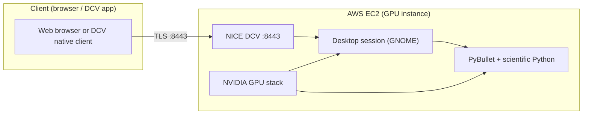
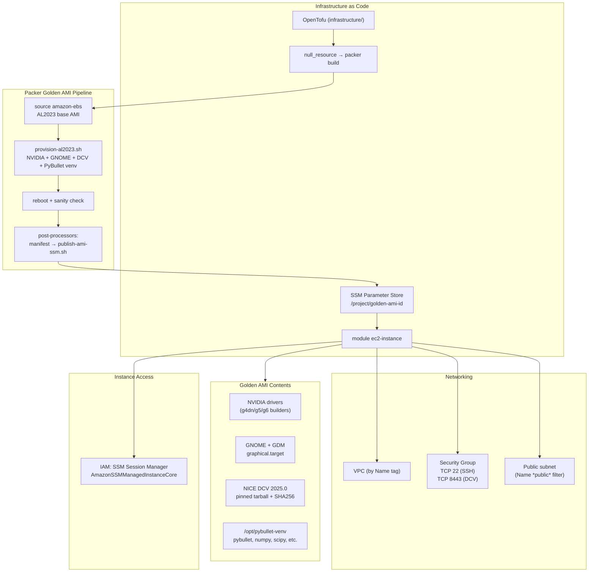
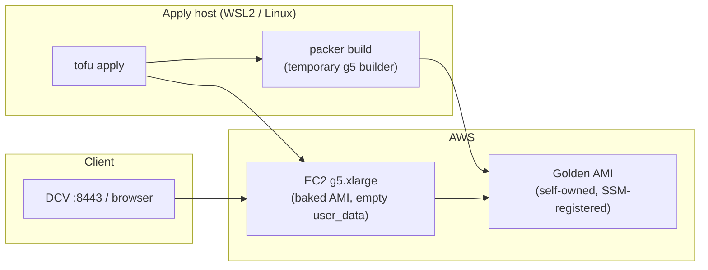
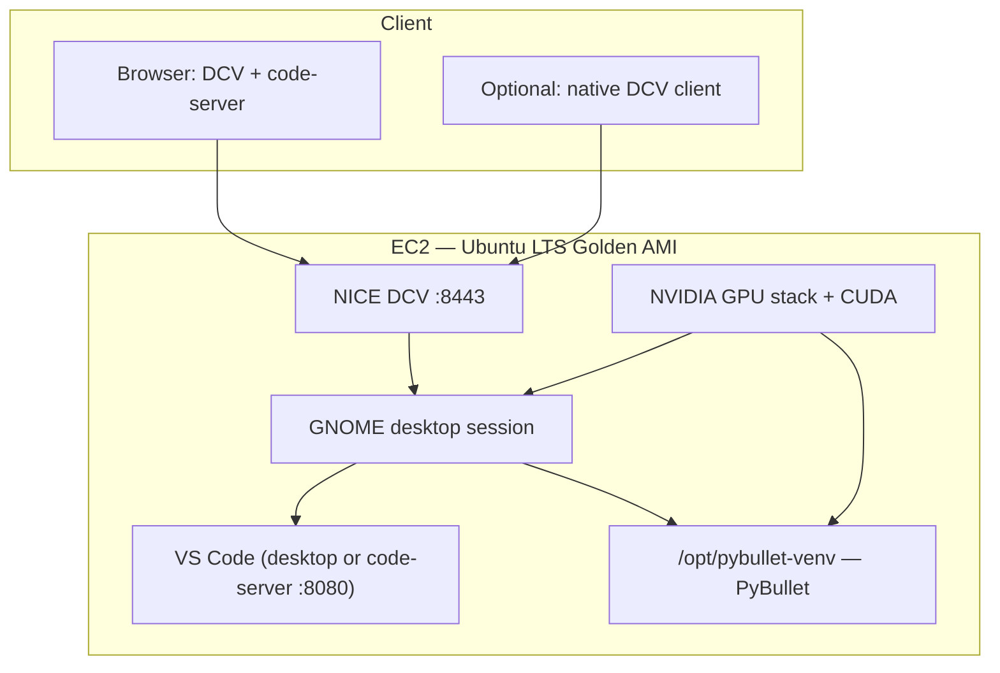

# aws-pybullet-environment

Cloud-based **PyBullet** simulation workstation on **AWS EC2**. A **GPU-backed golden AMI** (built with **Packer**) provides **NICE DCV** remote desktop, **PyBullet** physics simulation, and a full desktop environment — so robotics and ML development happen on powerful cloud hardware while the client only needs a **browser** or the **DCV native app**.

**Current OS:** Amazon Linux 2023 | **Target OS:** Ubuntu LTS — see [Roadmap](#roadmap-to-do) for the migration path.

---

## Architecture

### High-level: client to cloud



### Detailed: infrastructure components



### Build pipeline: apply host to running instance



### Target architecture (after Ubuntu + VS Code migration)



---

## Current State

| Component | Status | Details |
|-----------|--------|---------|
| **OS** | Amazon Linux 2023 | Target is Ubuntu LTS |
| **GPU drivers** | NVIDIA on g4dn/g5/g6 | Installed conditionally during Packer build |
| **Desktop** | GNOME + GDM | Wayland disabled, graphical.target default |
| **Remote access** | NICE DCV 2025.0 on :8443 | Pinned tarball + SHA256 verification |
| **Simulation** | PyBullet in `/opt/pybullet-venv` | numpy, scipy, Pillow, matplotlib included |
| **IDE** | **Not installed** | VS Code / code-server not in the AMI |
| **IaC** | OpenTofu + Packer | Golden AMI id stored in SSM Parameter Store |
| **Instance access** | SSM Session Manager | `AmazonSSMManagedInstanceCore` IAM policy |
| **Security group** | TCP 22, TCP 8443, `create_before_destroy` | Auto-locked to apply host's public IP via `checkip.amazonaws.com` |
| **DCV user** | `ec2-user` | Must switch to `ubuntu` after OS migration |
| **EBS root volume** | gp3, 80 GiB, encrypted | Tagged, `delete_on_termination = true` — no orphaned volumes |
| **AMI cost tracking** | `snapshot_tags` + `run_tags` | Packer builder instance and snapshots tagged for cost allocation |
| **Build sanity checks** | Post-reboot + end-of-provision | `nvidia-smi`, `dcvserver`, PyBullet import verified before AMI publish |

---

## Repository Layout

```
aws-pybullet-environment/
├── README.md                                    # This file (single source of documentation)
├── .gitattributes                               # LF line endings for .tf, .pkr.hcl, .sh
│
├── infrastructure/                              # OpenTofu root module
│   ├── provider.tf                              # AWS provider, S3 backend
│   ├── local.tf                                 # Instance settings, VPC name, CLI profile, CIDRs
│   ├── data.tf                                  # VPC lookup, public subnet discovery
│   ├── packer.tf                                # null_resource → packer build + SSM data source
│   ├── compute.tf                               # EC2 module wiring (AMI from SSM or override)
│   ├── outputs.tf                               # Public IP, DCV URL, AMI id, instance id
│   └── modules/
│       └── ec2-instance/                        # Reusable EC2 module
│           ├── main.tf                          # aws_instance (IMDSv2, gp3, public IP)
│           ├── variables.tf                     # ami_id, instance_type, subnet_id, etc.
│           ├── sg.tf                            # Security group: SSH 22, DCV 8443
│           ├── iam.tf                           # IAM role + SSM managed policy
│           ├── data.tf                          # Subnet discovery, IAM assume-role doc
│           ├── locals.tf                        # Subnet coalesce logic
│           └── outputs.tf                       # instance_id, public_ip, private_ip, etc.
│
└── packer/                                      # Packer golden AMI build
    ├── pybullet-al2023.pkr.hcl                  # amazon-ebs builder, provisioners, post-processors
    └── scripts/
        ├── provision-al2023.sh                  # NVIDIA + GNOME + DCV + PyBullet venv install
        └── publish-ami-ssm.sh                   # Post-build: write AMI id to SSM Parameter Store
```

---

## Prerequisites

| Requirement | Notes |
|-------------|-------|
| **AWS account + CLI profile** | Default profile name is `personal` — must match `provider.tf` and `local.tf` |
| **OpenTofu** (`tofu` CLI) | `.tf` files use `terraform {}` block syntax (shared HCL); run with `tofu`, not `terraform` |
| **AWS CLI v2** | For SSM sessions and `publish-ami-ssm.sh` |
| **Packer** | Required on the apply host for `null_resource` — see [Install Packer](#install-packer-on-linux-or-wsl) |
| **Python 3** | Used by `publish-ami-ssm.sh` to parse the Packer manifest |
| **VPC with Name tag** | Must match `local.vpc_name` in `local.tf` (default: `default-vpc`) |
| **Public subnet** | Subnet with `Name` tag matching `*public*`, or set `local.ec2_subnet_id` explicitly |

### IAM permissions (apply principal)

The CLI profile needs:
- **EC2**: `RunInstances`, `TerminateInstances`, `CreateImage`, `Describe*`, `CreateTags`, snapshot APIs (for Packer builder)
- **SSM**: `PutParameter`, `GetParameter` on `arn:aws:ssm:REGION:ACCOUNT:parameter/pybullet/aws-pybullet-environment/golden-ami-id`
- Broad policies like `PowerUserAccess` or `AdministratorAccess` cover everything; for least privilege, scope to the EC2 build + SSM parameter ARNs.

### Install Packer on Linux or WSL

#### Option A — Official zip (no sudo)

```bash
mkdir -p ~/.local/bin
PACKER_VER="$(curl -fsS 'https://checkpoint-api.hashicorp.com/v1/check/packer?arch=amd64&os=linux' | python3 -c "import sys,json; print(json.load(sys.stdin)['current_version'])")"
cd /tmp
curl -fsSLO "https://releases.hashicorp.com/packer/${PACKER_VER}/packer_${PACKER_VER}_linux_amd64.zip"
unzip -o "packer_${PACKER_VER}_linux_amd64.zip" packer -d ~/.local/bin
chmod +x ~/.local/bin/packer
rm -f "packer_${PACKER_VER}_linux_amd64.zip"
```

Ensure `~/.local/bin` is on PATH:

```bash
grep -q '.local/bin' ~/.bashrc 2>/dev/null || echo 'export PATH="$HOME/.local/bin:$PATH"' >> ~/.bashrc
source ~/.bashrc
packer version
```

#### Option B — apt repository (requires sudo)

```bash
sudo apt-get update && sudo apt-get install -y gnupg software-properties-common curl
curl -fsSL https://apt.releases.hashicorp.com/gpg | sudo gpg --dearmor -o /usr/share/keyrings/hashicorp-archive-keyring.gpg
echo "deb [signed-by=/usr/share/keyrings/hashicorp-archive-keyring.gpg] https://apt.releases.hashicorp.com $(lsb_release -cs) main" | sudo tee /etc/apt/sources.list.d/hashicorp.list
sudo apt-get update && sudo apt-get install -y packer
packer version
```

#### Validate the Packer template

```bash
cd packer
packer init .
packer validate \
  -var "region=us-east-1" \
  -var "vpc_id=vpc-YOURVALUE" \
  -var "subnet_id=subnet-YOURVALUE" \
  -var "project_name=aws-pybullet-environment" \
  -var "aws_cli_profile=personal" \
  pybullet-al2023.pkr.hcl
```

### Session Manager plugin (for CLI SSM sessions)

> [!IMPORTANT]
> If you run `aws` in WSL, install the **Linux** plugin inside WSL. The Windows MSI does not work.

```bash
curl -fsSLo /tmp/session-manager-plugin.deb \
  https://s3.amazonaws.com/session-manager-downloads/plugin/latest/ubuntu_64bit/session-manager-plugin.deb
sudo dpkg -i /tmp/session-manager-plugin.deb
session-manager-plugin --version
```

---

## Deploy

### Configure

Edit `infrastructure/local.tf`:
- `vpc_name` — must match your VPC `Name` tag
- `aws_cli_profile` — must match `provider.tf`
- `allowed_ingress_cidrs` — override with explicit CIDRs (empty = auto-detect your public IP via `checkip.amazonaws.com`)
- `ec2_instance_type` — default `g5.xlarge`
- `packer_ami_id_override` — set to an `ami-…` to skip Packer entirely

### First-time deploy (SSM parameter does not exist yet)

```bash
cd infrastructure
tofu init
tofu apply -auto-approve -target=null_resource.packer_pybullet_ami[0]
tofu apply -auto-approve
```

### Subsequent deploys

```bash
cd infrastructure
tofu init
tofu apply -auto-approve
```

### Rebuild triggers

The Packer build re-runs when `filesha256` changes for any of:
- `packer/pybullet-al2023.pkr.hcl`
- `packer/scripts/provision-al2023.sh`
- `packer/scripts/publish-ami-ssm.sh`

Or when `local.packer_golden_ami_ssm_parameter_name` changes.

### Outputs

```bash
cd infrastructure
tofu output -raw pybullet_host_dcv_url
tofu output -raw pybullet_host_public_ip
tofu output -raw pybullet_host_instance_id
tofu output -raw pybullet_golden_ami_id
tofu output -raw aws_region
```

> [!NOTE]
> The golden AMI is fully baked — no long cloud-init runs on first boot. SSM may take a few minutes to show the instance as "Online" after launch.

### Cost awareness

Each `packer build` runs a **g5.xlarge** for 30-60+ minutes and stores a new AMI snapshot. Packer builder instances and snapshots are tagged with `Project` and `PyBulletPacker` for cost-allocation filtering in Cost Explorer. Deregister unused AMIs and delete orphaned snapshots when iterating.

---

## Post-Deploy: Connect via DCV

### Step 1 — Verify ingress

The security group is automatically locked to the public IP of the machine running `tofu apply` (via `data "http"` → `checkip.amazonaws.com`). If your IP changed (ISP reassignment, VPN, etc.), just re-apply:

```bash
cd infrastructure
tofu apply -auto-approve
```

To verify your current IP matches what's in the SG:

```bash
curl -fsS https://checkip.amazonaws.com
```

### Step 2 — Open an SSM session

```bash
cd infrastructure
aws ssm start-session \
  --target "$(tofu output -raw pybullet_host_instance_id)" \
  --region "$(tofu output -raw aws_region)" \
  --profile personal
```

Or use the AWS Console: EC2 → select instance → Connect → Session Manager.

### Step 3 — Set the DCV login password

> [!WARNING]
> Run this **on the EC2 instance** via SSM, not on your local machine.

```bash
sudo passwd ec2-user
```

### Step 4 — Open DCV in the browser

```bash
cd infrastructure
tofu output -raw pybullet_host_dcv_url
```

Open the URL (`https://<PUBLIC_IP>:8443`) in a browser. Accept the self-signed certificate warning.

| Field | Value |
|-------|-------|
| User | `ec2-user` |
| Password | The password from Step 3 |

### Step 5 — Verify PyBullet

In a GNOME terminal on the remote desktop:

```bash
source /opt/pybullet-venv/bin/activate
python -c "import pybullet as p; cid=p.connect(p.DIRECT); print('connected id=', cid); p.disconnect(); print('PyBullet OK')"
```

Optional GUI test (opens a Bullet window on the DCV desktop):

```bash
python -c "import pybullet as p, time as t; p.connect(p.GUI); t.sleep(2); p.disconnect(); print('GUI OK')"
```

### Step 6 — Optional: native DCV client

[Download Amazon DCV](https://www.amazondcv.com/) and connect to `<PUBLIC_IP>:8443`.

### Clipboard (Windows host ↔ DCV session)

- **Web client**: Settings gear → enable bidirectional clipboard. Allow the browser clipboard permission prompt.
- **Native client**: Connection/Preferences → enable clipboard redirection.
- **GNOME terminal paste**: Use `Shift+Insert` or `Ctrl+Shift+V` (not `Ctrl+V`).

---

## Security

> [!NOTE]
> By default, the security group is automatically locked to the public IP of the machine running `tofu apply`, using `data "http"` against `https://checkip.amazonaws.com`. If auto-detection fails, uncomment the `0.0.0.0/0` fallback in `local.tf`. You can also set `allowed_ingress_cidrs` to an explicit list to override. SSM does not require exposing SSH globally.

### Line endings

`.gitattributes` forces LF for `*.tf`, `*.pkr.hcl`, and `packer/scripts/*.sh` to prevent CRLF corruption in `local-exec` and Packer shell provisioners on Windows checkouts.

---

## Troubleshooting

### DCV: "This site can't be reached" / connection timeout

1. **Verify the IP is current** — stopping/starting EC2 changes ephemeral public IPs:
   ```bash
   cd infrastructure && tofu output -raw pybullet_host_public_ip
   ```

2. **Check your client IP is in the security group** — if `allowed_ingress_cidrs` is restricted:
   ```bash
   curl -fsS https://checkip.amazonaws.com
   ```

3. **Verify DCV is listening** (via SSM):
   ```bash
   sudo systemctl status dcvserver --no-pager
   sudo ss -tlnp | grep 8443
   ```

4. **Test from your workstation**:
   ```bash
   curl -vk --connect-timeout 8 "https://PUBLIC_IP:8443/"
   ```
   `Connected` = path is open (certificate errors are normal). `timed out` / `refused` = network or service issue.

### DCV: "Wrong username or password"

- Username must be exactly `ec2-user` (lowercase, hyphen, not `ssm-user` or `root`).
- Password is what you set with `sudo passwd ec2-user` **on the instance** via SSM.
- The EC2 SSH key pair does not unlock the DCV screen.
- Verify the password is set: `sudo passwd --status ec2-user` (look for `P` = usable).

### DCV: stuck on "Connecting..." (spinner after login)

This means DCV is up (TCP :8443 works) but cannot attach to a desktop session.

1. Check GDM and DCV status:
   ```bash
   sudo systemctl status dcvserver --no-pager
   sudo systemctl status gdm --no-pager
   sudo dcv list-sessions 2>/dev/null || true
   ```

2. Soft restart (often fixes GDM/DCV attach timing):
   ```bash
   sudo systemctl restart gdm
   sleep 20
   sudo systemctl restart dcvserver
   ```

3. If `journalctl -u gdm` shows `maximum number of X display failures` — NVIDIA drivers are missing or not loaded. Repair:
   ```bash
   sudo dnf install -y "kernel-devel-$(uname -r)" "kernel-headers-$(uname -r)" gcc make
   sudo dnf install -y nvidia-release nvidia-driver-cuda
   sudo reboot
   ```
   Then verify with `nvidia-smi`.

### OpenTofu: `ParameterNotFound`

The SSM parameter for the golden AMI id does not exist yet. Fix:

```bash
tofu apply -auto-approve -target=null_resource.packer_pybullet_ami[0]
tofu apply -auto-approve
```

Or set `local.packer_ami_id_override` to an existing AMI id to skip Packer.

### OpenTofu: "Packer needs a subnet with internet access"

`local.packer_subnet_id` is null. Fix: set `local.ec2_subnet_id` in `local.tf`, or ensure a subnet in `vpc_name` has a `Name` tag matching `*public*`.

### SSM: instance shows "Offline"

- Instance must reach AWS SSM on HTTPS (443) — needs an internet-routable subnet (public + IGW) or NAT + VPC endpoints.
- IAM role has `AmazonSSMManagedInstanceCore` (already configured).
- Wait a few minutes after launch for the SSM agent to register.
- For private subnets, add [SSM VPC endpoints](https://docs.aws.amazon.com/systems-manager/latest/userguide/setup-create-vpc.html) or set `ec2_subnet_id` to a public subnet.

### Replacing the instance after a new AMI build

```bash
cd infrastructure
tofu apply -auto-approve
tofu apply -auto-approve -replace='module.pybullet_host.aws_instance.this'
```

### Quick AWS CLI sanity check

```bash
aws sts get-caller-identity --profile personal
```

---

## Roadmap (TO-DO)

### Status legend

- **DONE** — Implemented and verified in this revision.
- **IN PROGRESS** — Partially implemented or in active development.
- **NOT STARTED** — No code exists for this yet.

### Phase 0 — Current AL2023 baseline (DONE)

Everything below is implemented and working:

| # | Item | Status |
|---|------|--------|
| 0.1 | Packer golden AMI: AL2023 + NVIDIA + GNOME + DCV 2025.0 + PyBullet venv | DONE |
| 0.2 | OpenTofu: `null_resource` → `packer build` → SSM Parameter Store → EC2 | DONE |
| 0.3 | EC2 module: security group (SSH + DCV), IAM (SSM), IMDSv2, gp3, public IP | DONE |
| 0.4 | DCV pinned to specific tarball + SHA256 verification | DONE |
| 0.5 | Golden AMI id published to SSM after each build; OpenTofu reads `data.aws_ssm_parameter` | DONE |
| 0.6 | `packer_ami_id_override` to skip Packer during development | DONE |
| 0.7 | Architecture diagrams, deploy runbook, troubleshooting docs | DONE |
| 0.8 | `.gitattributes` LF enforcement for .tf, .pkr.hcl, .sh | DONE |
| 0.9 | Packer: `snapshot_tags`, `run_tags` for cost allocation; `ssh_timeout` for build robustness | DONE |
| 0.10 | Post-reboot sanity: `nvidia-smi`, `dcvserver` status, PyBullet import verified before AMI publish | DONE |
| 0.11 | Provision cleanup: DCV temp files removed; end-of-provision summary (kernel, GPU, DCV, PyBullet) | DONE |
| 0.12 | EC2: root volume tagged + explicit `delete_on_termination`; SG `create_before_destroy` lifecycle | DONE |
| 0.13 | Cleanup: removed legacy `user_data.sh`, reset `packer_ami_id_override` to null, added output descriptions | DONE |
| 0.14 | Auto-detect apply host public IP via `data "http"` → `checkip.amazonaws.com`; SG locked to `/32` by default | DONE |

### Phase 1 — Ubuntu LTS golden AMI (OS migration)

> **Priority: HIGH** — This is the primary migration that unblocks everything else.

| # | Task | Status | Details |
|---|------|--------|---------|
| 1.1 | Create `packer/pybullet-ubuntu.pkr.hcl` | NOT STARTED | New `source_ami_filter` for Ubuntu 22.04 or 24.04 (Canonical owner), `ssh_username = "ubuntu"`. Keep AL2023 template as legacy reference or remove. |
| 1.2 | Create `packer/scripts/provision-ubuntu.sh` | NOT STARTED | `apt`-based install: kernel headers, build tools, NVIDIA drivers (`ubuntu-drivers` or NVIDIA CUDA repo), desktop environment (GNOME or lighter), DCV `.deb` packages (Ubuntu-specific tarball + SHA256 pin), `/opt/pybullet-venv`, `chown ubuntu:ubuntu`. |
| 1.3 | NVIDIA drivers on Ubuntu | NOT STARTED | Use `ubuntu-drivers autoinstall` or NVIDIA's CUDA repo for the target LTS. Must be validated on g5 builders. Install GPU drivers **before** desktop stack to avoid GDM/X failures. |
| 1.4 | DCV for Ubuntu | NOT STARTED | Obtain Ubuntu `.deb` packages from AWS DCV downloads. Pin URL + SHA256 same as AL2023 pattern. Update `dcv.conf` automatic console owner to `ubuntu`. |
| 1.5 | Wire `infrastructure/packer.tf` to new template | NOT STARTED | Update `local-exec` to point to `pybullet-ubuntu.pkr.hcl`. Update `triggers` `filesha256` paths. Bump AMI tag (e.g., `PyBulletPacker=golden-ubuntu`). |
| 1.6 | Update all `ec2-user` references to `ubuntu` | NOT STARTED | In: `dcv.conf` owner, `.bashrc` venv hook, README DCV login instructions, SSM examples. |
| 1.7 | SSM agent on Ubuntu | NOT STARTED | Verify SSM agent is preinstalled on Canonical Ubuntu AMIs (usually yes). If not, install via `snap` or `.deb`. |

### Phase 2 — VS Code

> **Priority: HIGH** — Needed for the target development workflow.

| # | Task | Status | Decision needed |
|---|------|--------|-----------------|
| 2.1 | Choose install path | NOT STARTED | **Path A**: Desktop VS Code (`.deb` + Microsoft GPG repo) inside GNOME — simplest, uses DCV for access. **Path B**: `code-server` (browser IDE on :8080) — needs SG rule, TLS/tunnel consideration. |
| 2.2 | Install VS Code in Packer provisioner | NOT STARTED | Add to `provision-ubuntu.sh`. Verify with `code --version` or `code-server --version` post-install. |
| 2.3 | Security group for code-server (Path B only) | NOT STARTED | Add TCP 8080 ingress in `modules/ec2-instance/sg.tf`. Consider binding to localhost + SSH tunnel instead of exposing to `allowed_ingress_cidrs`. |

### Phase 3 — Quality and testing

> **Priority: MEDIUM** — Improves reliability and reduces iteration cost.

| # | Task | Status | Details |
|---|------|--------|---------|
| 3.1 | Automated smoke test after AMI build | PARTIAL | In-build sanity checks now run inside Packer (post-reboot: `nvidia-smi`, `dcvserver`, PyBullet import). Full external smoke test (launch throwaway instance, `curl -k https://localhost:8443/`) still not implemented. |
| 3.2 | Slim golden image variant | NOT STARTED | Minimal GPU + PyBullet + DCV without full Desktop group. Reduces AMI size and build time. |
| 3.3 | Acceptance test script | NOT STARTED | Runnable script (SSM or local) that validates all target criteria: DCV listening, PyBullet importable, VS Code present, GPU detected. |

### Phase 4 — Production hardening

> **Priority: LOW** — Important for shared/team use but not blocking individual development.

| # | Task | Status | Details |
|---|------|--------|---------|
| 4.1 | Dedicated Packer IAM role | NOT STARTED | Least-privilege role for EC2 build + `CreateImage` + SSM `PutParameter`. Replace shared `personal` profile for Packer operations. |
| 4.2 | AMI / snapshot lifecycle | NOT STARTED | Automated deregister of old golden AMIs. Cost alerts or Lambda for cleanup. |
| 4.3 | CI/CD for Packer builds | NOT STARTED | GitHub Actions, CodeBuild, or similar. Remove laptop-only build requirement. |
| 4.4 | SSM parameter hardening | NOT STARTED | `SecureString` with KMS, IAM conditions scoping `PutParameter` to CI role only. |
| 4.5 | Builder vs runtime instance type alignment | NOT STARTED | Document or parameterize when `local.ec2_instance_type` differs from Packer `builder_instance_type` (driver compatibility). |
| 4.6 | Root device mapping validation | NOT STARTED | Validate `/dev/xvda` across target regions and OS versions. |
| 4.7 | Optional container runtime | NOT STARTED | Reintroduce ECR / Docker on EC2 only if containers are needed alongside the golden AMI. |

---

## Development Guide

### Recommended execution order

1. **Prove the current baseline works** — configure `local.tf`, run `tofu apply`, verify DCV + PyBullet on the AL2023 instance using the [verification commands](#verification-commands) below.
2. **Phase 1.1–1.2** — Create the Ubuntu Packer template and provision script side by side with the AL2023 versions. Do not modify the AL2023 files.
3. **Phase 1.3–1.4** — Get NVIDIA and DCV working on Ubuntu. This is the hardest part — validate on g5 before proceeding.
4. **Phase 1.5–1.7** — Wire OpenTofu to the new template, update all user references, verify SSM.
5. **Phase 2.1** — Decide VS Code path (recommend Path A: desktop `.deb` for simplicity, since DCV already provides remote desktop).
6. **Phase 2.2–2.3** — Install VS Code, add SG if needed.
7. Run acceptance tests.

### Key files

Read these before making changes:

- `infrastructure/local.tf` — all configurable settings
- `infrastructure/packer.tf` — Packer integration with OpenTofu
- `packer/pybullet-al2023.pkr.hcl` — current AMI builder (pattern to follow for Ubuntu)
- `packer/scripts/provision-al2023.sh` — current provisioner (reference for Ubuntu equivalent)
- `packer/scripts/publish-ami-ssm.sh` — SSM publish (reusable as-is)
- `infrastructure/modules/ec2-instance/sg.tf` — security group rules (modify if adding code-server port)

### Files to create or modify for Ubuntu + VS Code

| Action | File |
|--------|------|
| **Create** | `packer/pybullet-ubuntu.pkr.hcl` |
| **Create** | `packer/scripts/provision-ubuntu.sh` |
| **Modify** | `infrastructure/packer.tf` (point to new template, update trigger hashes) |
| **Modify** | `infrastructure/modules/ec2-instance/sg.tf` (if code-server on :8080) |
| **Modify** | `README.md` (update DCV user, OS references, mark roadmap items DONE) |

### Open design decisions

1. **Ubuntu version**: 22.04 LTS (mature, well-tested DCV support) vs 24.04 LTS (newer, may need DCV compatibility check).
2. **NVIDIA install method**: `ubuntu-drivers autoinstall` (simpler) vs NVIDIA CUDA repo (more control over versions).
3. **Desktop environment**: Full GNOME (consistent with current AL2023) vs lighter DE (XFCE, MATE) to reduce AMI size.
4. **VS Code path**: Desktop `.deb` inside DCV (Path A, recommended) vs browser `code-server` on :8080 (Path B).
5. **Keep AL2023 files**: Keep as legacy reference or remove to avoid confusion.

### Verification commands

Run from `infrastructure/` after `tofu apply`:

```bash
tofu output -raw pybullet_host_dcv_url
tofu output -raw pybullet_host_public_ip
tofu output -raw pybullet_golden_ami_id
```

On the instance via SSM (adjust user to `ubuntu` after migration):

```bash
sudo systemctl is-active dcvserver
sudo ss -tlnp | grep 8443 || true
source /opt/pybullet-venv/bin/activate
python -c "import pybullet as p; c=p.connect(p.DIRECT); print('PyBullet', c); p.disconnect()"
```

VS Code (once installed):

```bash
code --version          # Path A: desktop
curl -fI http://127.0.0.1:8080  # Path B: code-server
```

### Acceptance criteria

The stack is complete when **all** of the following are true:

| # | Criterion |
|---|-----------|
| T1 | **Ubuntu LTS** on the golden AMI and running EC2 instance |
| T2 | **GPU** available (NVIDIA drivers loaded, `nvidia-smi` works) |
| T3 | **NICE DCV** reachable at `https://<public-ip>:8443` with console session |
| T4 | **PyBullet** importable and DIRECT mode smoke test passes in `/opt/pybullet-venv` |
| T5 | **VS Code** usable from the remote environment |
| T6 | **OpenTofu** provisions the host from SSM-stored golden AMI id (or override) |
| T7 | **SSM Session Manager** works for break-glass shell access |
| T8 | **Security group** allows client access to SSH :22 and DCV :8443 (and :8080 if code-server) |
