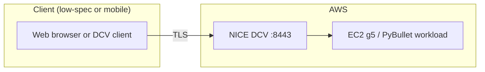
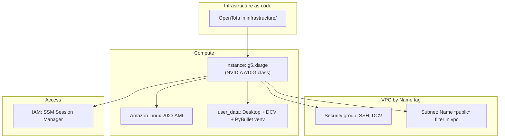
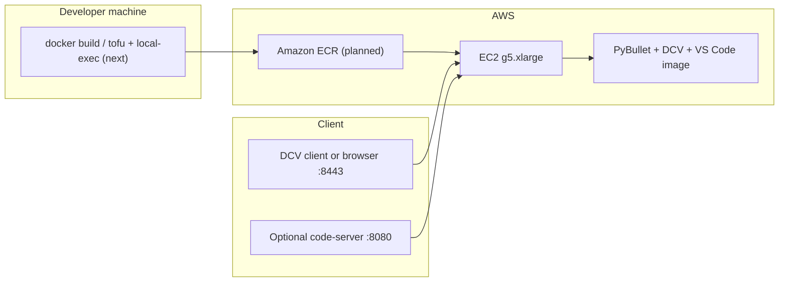
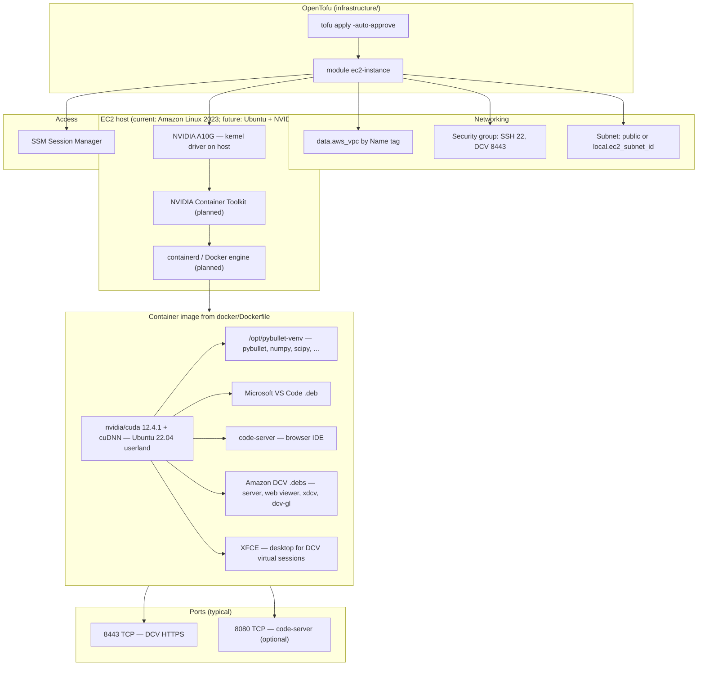

# aws-pybullet-environment

Infrastructure and tooling to run **PyBullet** physics simulation in **Amazon Web Services (AWS)**, so robotics and simulation work can be performed **remotely** from a **low-specification or portable client** (for example, a small laptop on Wi‑Fi) while the **GPU and CPU work** run on a **dedicated host in the cloud**. The goal is to separate **where you work** from **where the simulation runs**: a graphical desktop, DCV, and the PyBullet environment live on **EC2**; the client only needs a **browser** or the **NICE DCV** / **SSM** tooling.

The repository is moving toward a **Docker image** (`docker/Dockerfile`) as the canonical PyBullet runtime (CUDA user-space, **Visual Studio Code**, optional **code-server**, **Amazon DCV** packages on **Ubuntu 22.04**), built and pushed to **ECR** from OpenTofu in a follow-up step. **Today**, OpenTofu still provisions **Amazon Linux 2023** and first-boot **user data** as in `infrastructure/modules/ec2-instance/user_data.sh`; the Docker path does not replace that flow until EC2 and user data are wired to the image.

**What is deployed today** (see `infrastructure/`): a **GPU** EC2 instance (default type **`g5.xlarge`**, set in `local.tf`), **Amazon Linux 2023**, **NICE/Amazon DCV** (HTTPS on **8443**), **SSM** (no password stored in OpenTofu configuration), a **security group** with CIDRs from `local.tf`, first-boot **user data** (GNOME, DCV, PyBullet in `/opt/pybullet-venv`). The VPC is selected by the **`Name`** tag (`local.vpc_name` in `local.tf` → `data.aws_vpc` in `data.tf`).

## Architecture (overview)



## Architecture (detailed)



## Architecture (Docker image and future ECR flow — overview)

This is the **target** shape once the PyBullet host runs the container from **ECR** on **g5** (NVIDIA Container Toolkit on the instance). **ECR and EC2 user-data changes are not applied yet**; only the image definition exists under `docker/`.



## Architecture (Docker image on GPU EC2 — detailed)



## Repository layout

| Path | Purpose |
|------|--------|
| `docker/Dockerfile` | **PyBullet GPU image**: CUDA user-space on Ubuntu 22.04, PyBullet venv, **VS Code**, **code-server**, **Amazon DCV** + XFCE stack; see [PyBullet Docker image](#pybullet-docker-image) and [TO-DO](#to-do). |
| `docker/entrypoint.sh` | Container entry: default shell, or `START_CODE_SERVER=1` for code-server. |
| `infrastructure/provider.tf` | AWS provider, **S3 backend** (OpenTofu remote state); align **`profile`** with your CLI profile. |
| `infrastructure/local.tf` | **Instance** settings, **`allowed_ingress_cidrs`**, **`vpc_name`** (must match the VPC’s **`Name`** tag in EC2), optional **`ec2_subnet_id`** (else subnets with **`Name` *public* auto-picked), etc. |
| `infrastructure/data.tf` | `data.aws_vpc` (by **`local.vpc_name`**) and account/region data. |
| `infrastructure/compute.tf` | Wires the **ec2-instance** module. |
| `infrastructure/outputs.tf` | **Public IP**, instance id, **region** (SSM/CLI helpers). |
| `infrastructure/modules/ec2-instance` | IAM (SSM), security group, instance, `user_data.sh` |
| `src/` | Application and simulation code (to be expanded). |

## PyBullet Docker image

The image is based on **`nvidia/cuda:12.4.1-cudnn-devel-ubuntu22.04`**: it ships **CUDA libraries and cuDNN in user space**; the **NVIDIA kernel driver** must exist on the **host** (for example an **NVIDIA GPU-optimized AMI** or a manually installed driver on **Ubuntu**). On **EC2 g5.xlarge**, run the container with **`--gpus all`** after installing the **NVIDIA Container Toolkit** on the instance. Keep the image CUDA line within the range your host driver supports ([CUDA compatibility](https://docs.nvidia.com/deploy/cuda-compatibility/index.html)).

What is inside the image:

- **`/opt/pybullet-venv`** — PyBullet, NumPy, SciPy, Pillow, Matplotlib (same stack as the old user-data venv path conceptually).
- **Visual Studio Code** (`code`) — GUI when a display is available (for example under **DCV** on the host desktop, or X11 forwarding).
- **code-server** — VS Code–compatible **browser** editor; start with **`START_CODE_SERVER=1`** (set **`PASSWORD`** for the login prompt unless you change auth).
- **Amazon DCV** (server, web viewer, **xdcv**, **dcv-gl**) and **XFCE** — for **virtual sessions** once the container is run like a full VM (often **`--privileged`**, cgroup, and **dbus** on the host); production setups commonly run **DCV on the EC2 host** and use the container only for **CUDA + PyBullet**, which is simpler to operate.

Build (from the repository root; requires Docker):

```bash
docker build -t pybullet-dcv:dev -f docker/Dockerfile docker/
```

Smoke test (**GPU optional** for import + `DIRECT`):

```bash
docker run --rm -it pybullet-dcv:dev bash -lc "python -c \"import pybullet as p; c=p.connect(p.DIRECT); print('ok', c); p.disconnect()\""
```

With an NVIDIA GPU and the Container Toolkit on Linux:

```bash
docker run --rm -it --gpus all pybullet-dcv:dev bash -lc "nvidia-smi && python -c \"import pybullet as p; print('pybullet', p.__version__)\""
```

Optional **code-server** (bind **8080**; add **8080/tcp** to the security group when you expose it from EC2):

```bash
docker run --rm -it -p 8080:8080 -e START_CODE_SERVER=1 -e PASSWORD=changeme pybullet-dcv:dev
```

## TO-DO

Roadmap and status for the **Docker image**, **ECR**, and **EC2** integration. Link: `#to-do`.

### `user_data.sh` vs `docker/Dockerfile`

OpenTofu still provisions **Amazon Linux 2023** and runs **`infrastructure/modules/ec2-instance/user_data.sh` on the EC2 host**. The **Dockerfile** builds an **Ubuntu 22.04**-based **container** image. They are **not** the same operating system; packages and DCV archives **must** differ. Nothing is “wrong” solely because paths use `dnf` vs `apt` or `amzn2023` vs `ubuntu2204`.

| Concern | `user_data.sh` (AL2023 **host**) | `docker/Dockerfile` (**container**) | Parity / gap |
|--------|-----------------------------------|--------------------------------------|----------------|
| Package manager | `dnf` / `dnf groupinstall` | `apt-get` | Expected OS difference |
| NVIDIA kernel driver | Installs `nvidia-release`, `nvidia-driver-cuda` for `g4dn*`, `g5*`, `g6*` | **Not** in image; host (or GPU AMI) must provide driver for `--gpus all` | **By design**; CUDA image carries user-space libraries only |
| Desktop / session | GNOME “Desktop” group, **GDM**, `WaylandEnable=false`, graphical target | **XFCE** + dbus-x11 (lighter; geared toward DCV **virtual** sessions) | **Not equivalent** to full GNOME console session; future host may still need GDM/GNOME **on the EC2 OS** if you rely on DCV **automatic console** like today |
| DCV distribution | `nice-dcv-amzn2023-x86_64.tgz` RPMs | `nice-dcv-ubuntu2204-x86_64.tgz` DEBs | **Correct** per platform; do **not** swap tarball names between host and container |
| DCV GL / virtual | `nice-dcv-gl`, `nice-xdcv` RPMs | `nice-dcv-gl`, `nice-xdcv` DEBs | Aligned feature set |
| `dcv.conf` | Patches **automatic-console-session** `owner="ec2-user"` (AL2023 + DCV pattern) | **Not** patched; defaults depend on DCV package; container has no **`ec2-user`** | **Gap** if you run DCV **inside** this container and need the same console-owner behavior; **no gap** if DCV stays on the **host** and the container only runs PyBullet/CUDA |
| PyBullet | `/opt/pybullet-venv`, pip: numpy, scipy, pybullet, Pillow, matplotlib | Same path and **same pip set** | **Aligned** |
| VS Code / browser IDE | Not in user_data | `code` (Microsoft) + **code-server** | Intentional **extension** in the image |
| User / ownership | `chown ec2-user`, `.bashrc` auto-activate venv | No `ec2-user`; venv owned by root unless a follow-up `USER`/`chown` layer is added | **Gap** only when mapping Linux users for DCV or bind-mounted home |
| Firewall | `firewalld` port **8443** if active | Use Docker / EC2 **security groups** for published ports | Different layer; open **8080** if exposing code-server |

**Conclusion:** The Dockerfile is **set up consistently** with the **intent** of the old bootstrap (PyBullet venv + DCV-capable stack + GPU-friendly GL) for an **Ubuntu-based container**. It is **not** a line-for-line duplicate of Amazon Linux **host** user data. The next infrastructure step is to decide **where DCV runs** (host vs container) and align **AMI OS**, **user_data**, and **ECR pull** accordingly.

### Done

1. **Repository layout**: Added **`docker/Dockerfile`**, **`docker/entrypoint.sh`**, **`docker/.dockerignore`**.
2. **Base image**: `nvidia/cuda:12.4.1-cudnn-devel-ubuntu22.04` with **PATH** including **`/opt/pybullet-venv/bin`**.
3. **PyBullet environment**: Python venv at **`/opt/pybullet-venv`** with **`numpy>=1.22`**, **scipy**, **pybullet**, **Pillow**, **matplotlib** (matches **`user_data.sh`** pip list).
4. **Editors**: Microsoft **VS Code** (`code`); **code-server** (pinned **`CODE_SERVER_VERSION`**) with **`START_CODE_SERVER=1`** in **`docker/entrypoint.sh`**; **`PASSWORD`** env for password auth.
5. **DCV in image**: Ubuntu 22.04 **DEB** tarball from CloudFront (**server**, **web-viewer**, **xdcv**, **dcv-gl**); **XFCE** for a desktop stack inside the image.
6. **Process init**: **`tini`** as PID 1; **`policy-rc.d`** only during image build for apt postinst scripts.
7. **Documentation**: **README** updated with Docker-centric **architecture** Mermaid diagrams, **PyBullet Docker image** build/run examples, intro note that **ECR wiring is not done yet**.
8. **OpenTofu default instance type**: **`infrastructure/local.tf`** sets **`ec2_instance_type`** to **`g5.xlarge`** (still **AL2023** AMI + existing **`user_data.sh`** until you change the module).

### Not started

1. **No ECR repository** or **`local-exec`** build/push in OpenTofu.
2. **No change** to **`data.aws_ami`** / **`aws_instance`** to use **Ubuntu** or a **GPU-optimized AMI** for the PyBullet host.
3. **No replacement** of **`user_data.sh`** with “Docker + ECR only” bootstrap; **AL2023** still installs GNOME, DCV, and a **second** PyBullet venv on the host (duplicate of container until you remove or slim host install).
4. **No security group** rule for **TCP 8080** (code-server) unless added manually later.
5. **No IAM** for EC2 instance role to **`ecr:GetAuthorizationToken`**, **`ecr:BatchGetImage`**, **`ecr:GetDownloadUrlForLayer`**, etc., for pull from ECR.

### Next (ordered)

#### Phase A — ECR + `local-exec`

1. **Decide region and naming**: ECR repository name (for example **`aws-pybullet-environment/pybullet-dcv`** or project-prefixed), image tag strategy (**`latest`** vs **`git sha`**).
2. **Add OpenTofu resources** (new file such as **`infrastructure/ecr.tf`** or under a small module):
   - **`aws_ecr_repository`** for the PyBullet image.
   - Optional **`aws_ecr_lifecycle_policy`** (expire untagged / old images) to control cost.
3. **IAM for push** (pick one pattern):
   - **Developer machine / CI**: ensure the profile used by **`local-exec`** can **`ecr:PutImage`**, **`ecr:InitiateLayerUpload`**, **`ecr:UploadLayerPart`**, **`ecr:CompleteLayerUpload`**, **`ecr:BatchCheckLayerAvailability`**, **`ecr:GetAuthorizationToken`** (often via **`AmazonEC2ContainerRegistryPowerUser`** or a tighter custom policy).
   - Document that **`tofu apply`** must run where **Docker** can build **Linux/amd64** images (native Linux, **WSL2**, or **buildx** with a Linux builder); raw **Windows** PowerShell without Docker/WSL may fail.
4. **`null_resource` + `local-exec`** (user preference: **OpenTofu** + **`-auto-approve`**):
   - **`aws ecr get-login-password`** piped to **`docker login`** (non-interactive).
   - **`docker build`** with **`-f docker/Dockerfile`** and context **`docker/`** (same as README).
   - **`docker tag`** and **`docker push`** to **`${aws_ecr_repository.this.repository_url}:tag`**.
5. **Triggers**: Use **`timestamp()`** only if you accept rebuild every apply; prefer **`sha256(file(...))`** on **`docker/Dockerfile`** + **`docker/entrypoint.sh`** + any install script so apply rebuilds only when sources change.
6. **Outputs**: Add **`tofu output`** for **ECR repository URL** and **pushed image URI** for copy-paste into EC2 user data or systemd units.
7. **README**: Extend the Docker section with “**Push from OpenTofu**” commands and prerequisites (**Docker**, **AWS CLI**, profile).

**Acceptance criteria (Phase A):** After **`cd infrastructure && tofu apply -auto-approve`**, the image appears in **ECR** in the correct account/region and can be **`docker pull`**’d after login.

#### Phase B — EC2 consumes the image (after Phase A)

1. **Switch AMI** to **Ubuntu 22.04** or **AWS Deep Learning GPU AMI** / **NVIDIA-optimized AMI** that matches the **CUDA 12.4** line in the Dockerfile (watch **driver ↔ CUDA compatibility**).
2. **Rewrite or slim `user_data.sh`** for the new OS:
   - Install **Docker Engine** + **NVIDIA Container Toolkit**.
   - **`docker pull`** the ECR image (needs **instance IAM** for ECR pull + **`aws ecr get-login-password`** on the instance or use **`credential_helper`** / **IAM**-based pull patterns).
   - Optionally **stop** installing a full duplicate PyBullet venv on the host if the container is canonical.
3. **DCV decision**:
   - **Option 1 (simpler):** DCV + GNOME/GDM **on the Ubuntu host** (similar mental model to today’s AL2023); container only for **`docker run --gpus all`** PyBullet jobs.
   - **Option 2 (harder):** Run DCV **inside** the container; then implement **`dcv.conf`** owner, **privileged**/cgroup behavior, and document **8443** publishing — align with the **`dcv.conf`** gap table above.
4. **Security group**: Add **8080** if code-server is exposed; keep **8443** for DCV.
5. **README**: Replace or narrow **Amazon Linux 2023**-specific DCV instructions (**`ec2-user`**, **`dnf`**) where the host becomes Ubuntu (**`ubuntu`** user, **`apt`**).

**Acceptance criteria (Phase B):** From a client, **DCV** (and/or **code-server**) works; **`docker run --gpus all …`** runs **`nvidia-smi`** and the PyBullet smoke test inside the pulled image.

#### Phase C — Hardening and cleanup

1. Remove or gate **duplicate** PyBullet installs (host venv vs container) to shorten boot and avoid version skew.
2. Pin **DCV tarball** to a versioned URL if **`latest` symlinks** cause non-reproducible builds.
3. **Secrets**: Do not bake **ECR** or **code-server** passwords into OpenTofu state; use **SSM Parameter Store** or env from CI.

### Reference files

- **`infrastructure/modules/ec2-instance/user_data.sh`** — current production bootstrap.
- **`docker/Dockerfile`**, **`docker/entrypoint.sh`** — image definition and runtime switches.
- **`infrastructure/local.tf`**, **`infrastructure/compute.tf`**, **`infrastructure/modules/ec2-instance/main.tf`** — how the instance is wired today.
- **`README.md`** — **PyBullet Docker image** (above) and **TO-DO** (this section).

## Security: instance ingress

`infrastructure/local.tf` sets `allowed_ingress_cidrs`.

> [!WARNING]
> If **`allowed_ingress_cidrs`** is **empty**, OpenTofu uses **`0.0.0.0/0`**, so **any** public IPv4 can reach **TCP 22** (SSH) and **TCP 8443** (NICE DCV). Narrow this list for routine use—for example **`["YOUR.PUBLIC.IP/32"]`**—or use a VPN or bastion. **SSM** does **not** require exposing SSH globally; outbound HTTPS from the instance to AWS is usually enough once SSM networking is healthy.

## Prerequisites

You need:

- An **AWS account** and a **CLI profile** (examples use **`personal`**).

> [!NOTE]
> **`AWS_PROFILE`** and **`provider.tf`** **`profile`** should match **`personal`** unless you deliberately use another named profile everywhere.

- **OpenTofu** (`tofu` CLI). `.tf` files still declare **`terraform { … }`** for backend and settings—that keyword is **HCL syntax** shared with OpenTofu; run plans and applies with **`tofu`**, not **`terraform`**.
- **AWS CLI v2**.

In **`infrastructure/local.tf`**, **`vpc_name`** must match your VPC **`Name`** tag in AWS. Correct the tag in the EC2 VPC console if `apply` fails to find it.

### Session Manager plugin for CLI SSM sessions

`aws ssm start-session` requires the **Session Manager plugin** binary in the **same** shell environment as **`aws`**.

> [!IMPORTANT]
> If you run **`aws`** in **WSL**, install the **Linux** plugin **inside WSL**. The Windows MSI alone does **not** satisfy **`aws`** in your Linux distro.

Download and install (**Ubuntu / Debian / WSL**, 64-bit). See also the official [Install the Session Manager plugin](https://docs.aws.amazon.com/systems-manager/latest/userguide/session-manager-working-with-install-plugin.html).

```bash
curl -fsSLo /tmp/session-manager-plugin.deb \
  https://s3.amazonaws.com/session-manager-downloads/plugin/latest/ubuntu_64bit/session-manager-plugin.deb
```

```bash
sudo dpkg -i /tmp/session-manager-plugin.deb
```

If you downloaded the `.deb` elsewhere:

```bash
sudo dpkg -i path/to/session-manager-plugin.deb
```

Verify installation:

```bash
session-manager-plugin --version
```

```bash
which session-manager-plugin
```

> [!NOTE]
> A successful **`dpkg -i`** run often prints lines such as **`Setting up session-manager-plugin`** and **`Creating symbolic link for session-manager-plugin`**.

> [!WARNING]
> If **`SessionManagerPlugin is not found`** appears when running **`aws ssm start-session`**, install or fix **`PATH`** in that environment—or use **EC2 → Connect → Session Manager** in the AWS console instead of the CLI.

## Deploy the stack

Working directory (**contains `provider.tf` and backend config**):

```bash
cd infrastructure
tofu init
tofu plan
tofu apply -auto-approve
```

> [!NOTE]
> Confirm **`provider.tf`** backend (bucket, key, **`profile`**, region) matches your account.

### Outputs and example commands

Run these from **`infrastructure/`** after apply:

```bash
tofu output -raw pybullet_host_dcv_url
tofu output -raw pybullet_host_public_ip
tofu output -raw pybullet_host_instance_id
tofu output -raw pybullet_host_subnet_id
tofu output -raw aws_region
```

| Output | Use |
|--------|-----|
| `pybullet_host_dcv_url` | **DCV in the browser** — full `https://…:8443` |
| `pybullet_host_public_ip` | Public IPv4 |
| `pybullet_host_instance_id` | **SSM** target, EC2 console |
| `pybullet_host_subnet_id` | Subnet id (routing / SSM troubleshooting) |
| `aws_region` | Region string for **`--region`** |

> [!NOTE]
> **First boot** can take **a long time**. Wait until the instance is **Running**; **SSM** may show online only after boot and user-data finish.

## After deploy: NICE / Amazon DCV

Perform **steps 1 → 6** in order.

### 1. Ingress

If **`allowed_ingress_cidrs`** is restricted, include your **current** client public IP **CIDR**, or HTTPS **8443** (and optionally SSH **22**) will not reach the instance. Edit **`local.tf`** and **`apply`** again if your IP changed.

---

### 2. SSM: open a shell

You need a Session Manager shell **before** DCV (step 4) so you can set **`ec2-user`**’s password in step **3**.

**Console path:** **EC2** → select the instance → **Connect** → **Session Manager** → **Connect**.

**CLI path:** from **`infrastructure/`**:

```bash
cd infrastructure
aws ssm start-session \
  --target "$(tofu output -raw pybullet_host_instance_id)" \
  --region "$(tofu output -raw aws_region)" \
  --profile personal
```

Expected banner and prompt shapes:

```text
Starting session with SessionId: ...
sh-5.2$
```

Optional (if you want bash):

```bash
bash
```

> [!NOTE]
> You may appear as **`ssm-user`** after **`bash`**. **`ssm-user`** is **not** the DCV login user—DCV uses **`ec2-user`**.

> [!TIP]
> Keep this shell until step **3** is done, or **`exit`** and open a **new** SSM session before **`sudo passwd`** if you disconnect.

---

### 3. Linux password for `ec2-user` (before opening DCV)

DCV asks for a **desktop** login: **`ec2-user`** plus the **Linux password** on the instance.

> [!WARNING]
> Run **`sudo passwd ec2-user`** only **on the EC2 instance**, in the **SSM** shell from step **2** (prompt like **`sh-5.2$`**, **`ssm-user@ip-…`**). If you run **`sudo passwd ec2-user`** in **WSL**, **PowerShell**, or **Terminal on your laptop**, **`sudo`** asks for **your local user’s** password (`[sudo] password for alice:`)—that is **not** changing **`ec2-user`** on AWS. Open **Session Manager** first, **then** run the command there.

> [!NOTE]
> That password is **not** in OpenTofu configuration, Secrets Manager, or the console. The EC2 **SSH key pair** (`key_name`) is for **`ssh`**, **not** this DCV password.

In the **same** SSM session as step **2**, run:

```bash
sudo passwd ec2-user
```

Enter and confirm a **strong password** at the prompts. That string is what you type in DCV (step **5**).

To change a forgotten password later, start SSM again and run the same command.

End the SSM session when finished:

```bash
exit
```

```text
Exiting session with sessionId: ...
```

> [!NOTE]
> Closing SSM does **not** close a separate DCV tab in the browser once you are connected.

---

### 4. Open the DCV web client

Resolve the URL from **current** OpenTofu state (use this **IP**, not an old screenshot or cached tab):

```bash
cd infrastructure
tofu output -raw pybullet_host_public_ip
```

```bash
tofu output -raw pybullet_host_dcv_url
```

In the browser, open **`https://<PUBLIC_IP>:8443`** (HTTPS, port **8443**).

> [!TIP]
> A **certificate warning** (unknown issuer) followed by the DCV page means traffic **is** reaching the server—here you normally continue to the site. **`This site can’t be reached`**, **`ERR_CONNECTION_REFUSED`**, **timeouts**, or **connection reset** usually mean TCP never reached DCV ([debug below](#troubleshooting-dcv-https-on-port-8443)).

> [!NOTE]
> If **`pybullet_host_dcv_url`** or **`pybullet_host_public_ip`** is **`null`**, the instance has **no IPv4 address** usable from the Internet (subnet, stopped instance, etc.). **`apply`** again after **`replace`** updates outputs when the replacement finishes.

---

### 5. Sign in to DCV

| Field | Value |
|--------|--------|
| User | **`ec2-user`** |
| Password | The password you set in step **3** |

You should see **GNOME**. PyBullet lives in **`/opt/pybullet-venv`** (often sourced in **`ec2-user`** **`.bashrc`** for new shells).

Activate the venv in a terminal:

```bash
source /opt/pybullet-venv/bin/activate
```

#### Verify PyBullet

Open a **terminal** in **GNOME** (the venv is often auto-sourced in **`ec2-user`**’s **`~/.bashrc`** for **new** terminals; if your prompt does not show **`(pybullet-venv)`**, run **`source`** again).

**Smoke test** (physics + import; **no** GUI window—uses **`DIRECT`**):

```bash
source /opt/pybullet-venv/bin/activate
python -c "import pybullet as p; cid=p.connect(p.DIRECT); print('connected id=', cid); p.disconnect(); print('PyBullet OK')"
```

You should see **`connected id=`** (usually **`0`**) and **`PyBullet OK`** with **no** traceback.

**Optional** (**`GUI`**—opens a Bullet window using your DCV desktop; **`DISPLAY`** must be set):

```bash
python -c "import pybullet as p, time as t; p.connect(p.GUI); t.sleep(2); p.disconnect(); print('GUI OK')"
```

**Note:** Routine **Rigid Body Dynamics API** workloads are **CPU**-bound; **`nvidia-smi`** staying idle unless you attach **CUDA**/rendering-heavy code is normal.

#### Clipboard: copy/paste between Windows and the DCV session

Your **local** Windows browser (or **Amazon DCV** app) is separate from **GNOME** on the instance—use **DCV’s clipboard redirection**, not only the browser’s usual **Ctrl+C/V** across tabs.

| Client | What to do |
|--------|-------------|
| **Web client** (browser) | **Gear (Settings)** on the **DCV window** top bar → turn on **clipboard** / **bidirectional clipboard** (wording varies slightly by version). Allow the **browser** prompt if it asks permission to read the **clipboard** (Chrome/Edge/Firefox each differ). Then **copy** text on Windows, **paste** in the remote desktop with **Ctrl+V** (and the reverse). If paste does nothing, toggle the setting off/on once. |
| **Native Amazon DCV** | **Connection** / **Session** / **Preferences** (depending on version) → enable **clipboard redirection** / **remote clipboard**. Often more reliable than **Web** for large or repeated pastes. |

**Paste into a Linux terminal (**`Terminal`** / **`gnome-terminal`**):**

That is **different** from paste into **`Text Editor`**. With **DCV** clipboard sync, pasting from your **host** into the remote terminal commonly works with **`Shift+Insert`** (often the most reliable shortcut here). Alternatives: **`Ctrl+Shift+V`** (paste from clipboard), **`Ctrl+Shift+C`** (copy from terminal), or **`right-click → Paste`**. In **GNOME Terminal**, **`Ctrl+V`** usually does **not** paste (**`Ctrl+C`** sends **interrupt** to the shell). You can enable **Paste using Ctrl+V** under **terminal → Preferences → Shortcuts / Keyboard** if you prefer Windows-style **`Ctrl+V`**.

> [!NOTE]
> If **both** directions stay dead, the **DCV server** may have clipboard options in **`/etc/dcv/dcv.conf`** (defaults are usually on)—compare with **`/etc/dcv/dcv.default`** on the instance, then **`sudo systemctl restart dcvserver`** after any change. See [Use the clipboard](https://docs.aws.amazon.com/dcv/latest/userguide/client-use-clipboard.html) in the DCV user guide (and the **server** **`dcv.conf`** section in the DCV **Administration Guide** if clipboard stays disabled).

#### DCV reports “wrong username or password”

| Check | What to do |
|--------|------------|
| **Username** | Must be exactly **`ec2-user`** (all **lowercase**, hyphen, **no** domain, **not** **`ssm-user`**, **not** **`root`**, **not** your AWS account email). |
| **Password** | Only the string you set with **`sudo passwd ec2-user`** in an **SSM** shell **on the instance** (step **3**). The EC2 **SSH key pair** does **not** unlock this screen—neither does **`sudo passwd`** run **on your own PC** (WSL/PowerShell): that only prompts for **your laptop** user. |
| **Never set password?** | Open **SSM** again and run **`sudo passwd ec2-user`**, typing the password slowly (keyboard layout **Caps Lock**). |
| **Still fails?** | In **SSM**, reset once more (**`sudo passwd ec2-user`**) and retry **DCV** immediately. Avoid pasting passwords if hidden characters creep in—type manually once to test. |

Optional sanity check (**SSM** shell): verify **`ec2-user`** has a usable password (**`P`** status from **`passwd`** means “usable” on many systems):

```bash
sudo passwd --status ec2-user
```

#### DCV stuck on **“Connecting…”** (web **and/or** native client)

If you **already signed in** (username/password accepted) and the UI spins on **Connecting** with a **broken/disconnected monitor** icon in the toolbar—that usually means **`dcvserver`** is up (**TCP :8443** worked) but DCV **cannot attach to a desktop session** (**GDM**/**X**/**automatic console** not ready), not a wrong password.

| Situation | Likely focus |
|----------|----------------|
| **Both** web **and** DCV app stuck | **Server-side** session/display—run the **SSM diagnostics** below (**not** only browser WebSockets). |
| **Only** the browser sticks | First try **native client**; then check **WebSockets** (**F12 → Network → WS**). |
| Right after **boot** / **first login** | Wait **several minutes**, **reload** once (**GDM** may still be bringing up **GNOME/X**). |

**SSM diagnostics** (on the instance):

```bash
sudo systemctl status dcvserver --no-pager
sudo systemctl status gdm --no-pager
```

```bash
sudo dcv list-sessions 2>/dev/null || true
```

```bash
sudo journalctl -u dcvserver -u gdm --since "30 min ago" --no-pager | tail -120
```

**Soft restart** (often unsticks a missed attach between **GDM** and **DCV**):

```bash
sudo systemctl restart gdm
sleep 20
sudo systemctl restart dcvserver
```

Reconnect from the client in **~1 minute**.

#### **`GDM`**: **`maximum number of X display failures`** / **`Session never registered`** (**`g4dn`** / **`g5`** / **`g6`**)

If **`journalctl -u gdm`** repeats **`GdmDisplay: Session never registered`** and ends with **`GdmLocalDisplayFactory: maximum number of X display failures reached`**, **Xorg** is crashing (**no stable display** → **GNOME never starts** → **DCV** spins on **Connecting**).

On **GPU** instance types **without** NVIDIA kernel drivers loaded yet, **GDM+X** commonly fail exactly like this—the issue is **not** DCV **`8443`** or **your password**, it is **graphics bring-up**.

**Current `user_data`** (for **`g4dn*`** / **`g5*`** / **`g6*`**) installs **[NVIDIA drivers on Amazon Linux 2023](https://docs.aws.amazon.com/linux/al2023/ug/nvidia-drivers.html)** (`nvidia-release`, `nvidia-driver-cuda`) **before** **`dnf groupinstall "Desktop"`** so **X/GDM** can start on first boot.

**Already-running instance baked without that step** — install drivers over **SSM**, then **`reboot`**, then verify **`nvidia-smi`** shows the GPU:

```bash
sudo dnf install -y "kernel-devel-$(uname -r)" "kernel-headers-$(uname -r)" gcc make
sudo dnf install -y nvidia-release
sudo dnf install -y nvidia-driver-cuda
sudo reboot
```

```bash
nvidia-smi
```

Then retry DCV (**`pam_unix(dcv:auth): authentication failure`** in logs sometimes clears once **X** works; still ensure **`sudo passwd ec2-user`** matches what you type in DCV.)

Or **`tofu apply -auto-approve -replace='module.pybullet_host.aws_instance.this'`** so the refreshed **`user_data`** runs cleanly on a new instance.

> [!TIP]
> For **browser-only** hangs (native client works), check **F12 → Network → WS**. If **both** clients fail, prioritize **`gdm`**/**X**/NVIDIA (**above**) before blaming **WebSockets** alone.

---

### 6. Optional: native Amazon DCV client

[Download Amazon DCV](https://www.amazondcv.com/) and connect to **`<PUBLIC_IP>:8443`**.

---

## Troubleshooting DCV HTTPS on port 8443

**Browser** messages such as **`This site can't be reached`**, **`Unable to connect`**, **`Connection timed out`**, or **`ERR_CONNECTION_REFUSED`** mean the TCP connection did not complete—not the usual “bad certificate” step.

### 1) Confirm OpenTofu output matches what you browse

Stale tabs or IPs from an old stop/start confuse debugging.

```bash
cd infrastructure
tofu output -raw pybullet_host_public_ip
tofu output -raw aws_region
```

Compare with the hostname in your browser (**must** be **`https://<that-ip>:8443`**).

> [!WARNING]
> Stopping/restarting EC2 often **changes** an **ephemeral** public IP unless you use an Elastic IP. After any lifecycle change, **re-read outputs** above.

---

### 2) Security group: inbound TCP **8443** (and client IP)

The module opens **SSH 22** and **DCV 8443** to **`allowed_ingress_cidrs`** in **`local.tf`**. Empty list ⇒ **`0.0.0.0/0`** (world).

If you restricted to **`your.ip/32`**, verify your browser’s network still uses that IPv4 (**VPN/mobile hotspot moves your address**):

```bash
curl -fsS https://checkip.amazonaws.com
```

Put that CIDR **`x.x.x.x/32`** in **`allowed_ingress_cidrs`**, **`apply`** again, retry DCV.

> [!NOTE]
> In **EC2 → Security groups**, confirm the attached group has **Ingress** **`8443/tcp`** sourced to the CIDRs you expect—not only `:22`.

---

### 3) First boot and user-data (DCV not listening yet)

**User data installs GNOME, DCV, and may reboot**—this can exceed **many minutes**.

> [!IMPORTANT]
> If **DCV** is not running yet, the browser behaves like **`CONNECTION_REFUSED`**. Prefer **SSM** (section **2**) until user data finishes—then retry DCV.

On the instance (SSM shell), inspect progress and listener:

```bash
sudo tail -n 120 /var/log/cloud-init-output.log
```

```bash
sudo systemctl status dcvserver --no-pager
```

```bash
sudo ss -tlnp | grep 8443 || true
```

Healthy pattern: **`dcvserver`** is **active**, and **`ss`** shows **`0.0.0.0:8443`** (or **`:::8443`**) **`LISTEN`**.

Logs if the service fails:

```bash
sudo journalctl -u dcvserver -n 80 --no-pager
```

```bash
grep -nE 'Failed to run module scripts-user|conflicts with curl' /var/log/cloud-init-output.log | tail -20
```

```bash
sudo tail -n 80 /var/log/user-data-pyb.log
```

#### What to expect in the logs

| Path | Role |
|------|------|
| **`/var/log/user-data-pyb.log`** | Full **`user_data`** transcript (**`set -x`** prints **`+`** lines). Prefer this file to verify **`dnf`** (**Desktop**, Python/build deps), DCV **`rpm`** install, **`pip`** (**PyBullet** venv), **`systemctl`** for **`dcvserver`** / **`gdm`**, and **`reboot`**. Written by **`infrastructure/modules/ec2-instance/user_data.sh`**. |
| **`/var/log/cloud-init-output.log`** | **`cloud-init`** umbrella log. **`user_data`** failures appear as **`Failed to run module scripts-user`**. The file **appends**—old errors remain. A **successful** first full run typically ends with **`Cloud-init … finished … Up 200+ seconds`** (order of **minutes**). After **`user_data`** calls **`reboot`**, new lines like **`… finished … Up ~8 seconds`** are **normal** post-reboot **`cloud-init`**—**not** a second **`user_data`** run. |

**Healthy first-boot tail** (snippet—versions and IPs will differ):

```text
Successfully installed Pillow- … pybullet- … scipy- … matplotlib- …
+ systemctl enable dcvserver
Created symlink …/dcvserver.service …
+ systemctl enable gdm
+ systemctl start dcvserver
+ reboot
Cloud-init v. … finished at … Up 200+ seconds
```

After **`reboot`**, you may see another block like **`Cloud-init … finished … Up 8 seconds`**—that is **post-reboot** **`cloud-init`**, not a second full **`scripts-user`** pass.

**Failed bootstrap**—look near the **`scripts-user`** line and earlier **`dnf`** output:

```text
package curl-minimal … conflicts with curl …
Failed to run module scripts-user (scripts in /var/lib/cloud/instance/scripts)
```

If **`user-data-pyb.log`** ends before **`pip`**’s **`Successfully installed … pybullet`** lines, before **`systemctl start dcvserver`**, or before **`reboot`**—bootstrap did not finish; **`dcvserver`** will not serve **HTTPS :8443**.

If you see **`package curl-minimal`** **conflicting** with **`curl`**, **`dnf`** may have stopped before GNOME / DCV / PyBullet ran end-to-end (**`scripts-user`** / **`scripts in /var/lib/cloud/instance/scripts`** **failed** in **`cloud-init-output.log`**).

> [!IMPORTANT]
> **Reboot alone does not fix this.** EC2 **`User data`** runs **once** on **first boot** of a **given instance**. Later boots show **`Cloud-init`** finishing in seconds with **no** long **`scripts-user`** block—you are **not** re-applying **`user_data`**. Editing **`user_data.sh`** locally or in Git does nothing on-disk until OpenTofu **creates a new instance**.

> [!WARNING]
> Older revisions of **`user_data.sh`** explicitly installed the **`curl`** RPM, which clashes with **`curl-minimal`** on Amazon Linux 2023. **Pull the latest `infrastructure/modules/ec2-instance/user_data.sh`**, **`tofu apply -auto-approve`**, then **replace** the instance so bootstrap runs cleanly again (**`apply -replace`** below is the usual fix; AMI-only refresh does **not** replay **`User data`** on the **same** instance ID).

```bash
cd infrastructure
tofu apply -auto-approve
tofu apply -auto-approve -replace='module.pybullet_host.aws_instance.this'
```

---

### 4) Quick test from **your workstation** (not the browser)

Uses **`curl`** toward **HTTPS :8443** on the instance. **Replace** **`PUBLIC_IP`** below with **`tofu output -raw pybullet_host_public_ip`**.

PowerShell (**Windows**, use **`curl.exe`** so you do **not** invoke **`Invoke-WebRequest`**):

```powershell
curl.exe -vk --connect-timeout 8 "https://PUBLIC_IP:8443/"
```

Bash (**WSL** / macOS **/ Linux):

```bash
curl -vk --connect-timeout 8 "https://PUBLIC_IP:8443/"
```

Interpret the result:

```text
# Usually OK (TLS/cert noise is OK)
* Connected to ...

# Blocking issues
curl: (...28) Failed to connect ...
timed out
Connection refused
```

If **`curl`** shows **`Connected`** but errors later (TLS/HTML), reopen **`https://<PUBLIC_IP>:8443`** in the browser—your path to **TCP 8443** is mostly fine.

If **`curl`** cannot connect (**refused**, **timeout**), work through **sections 1–3** above (IP, security group, **`dcvserver`** / user-data).

---

## Optional: quick AWS CLI check (before deploy)

```bash
aws configure --profile personal
aws sts get-caller-identity --profile personal
```

> [!NOTE]
> **`tofu plan`** may show **no changes** when state matches the repo. A **replace** on the instance does **not** prove SSM or DCV are ready—confirm networking, IAM, and instance health separately.

---

## Troubleshooting SSM “Offline”

> [!WARNING]
> The instance must reach **AWS Systems Manager** on **HTTPS (443)**. Typical issues: **no internet path** (private subnet without **NAT** or **SSM/VPC endpoints**), **wrong IAM** (this stack attaches **`AmazonSSMManagedInstanceCore`**), or **still booting** / user-data **not finished**.

When **`ec2_subnet_id`** is **unset**, OpenTofu picks subnets whose **`tag:Name`** matches **`*public*`** inside **`vpc_name`**. In a **private-only** VPC, set **`ec2_subnet_id`** or add [SSM interface endpoints](https://docs.aws.amazon.com/systems-manager/latest/userguide/setup-create-vpc.html). See [SSM agent troubleshooting](https://docs.aws.amazon.com/systems-manager/latest/userguide/troubleshooting-ssm-agent.html).
