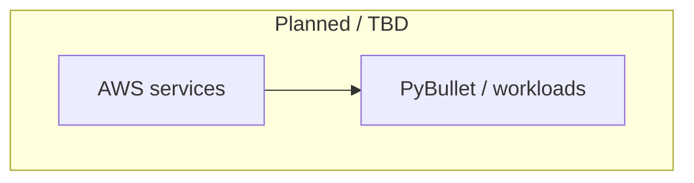
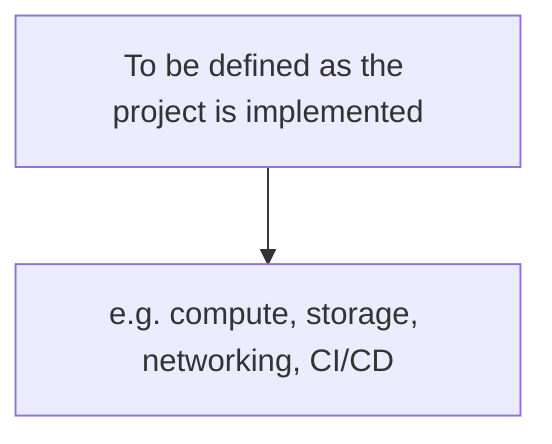

# aws-pybullet-environment

AWS resources and automation for a PyBullet-based simulation environment.

## Architecture (overview)

## Architecture (detailed)

## Repository

This repository holds infrastructure-as-code, application code, and configuration for the environment. Expand the diagrams above as components are added.
