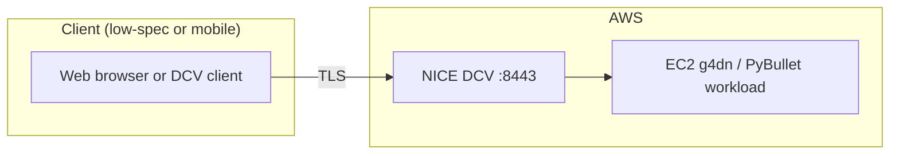
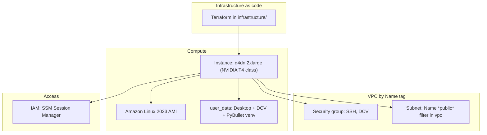

# aws-pybullet-environment

Infrastructure and tooling to run **PyBullet** physics simulation in **Amazon Web Services (AWS)**, so robotics and simulation work can be performed **remotely** from a **low-specification or portable client** (for example, a small laptop on Wi‑Fi) while the **GPU and CPU work** run on a **dedicated host in the cloud**. The goal is to separate **where you work** from **where the simulation runs**: a graphical desktop, DCV, and the PyBullet environment live on **EC2**; the client only needs a **browser** or the **NICE DCV** / **SSM** tooling.

**What is deployed today** (see `infrastructure/`): a **GPU** EC2 instance (default type **`g4dn.2xlarge`**, set in `local.tf`), **Amazon Linux 2023**, **NICE/Amazon DCV** (HTTPS on **8443**), **SSM** (no password stored in Terraform), a **security group** with CIDRs from `local.tf`, first-boot **user data** (GNOME, DCV, PyBullet in `/opt/pybullet-venv`). The VPC is selected by the **`Name`** tag (`local.vpc_name` in `local.tf` → `data.aws_vpc` in `data.tf`).

## Architecture (overview)



## Architecture (detailed)



## Repository layout

| Path | Purpose |
|------|--------|
| `infrastructure/provider.tf` | AWS provider, **S3 backend** (state); align **`profile`** with your CLI profile. |
| `infrastructure/local.tf` | **Instance** settings, **`allowed_ingress_cidrs`**, **`vpc_name`** (must match the VPC’s **`Name`** tag in EC2), optional **`ec2_subnet_id`** (else subnets with **`Name` *public* auto-picked), etc. |
| `infrastructure/data.tf` | `data.aws_vpc` (by **`local.vpc_name`**) and account/region data. |
| `infrastructure/compute.tf` | Wires the **ec2-instance** module. |
| `infrastructure/outputs.tf` | **Public IP**, instance id, **region** (SSM/CLI helpers). |
| `infrastructure/modules/ec2-instance` | IAM (SSM), security group, instance, `user_data.sh` |
| `src/` | Application and simulation code (to be expanded). |

## Security: instance ingress

`infrastructure/local.tf` sets `allowed_ingress_cidrs`. If that list is **empty**, Terraform uses **`0.0.0.0/0`**, so **any** public IPv4 can reach **TCP 22** (SSH) and **TCP 8443** (NICE DCV).

That is convenient for a first test but **not** appropriate for a long-lived or sensitive system. For routine use, set **`allowed_ingress_cidrs`** to your public IP as **`["x.x.x.x/32"]`**, and update it when your address changes, or use a **VPN** / **bastion** with a stable CIDR. **SSM** does *not* require you to open SSH to the world: your **AWS CLI** uses the SSM service; the instance only needs **outbound HTTPS to AWS** (the default security group allows this).

## Prerequisites

- An **AWS account** and a **named CLI profile** (examples below use `personal`; it must match **`profile`** in `infrastructure/provider.tf` or export **`AWS_PROFILE`**).
- The **HashiCorp Terraform** CLI (examples use **`terraform`**; **OpenTofu** users can substitute **`tofu`**) and **AWS CLI v2**.
- In **`infrastructure/local.tf`**, set **`vpc_name`** to the **`Name` tag** of the VPC you use. If `terraform apply` cannot find a VPC, add or correct that tag in the AWS console for that VPC.

### Session Manager plugin for CLI SSM sessions

`aws ssm start-session` does **not** work with the AWS CLI alone: it needs the **Session Manager plugin** installed in the **same** environment as the `aws` binary (if you use **WSL**, install the **Linux** plugin **inside WSL**, not only the Windows installer on the host).

**Ubuntu / Debian / WSL (64-bit)**

1. Download the Ubuntu 64-bit package ([full install doc](https://docs.aws.amazon.com/systems-manager/latest/userguide/session-manager-working-with-install-plugin.html)):

   ```bash
   curl -fsSLo /tmp/session-manager-plugin.deb \
     https://s3.amazonaws.com/session-manager-downloads/plugin/latest/ubuntu_64bit/session-manager-plugin.deb
   ```

2. Install it (adjust the path if you saved the `.deb` somewhere else):

   ```bash
   sudo dpkg -i /tmp/session-manager-plugin.deb
   ```

   A successful install ends with **`Creating symbolic link for session-manager-plugin`** (and similar **`Setting up session-manager-plugin`** lines).

3. **Check:** `session-manager-plugin --version` — or **`which session-manager-plugin`**.

If **`aws ssm ...`** prints **`SessionManagerPlugin is not found`**, the plugin is missing or not on `PATH` in that shell. Until it works from the CLI, use **EC2 → Connect → Session Manager** in the **AWS Console** instead.

## Deploy the stack

From the **`infrastructure/`** directory (the directory that contains `provider.tf` and state or backend config):

```bash
cd infrastructure
terraform init
terraform plan
terraform apply -auto-approve
```

If you use **OpenTofu**, run the same with **`tofu`** instead of **`terraform`**. Ensure your backend in **`provider.tf`** (S3 bucket, key, **profile**, region) is valid for your account.

**Useful outputs** (run from `infrastructure/` after apply):

| Output | Use |
|--------|-----|
| `terraform output -raw pybullet_host_dcv_url` | **DCV in the browser** — full `https://…:8443` (best for copy or clickable links) |
| `terraform output -raw pybullet_host_public_ip` | Public IPv4 only |
| `terraform output -raw pybullet_host_instance_id` | **SSM** target, EC2 console |
| `terraform output -raw pybullet_host_subnet_id` | **Subnet** the instance is in (check **public** / route table in console if SSM is offline) |
| `terraform output -raw aws_region` | **Region** for CLI commands |

**First boot:** user data may take **a long time** (desktop packages, DCV, reboot). Wait until the instance is **Running**; if the URL does not load yet, wait a few more minutes. **SSM** may show **Online** only after a short delay.

## After deploy: use NICE / Amazon DCV

Follow these in order the first time.

1. **Ingress**  
   If you restricted `allowed_ingress_cidrs`, your **current** public IP must be included, or the browser will not reach **8443** (or SSH **22**). You can re-apply after editing `local.tf`.

2. **SSM (Session Manager)**  

   - **Console:** **EC2** → select the instance → **Connect** → **Session Manager** → **Connect**.

   - **Terminal:** After you install the [Session Manager plugin](#session-manager-plugin-for-cli-ssm-sessions), run **`start-session`** from **`infrastructure/`** (same **profile** and **region** as `provider.tf`):

     ```bash
     cd infrastructure
     aws ssm start-session \
       --target "$(terraform output -raw pybullet_host_instance_id)" \
       --region "$(terraform output -raw aws_region)" \
       --profile personal
     ```

   What you should see:

   ```text
   Starting session with SessionId: ...
   sh-5.2$
   ```

   The shell may start as **`sh`** (prompt like **`sh-5.2$`**). Type **`bash`** if you prefer **`bash`**; you might then show as **`ssm-user`** on Amazon Linux—that is normal.

   Inside the remote shell, set the Linux password **`ec2-user`** will use with DCV (**DCV logs in as `ec2-user`**, not as `ssm-user`):

   ```bash
   sudo passwd ec2-user
   ```

   Exit the session when done (`exit`, or **`exit`** again if nested shells). Terraform prints **`Exiting session with sessionId: ...`** when the session closes.

   If **`SessionManagerPlugin is not found`**, finish the plugin install above or use the **console** path.

3. **Open the DCV web client**  
   In a browser, open the DCV URL. Run `terraform output -raw pybullet_host_dcv_url` to print **`https://<PUBLIC_IP>:8443`**, or copy the **`pybullet_host_dcv_url`** value from the apply output in your UI. If it is `null`, the instance has no public address yet (subnets / route tables). You may need to **accept a certificate warning** for a test server.

4. **Sign in to DCV**  
   User **`ec2-user`**, using the password you set with **`sudo passwd ec2-user`** in the SSM shell. You should see the **GNOME** desktop. PyBullet is installed in a venv: **`/opt/pybullet-venv`** (sourced in **`ec2-user`**’s `~/.bashrc` for new shells). Open a terminal and run: `source /opt/pybullet-venv/bin/activate` if needed, then your Python or PyBullet commands.

5. **Optional: native Amazon DCV client**  
   For some workloads, the native client is preferable: [Download Amazon DCV](https://www.amazondcv.com/) and connect to **`<PUBLIC_IP>:8443`**.

### Optional: quick AWS and CLI check before deploy

```bash
aws configure --profile personal
aws sts get-caller-identity --profile personal
```

**Why `terraform plan` shows “no changes”:** the **saved state** already matches the **current .tf** (including subnet selection). You only see a **replace** the first time you apply after a change, or if you [replace](https://developer.hashicorp.com/terraform/cli/commands/apply#replace) the instance. That does *not* by itself mean SSM is working—confirm the subnet has a path to the internet (or endpoints) and that the **SSM** agent is running.

If SSM stays **Offline**, the instance must reach **AWS Systems Manager** on **HTTPS (443)** (SSM agent to regional endpoints). Common causes: **no internet path** (instance in a **private subnet** with no **NAT gateway** and no **SSM/VPC interface endpoints**), wrong **IAM** (this stack uses **`AmazonSSMManagedInstanceCore`** on the instance profile), or the node is still **booting / running user data** (wait, then check again). When **`ec2_subnet_id`** is unset, Terraform uses **`data.aws_subnets.filtered`**: subnets in **`local.vpc_name`**’s VPC whose **`tag:Name`** matches **`*public*`** (EC2 wildcard filter); the first subnet id (**sorted**) is chosen. In a **private-only** VPC, set **`ec2_subnet_id`** or add [SSM endpoints](https://docs.aws.amazon.com/systems-manager/latest/userguide/setup-create-vpc.html)—see [SSM agent troubleshooting](https://docs.aws.amazon.com/systems-manager/latest/userguide/troubleshooting-ssm-agent.html).
