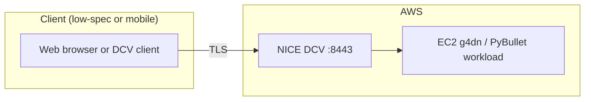
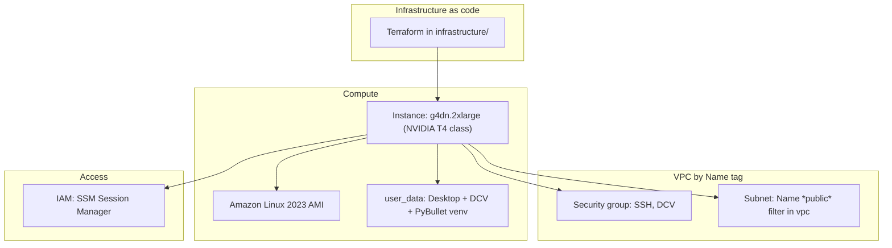

# aws-pybullet-environment

Infrastructure and tooling to run **PyBullet** physics simulation in **Amazon Web Services (AWS)**, so robotics and simulation work can be performed **remotely** from a **low-specification or portable client** (for example, a small laptop on Wi‑Fi) while the **GPU and CPU work** run on a **dedicated host in the cloud**. The goal is to separate **where you work** from **where the simulation runs**: a graphical desktop, DCV, and the PyBullet environment live on **EC2**; the client only needs a **browser** or the **NICE DCV** / **SSM** tooling.

**What is deployed today** (see `infrastructure/`): a **GPU** EC2 instance (default type **`g4dn.2xlarge`**, set in `local.tf`), **Amazon Linux 2023**, **NICE/Amazon DCV** (HTTPS on **8443**), **SSM** (no password stored in Terraform), a **security group** with CIDRs from `local.tf`, first-boot **user data** (GNOME, DCV, PyBullet in `/opt/pybullet-venv`). The VPC is selected by the **`Name`** tag (`local.vpc_name` in `local.tf` → `data.aws_vpc` in `data.tf`).

## Architecture (overview)



## Architecture (detailed)



## Repository layout

| Path | Purpose |
|------|--------|
| `infrastructure/provider.tf` | AWS provider, **S3 backend** (state); align **`profile`** with your CLI profile. |
| `infrastructure/local.tf` | **Instance** settings, **`allowed_ingress_cidrs`**, **`vpc_name`** (must match the VPC’s **`Name`** tag in EC2), optional **`ec2_subnet_id`** (else subnets with **`Name` *public* auto-picked), etc. |
| `infrastructure/data.tf` | `data.aws_vpc` (by **`local.vpc_name`**) and account/region data. |
| `infrastructure/compute.tf` | Wires the **ec2-instance** module. |
| `infrastructure/outputs.tf` | **Public IP**, instance id, **region** (SSM/CLI helpers). |
| `infrastructure/modules/ec2-instance` | IAM (SSM), security group, instance, `user_data.sh` |
| `src/` | Application and simulation code (to be expanded). |

## Security: instance ingress

`infrastructure/local.tf` sets `allowed_ingress_cidrs`.

> [!WARNING]
> If **`allowed_ingress_cidrs`** is **empty**, Terraform uses **`0.0.0.0/0`**, so **any** public IPv4 can reach **TCP 22** (SSH) and **TCP 8443** (NICE DCV). Narrow this list for routine use—for example **`["YOUR.PUBLIC.IP/32"]`**—or use a VPN or bastion. **SSM** does **not** require exposing SSH globally; outbound HTTPS from the instance to AWS is usually enough once SSM networking is healthy.

## Prerequisites

You need:

- An **AWS account** and a **CLI profile** (examples use **`personal`**).

> [!NOTE]
> **`AWS_PROFILE`** and **`provider.tf`** **`profile`** should match **`personal`** unless you deliberately use another named profile everywhere.

- **Terraform** (examples use **`terraform`**; substitute **`tofu`** if you use **OpenTofu**).
- **AWS CLI v2**.

In **`infrastructure/local.tf`**, **`vpc_name`** must match your VPC **`Name`** tag in AWS. Correct the tag in the EC2 VPC console if `apply` fails to find it.

### Session Manager plugin for CLI SSM sessions

`aws ssm start-session` requires the **Session Manager plugin** binary in the **same** shell environment as **`aws`**.

> [!IMPORTANT]
> If you run **`aws`** in **WSL**, install the **Linux** plugin **inside WSL**. The Windows MSI alone does **not** satisfy **`aws`** in your Linux distro.

Download and install (**Ubuntu / Debian / WSL**, 64-bit). See also the official [Install the Session Manager plugin](https://docs.aws.amazon.com/systems-manager/latest/userguide/session-manager-working-with-install-plugin.html).

```bash
curl -fsSLo /tmp/session-manager-plugin.deb \
  https://s3.amazonaws.com/session-manager-downloads/plugin/latest/ubuntu_64bit/session-manager-plugin.deb
```

```bash
sudo dpkg -i /tmp/session-manager-plugin.deb
```

If you downloaded the `.deb` elsewhere:

```bash
sudo dpkg -i path/to/session-manager-plugin.deb
```

Verify installation:

```bash
session-manager-plugin --version
```

```bash
which session-manager-plugin
```

> [!NOTE]
> A successful **`dpkg -i`** run often prints lines such as **`Setting up session-manager-plugin`** and **`Creating symbolic link for session-manager-plugin`**.

> [!WARNING]
> If **`SessionManagerPlugin is not found`** appears when running **`aws ssm start-session`**, install or fix **`PATH`** in that environment—or use **EC2 → Connect → Session Manager** in the AWS console instead of the CLI.

## Deploy the stack

Working directory (**contains `provider.tf` and backend config**):

```bash
cd infrastructure
terraform init
terraform plan
terraform apply -auto-approve
```

OpenTofu:

```bash
cd infrastructure
tofu init
tofu plan
tofu apply -auto-approve
```

> [!NOTE]
> Confirm **`provider.tf`** backend (bucket, key, **`profile`**, region) matches your account.

### Outputs and example commands

Run these from **`infrastructure/`** after apply:

```bash
terraform output -raw pybullet_host_dcv_url
terraform output -raw pybullet_host_public_ip
terraform output -raw pybullet_host_instance_id
terraform output -raw pybullet_host_subnet_id
terraform output -raw aws_region
```

Replace **`terraform`** with **`tofu`** if applicable.

| Output | Use |
|--------|-----|
| `pybullet_host_dcv_url` | **DCV in the browser** — full `https://…:8443` |
| `pybullet_host_public_ip` | Public IPv4 |
| `pybullet_host_instance_id` | **SSM** target, EC2 console |
| `pybullet_host_subnet_id` | Subnet id (routing / SSM troubleshooting) |
| `aws_region` | Region string for **`--region`** |

> [!NOTE]
> **First boot** can take **a long time**. Wait until the instance is **Running**; **SSM** may show online only after boot and user-data finish.

## After deploy: NICE / Amazon DCV

Perform **steps 1 → 6** in order.

### 1. Ingress

If **`allowed_ingress_cidrs`** is restricted, include your **current** client public IP **CIDR**, or HTTPS **8443** (and optionally SSH **22**) will not reach the instance. Edit **`local.tf`** and **`apply`** again if your IP changed.

---

### 2. SSM: open a shell

You need a Session Manager shell **before** DCV (step 4) so you can set **`ec2-user`**’s password in step **3**.

**Console path:** **EC2** → select the instance → **Connect** → **Session Manager** → **Connect**.

**CLI path:** from **`infrastructure/`**:

```bash
cd infrastructure
aws ssm start-session \
  --target "$(terraform output -raw pybullet_host_instance_id)" \
  --region "$(terraform output -raw aws_region)" \
  --profile personal
```

Expected banner and prompt shapes:

```text
Starting session with SessionId: ...
sh-5.2$
```

Optional (if you want bash):

```bash
bash
```

> [!NOTE]
> You may appear as **`ssm-user`** after **`bash`**. **`ssm-user`** is **not** the DCV login user—DCV uses **`ec2-user`**.

> [!TIP]
> Keep this shell until step **3** is done, or **`exit`** and open a **new** SSM session before **`sudo passwd`** if you disconnect.

---

### 3. Linux password for `ec2-user` (before opening DCV)

DCV asks for a **desktop** login: **`ec2-user`** plus the **Linux password** on the instance.

> [!WARNING]
> Run **`sudo passwd ec2-user`** only **on the EC2 instance**, in the **SSM** shell from step **2** (prompt like **`sh-5.2$`**, **`ssm-user@ip-…`**). If you run **`sudo passwd ec2-user`** in **WSL**, **PowerShell**, or **Terminal on your laptop**, **`sudo`** asks for **your local user’s** password (`[sudo] password for alice:`)—that is **not** changing **`ec2-user`** on AWS. Open **Session Manager** first, **then** run the command there.

> [!NOTE]
> That password is **not** in Terraform, Secrets Manager, or the console. The EC2 **SSH key pair** (`key_name`) is for **`ssh`**, **not** this DCV password.

In the **same** SSM session as step **2**, run:

```bash
sudo passwd ec2-user
```

Enter and confirm a **strong password** at the prompts. That string is what you type in DCV (step **5**).

To change a forgotten password later, start SSM again and run the same command.

End the SSM session when finished:

```bash
exit
```

```text
Exiting session with sessionId: ...
```

> [!NOTE]
> Closing SSM does **not** close a separate DCV tab in the browser once you are connected.

---

### 4. Open the DCV web client

Resolve the URL from **current** Terraform state (use this **IP**, not an old screenshot or cached tab):

```bash
cd infrastructure
terraform output -raw pybullet_host_public_ip
```

```bash
terraform output -raw pybullet_host_dcv_url
```

In the browser, open **`https://<PUBLIC_IP>:8443`** (HTTPS, port **8443**).

> [!TIP]
> A **certificate warning** (unknown issuer) followed by the DCV page means traffic **is** reaching the server—here you normally continue to the site. **`This site can’t be reached`**, **`ERR_CONNECTION_REFUSED`**, **timeouts**, or **connection reset** usually mean TCP never reached DCV ([debug below](#troubleshooting-dcv-https-on-port-8443)).

> [!NOTE]
> If **`pybullet_host_dcv_url`** or **`pybullet_host_public_ip`** is **`null`**, the instance has **no IPv4 address** usable from the Internet (subnet, stopped instance, etc.). **`apply`** again after **`replace`** updates outputs when the replacement finishes.

---

### 5. Sign in to DCV

| Field | Value |
|--------|--------|
| User | **`ec2-user`** |
| Password | The password you set in step **3** |

You should see **GNOME**. PyBullet lives in **`/opt/pybullet-venv`** (often sourced in **`ec2-user`** **`.bashrc`** for new shells).

Activate the venv in a terminal:

```bash
source /opt/pybullet-venv/bin/activate
```

#### DCV reports “wrong username or password”

| Check | What to do |
|--------|------------|
| **Username** | Must be exactly **`ec2-user`** (all **lowercase**, hyphen, **no** domain, **not** **`ssm-user`**, **not** **`root`**, **not** your AWS account email). |
| **Password** | Only the string you set with **`sudo passwd ec2-user`** in an **SSM** shell **on the instance** (step **3**). The EC2 **SSH key pair** does **not** unlock this screen—neither does **`sudo passwd`** run **on your own PC** (WSL/PowerShell): that only prompts for **your laptop** user. |
| **Never set password?** | Open **SSM** again and run **`sudo passwd ec2-user`**, typing the password slowly (keyboard layout **Caps Lock**). |
| **Still fails?** | In **SSM**, reset once more (**`sudo passwd ec2-user`**) and retry **DCV** immediately. Avoid pasting passwords if hidden characters creep in—type manually once to test. |

Optional sanity check (**SSM** shell): verify **`ec2-user`** has a usable password (**`P`** status from **`passwd`** means “usable” on many systems):

```bash
sudo passwd --status ec2-user
```

---

### 6. Optional: native Amazon DCV client

[Download Amazon DCV](https://www.amazondcv.com/) and connect to **`<PUBLIC_IP>:8443`**.

---

## Troubleshooting DCV HTTPS on port 8443

**Browser** messages such as **`This site can't be reached`**, **`Unable to connect`**, **`Connection timed out`**, or **`ERR_CONNECTION_REFUSED`** mean the TCP connection did not complete—not the usual “bad certificate” step.

### 1) Confirm Terraform output matches what you browse

Stale tabs or IPs from an old stop/start confuse debugging.

```bash
cd infrastructure
terraform output -raw pybullet_host_public_ip
terraform output -raw aws_region
```

Compare with the hostname in your browser (**must** be **`https://<that-ip>:8443`**).

> [!WARNING]
> Stopping/restarting EC2 often **changes** an **ephemeral** public IP unless you use an Elastic IP. After any lifecycle change, **re-read outputs** above.

---

### 2) Security group: inbound TCP **8443** (and client IP)

The module opens **SSH 22** and **DCV 8443** to **`allowed_ingress_cidrs`** in **`local.tf`**. Empty list ⇒ **`0.0.0.0/0`** (world).

If you restricted to **`your.ip/32`**, verify your browser’s network still uses that IPv4 (**VPN/mobile hotspot moves your address**):

```bash
curl -fsS https://checkip.amazonaws.com
```

Put that CIDR **`x.x.x.x/32`** in **`allowed_ingress_cidrs`**, **`apply`** again, retry DCV.

> [!NOTE]
> In **EC2 → Security groups**, confirm the attached group has **Ingress** **`8443/tcp`** sourced to the CIDRs you expect—not only `:22`.

---

### 3) First boot and user-data (DCV not listening yet)

**User data installs GNOME, DCV, and may reboot**—this can exceed **many minutes**.

> [!IMPORTANT]
> If **DCV** is not running yet, the browser behaves like **`CONNECTION_REFUSED`**. Prefer **SSM** (section **2**) until user data finishes—then retry DCV.

On the instance (SSM shell), inspect progress and listener:

```bash
sudo tail -n 120 /var/log/cloud-init-output.log
```

```bash
sudo systemctl status dcvserver --no-pager
```

```bash
sudo ss -tlnp | grep 8443 || true
```

Healthy pattern: **`dcvserver`** is **active**, and **`ss`** shows **`0.0.0.0:8443`** (or **`:::8443`**) **`LISTEN`**.

Logs if the service fails:

```bash
sudo journalctl -u dcvserver -n 80 --no-pager
```

```bash
grep -nE 'Failed to run module scripts-user|conflicts with curl' /var/log/cloud-init-output.log | tail -20
```

```bash
sudo tail -n 80 /var/log/user-data-pyb.log
```

#### What to expect in the logs

| Path | Role |
|------|------|
| **`/var/log/user-data-pyb.log`** | Full **`user_data`** transcript (**`set -x`** prints **`+`** lines). Prefer this file to verify **`dnf`** (**Desktop**, Python/build deps), DCV **`rpm`** install, **`pip`** (**PyBullet** venv), **`systemctl`** for **`dcvserver`** / **`gdm`**, and **`reboot`**. Written by **`infrastructure/modules/ec2-instance/user_data.sh`**. |
| **`/var/log/cloud-init-output.log`** | **`cloud-init`** umbrella log. **`user_data`** failures appear as **`Failed to run module scripts-user`**. The file **appends**—old errors remain. A **successful** first full run typically ends with **`Cloud-init … finished … Up 200+ seconds`** (order of **minutes**). After **`user_data`** calls **`reboot`**, new lines like **`… finished … Up ~8 seconds`** are **normal** post-reboot **`cloud-init`**—**not** a second **`user_data`** run. |

**Healthy first-boot tail** (snippet—versions and IPs will differ):

```text
Successfully installed Pillow- … pybullet- … scipy- … matplotlib- …
+ systemctl enable dcvserver
Created symlink …/dcvserver.service …
+ systemctl enable gdm
+ systemctl start dcvserver
+ reboot
Cloud-init v. … finished at … Up 200+ seconds
```

After **`reboot`**, you may see another block like **`Cloud-init … finished … Up 8 seconds`**—that is **post-reboot** **`cloud-init`**, not a second full **`scripts-user`** pass.

**Failed bootstrap**—look near the **`scripts-user`** line and earlier **`dnf`** output:

```text
package curl-minimal … conflicts with curl …
Failed to run module scripts-user (scripts in /var/lib/cloud/instance/scripts)
```

If **`user-data-pyb.log`** ends before **`pip`**’s **`Successfully installed … pybullet`** lines, before **`systemctl start dcvserver`**, or before **`reboot`**—bootstrap did not finish; **`dcvserver`** will not serve **HTTPS :8443**.

If you see **`package curl-minimal`** **conflicting** with **`curl`**, **`dnf`** may have stopped before GNOME / DCV / PyBullet ran end-to-end (**`scripts-user`** / **`scripts in /var/lib/cloud/instance/scripts`** **failed** in **`cloud-init-output.log`**).

> [!IMPORTANT]
> **Reboot alone does not fix this.** EC2 **`User data`** runs **once** on **first boot** of a **given instance**. Later boots show **`Cloud-init`** finishing in seconds with **no** long **`scripts-user`** block—you are **not** re-applying **`user_data`**. Editing **`user_data.sh`** locally or in Git does nothing on-disk until Terraform **creates a new instance**.

> [!WARNING]
> Older revisions of **`user_data.sh`** explicitly installed the **`curl`** RPM, which clashes with **`curl-minimal`** on Amazon Linux 2023. **Pull the latest `infrastructure/modules/ec2-instance/user_data.sh`**, **`terraform apply`**, then **replace** the instance so bootstrap runs cleanly again (**`apply -replace`** below is the usual fix; AMI-only refresh does **not** replay **`User data`** on the **same** instance ID).

```bash
cd infrastructure
terraform apply
terraform apply -replace='module.pybullet_host.aws_instance.this'
```

(Use **`tofu`** instead of **`terraform`** if applicable.)

---

### 4) Quick test from **your workstation** (not the browser)

Uses **`curl`** toward **HTTPS :8443** on the instance. **Replace** **`PUBLIC_IP`** below with **`terraform output -raw pybullet_host_public_ip`**.

PowerShell (**Windows**, use **`curl.exe`** so you do **not** invoke **`Invoke-WebRequest`**):

```powershell
curl.exe -vk --connect-timeout 8 "https://PUBLIC_IP:8443/"
```

Bash (**WSL** / macOS **/ Linux):

```bash
curl -vk --connect-timeout 8 "https://PUBLIC_IP:8443/"
```

Interpret the result:

```text
# Usually OK (TLS/cert noise is OK)
* Connected to ...

# Blocking issues
curl: (...28) Failed to connect ...
timed out
Connection refused
```

If **`curl`** shows **`Connected`** but errors later (TLS/HTML), reopen **`https://<PUBLIC_IP>:8443`** in the browser—your path to **TCP 8443** is mostly fine.

If **`curl`** cannot connect (**refused**, **timeout**), work through **§1–3** above (IP, security group, **`dcvserver`** / user-data).

---

## Optional: quick AWS CLI check (before deploy)

```bash
aws configure --profile personal
aws sts get-caller-identity --profile personal
```

> [!NOTE]
> **`terraform plan`** may show **no changes** when state matches the repo. A **replace** on the instance does **not** prove SSM or DCV are ready—confirm networking, IAM, and instance health separately.

---

## Troubleshooting SSM “Offline”

> [!WARNING]
> The instance must reach **AWS Systems Manager** on **HTTPS (443)**. Typical issues: **no internet path** (private subnet without **NAT** or **SSM/VPC endpoints**), **wrong IAM** (this stack attaches **`AmazonSSMManagedInstanceCore`**), or **still booting** / user-data **not finished**.

When **`ec2_subnet_id`** is **unset**, Terraform picks subnets whose **`tag:Name`** matches **`*public*`** inside **`vpc_name`**. In a **private-only** VPC, set **`ec2_subnet_id`** or add [SSM interface endpoints](https://docs.aws.amazon.com/systems-manager/latest/userguide/setup-create-vpc.html). See [SSM agent troubleshooting](https://docs.aws.amazon.com/systems-manager/latest/userguide/troubleshooting-ssm-agent.html).
