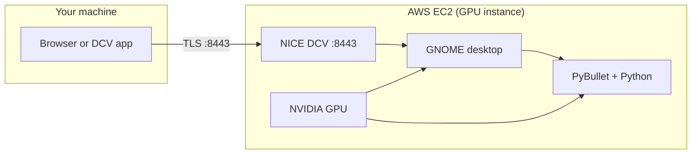
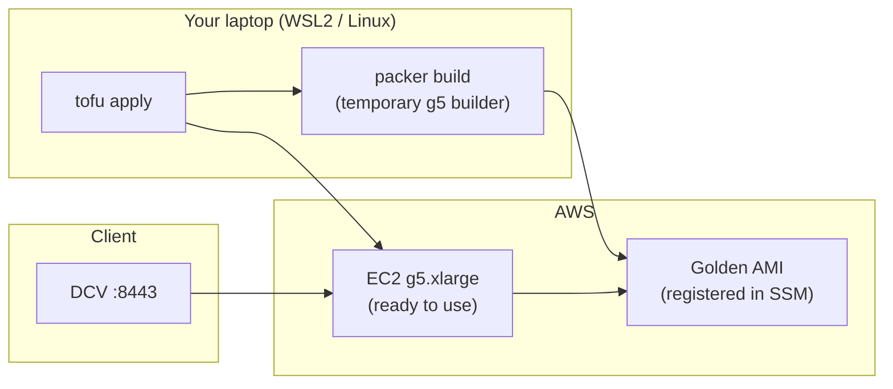
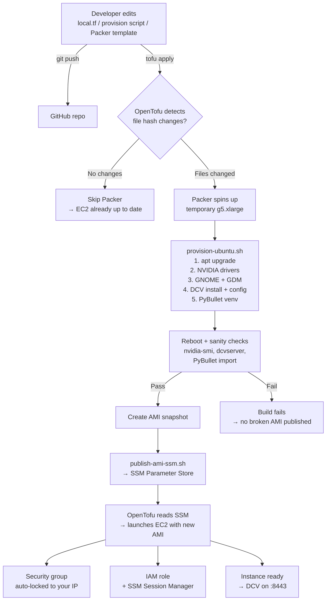
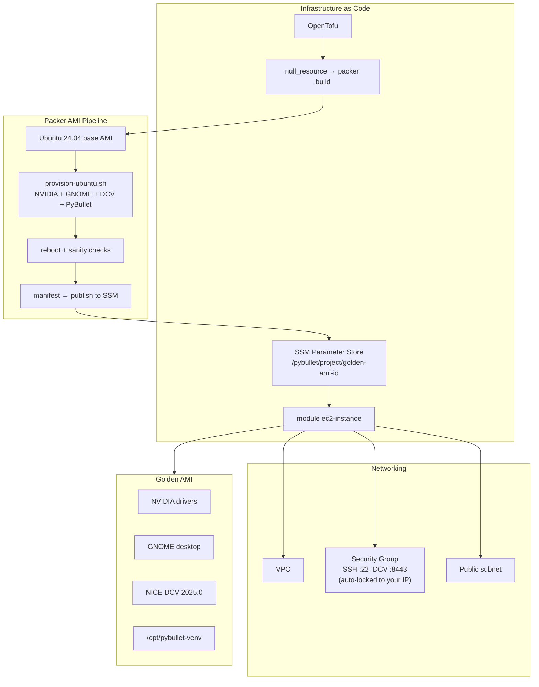

# aws-pybullet-environment

A GPU-powered cloud workstation for robotics and ML simulation. Uses **Packer** to build a golden AMI with everything pre-installed (NVIDIA drivers, GNOME desktop, NICE DCV remote access, PyBullet), and **OpenTofu** to deploy it on AWS EC2. You connect from a browser or the DCV native app — no local GPU needed.

**OS:** Ubuntu 24.04 LTS (migration in progress — see [ROADMAP.md](ROADMAP.md) for status and known issues)

---

## Architecture

### How it works



### Build and deploy pipeline



### DevOps flow



### What's inside the infrastructure



---

## What you get

| Component | Details |
|-----------|---------|
| **OS** | Ubuntu 24.04 LTS |
| **GPU** | NVIDIA drivers installed for g4dn/g5/g6 instances |
| **Desktop** | GNOME with GDM, Wayland disabled |
| **Remote access** | NICE DCV 2025.0 on port 8443 (pinned + SHA256 verified) |
| **Simulation** | PyBullet in `/opt/pybullet-venv` with numpy, scipy, Pillow, matplotlib |
| **Security** | SG auto-locked to your public IP, IMDSv2, encrypted gp3 volumes |
| **Access** | SSM Session Manager for shell access (no SSH key required) |

---

## Prerequisites

You need these installed on the machine where you'll run `tofu apply`:

- **AWS CLI v2** with a configured profile (default: `personal`)
- **OpenTofu** (`tofu` CLI)
- **Packer** — see [SETUP.md](SETUP.md) for install instructions
- **Python 3** (used by the SSM publish script)

Your AWS account needs:
- A **VPC** with a `Name` tag matching `local.vpc_name` (default: `default-vpc`)
- A **public subnet** with `Name` tag containing `public`
- IAM permissions for EC2, SSM, and Packer — see [SETUP.md](SETUP.md) for details

---

## Quick Start

### 1. Configure

Edit `infrastructure/local.tf`:

| Setting | What it does |
|---------|-------------|
| `vpc_name` | Must match your VPC's `Name` tag |
| `aws_cli_profile` | Must match `provider.tf` (default: `personal`) |
| `ec2_instance_type` | GPU instance type (default: `g5.xlarge`) |
| `allowed_ingress_cidrs` | Leave empty to auto-detect your IP, or set explicit CIDRs |
| `packer_ami_id_override` | Set to an `ami-…` to skip Packer entirely |

### 2. Deploy

**First time** (the SSM parameter doesn't exist yet, so Packer needs to run first):

```bash
cd infrastructure
tofu init
tofu apply -auto-approve -target=null_resource.packer_pybullet_ami[0]
tofu apply -auto-approve
```

**After that**, a single command is enough:

```bash
cd infrastructure
tofu apply -auto-approve
```

> The Packer build takes 30-60 minutes (it spins up a g5 to install NVIDIA drivers). The AMI is fully baked — instances boot ready to use with no cloud-init wait.

### 3. Connect

**Set the DCV password** (via SSM — this runs on the EC2 instance, not your laptop):

```bash
aws ssm start-session \
  --target "$(tofu output -raw pybullet_host_instance_id)" \
  --region "$(tofu output -raw aws_region)" \
  --profile personal
```

Then inside the SSM session:

```bash
sudo passwd ubuntu
```

**Open DCV in your browser:**

```bash
tofu output -raw pybullet_host_dcv_url
```

Go to the URL, accept the self-signed certificate, and log in as `ubuntu` with the password you just set.

### 4. Verify PyBullet

In a terminal on the remote desktop:

```bash
source /opt/pybullet-venv/bin/activate
python -c "import pybullet as p; c=p.connect(p.DIRECT); print('PyBullet OK, id =', c); p.disconnect()"
```

---

## Useful Commands

```bash
tofu output -raw pybullet_host_dcv_url        # DCV URL
tofu output -raw pybullet_host_public_ip       # Public IP
tofu output -raw pybullet_host_instance_id     # Instance ID for SSM
```

**If your IP changed** (VPN, ISP reassignment, etc.), re-apply to update the security group:

```bash
tofu apply -auto-approve
```

**Replace the instance** after a new AMI build:

```bash
tofu apply -auto-approve -replace='module.pybullet_host.aws_instance.this'
```

---

## Clipboard (Windows ↔ DCV)

- **Web client**: Click the settings gear → enable bidirectional clipboard. Allow the browser permission prompt.
- **Native client**: Connection/Preferences → enable clipboard redirection.
- **GNOME terminal**: Paste with `Shift+Insert` or `Ctrl+Shift+V` (not `Ctrl+V`).

---

## Security

The security group auto-locks SSH (22) and DCV (8443) to the public IP of the machine that ran `tofu apply`. This uses `data "http"` against `checkip.amazonaws.com` — no manual IP management needed.

If auto-detection ever breaks, there's a commented `0.0.0.0/0` fallback in `local.tf`. You can also set `allowed_ingress_cidrs` to a manual list.

`.gitattributes` forces LF line endings for `.tf`, `.pkr.hcl`, and `.sh` files to prevent CRLF issues on Windows.

---

## Cost

Each Packer build runs a **g5.xlarge** for 30-60+ minutes and creates an AMI snapshot. Builder instances and snapshots are tagged with `Project` and `PyBulletPacker` so you can track costs in AWS Cost Explorer.

Clean up old AMIs and snapshots when iterating — they accumulate fast.

---

## Rebuild Triggers

Packer re-runs automatically when `tofu apply` detects changes in:
- `packer/pybullet-ubuntu.pkr.hcl`
- `packer/scripts/provision-ubuntu.sh`
- `packer/scripts/publish-ami-ssm.sh`

Or when the SSM parameter name changes.

---

## Repository Layout

```
aws-pybullet-environment/
├── README.md                        # You're here
├── SETUP.md                         # Tool installation and IAM setup
├── TROUBLESHOOTING.md               # Common issues and fixes
├── ROADMAP.md                       # What's done, what's next, dev guide
├── .gitattributes                   # LF enforcement for .tf, .pkr.hcl, .sh
│
├── infrastructure/                  # OpenTofu root module
│   ├── provider.tf                  # AWS provider + S3 backend
│   ├── local.tf                     # Settings: instance type, VPC, CIDRs
│   ├── data.tf                      # VPC lookup, subnet discovery, IP detection
│   ├── packer.tf                    # null_resource → packer build + SSM lookup
│   ├── compute.tf                   # EC2 module wiring
│   ├── outputs.tf                   # Public IP, DCV URL, AMI id, etc.
│   └── modules/
│       └── ec2-instance/
│           ├── main.tf              # aws_instance (IMDSv2, gp3, tags)
│           ├── variables.tf         # Module inputs
│           ├── sg.tf                # Security group rules
│           ├── iam.tf               # IAM role + SSM policy
│           ├── data.tf              # Subnet discovery
│           ├── locals.tf            # Subnet coalesce logic
│           └── outputs.tf           # Module outputs
│
└── packer/                          # Golden AMI build
    ├── pybullet-ubuntu.pkr.hcl      # Packer template (Ubuntu 24.04)
    └── scripts/
        ├── provision-ubuntu.sh       # Install script (NVIDIA, GNOME, DCV, PyBullet)
        └── publish-ami-ssm.sh       # Publishes AMI id to SSM Parameter Store
```

---

## More Info

- **[SETUP.md](SETUP.md)** — How to install Packer, the SSM plugin, and what IAM permissions you need
- **[TROUBLESHOOTING.md](TROUBLESHOOTING.md)** — DCV connection issues, OpenTofu errors, SSM problems
- **[ROADMAP.md](ROADMAP.md)** — What's been done, the Ubuntu migration plan, and where to contribute next
