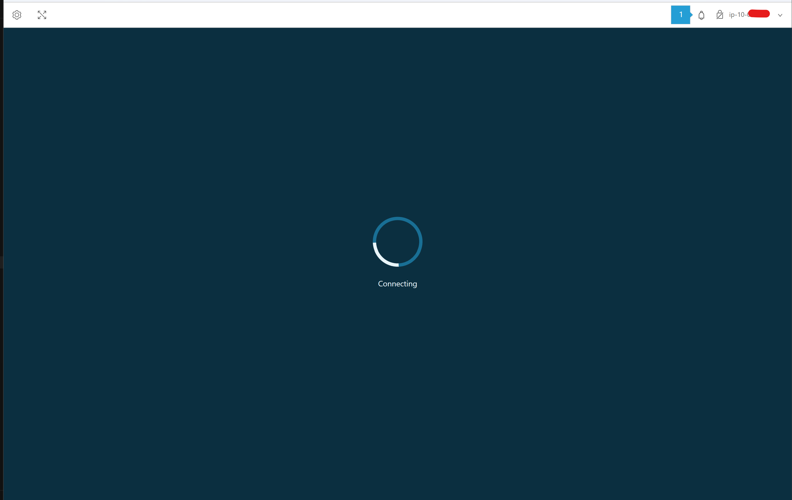
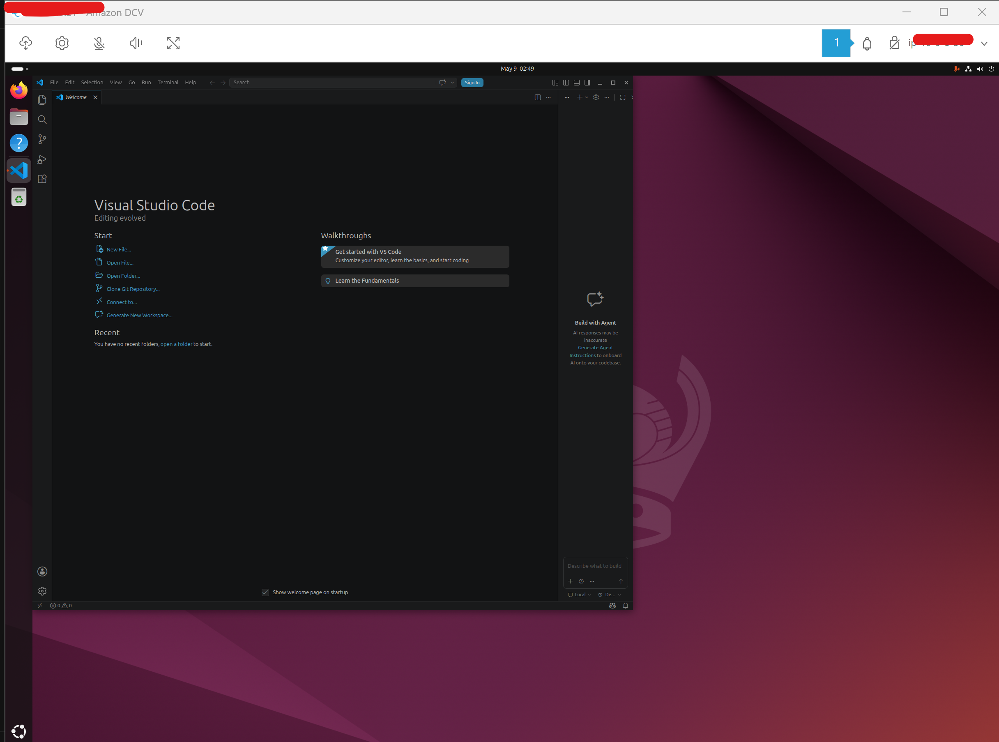
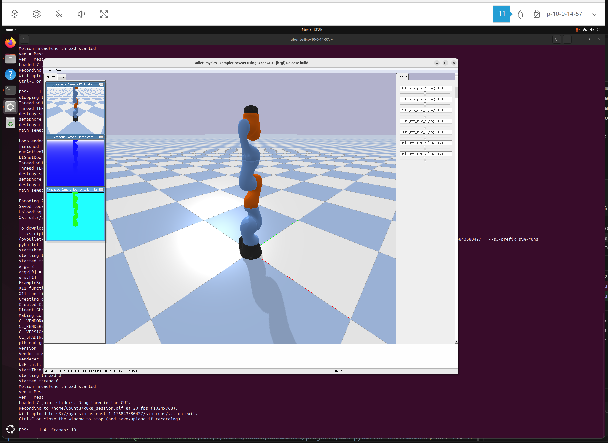
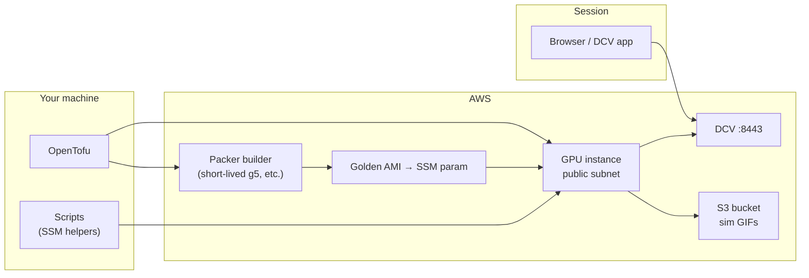
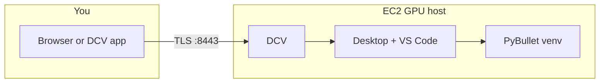

# Remote GPU workstation for PyBullet simulation on AWS

You get an Ubuntu desktop on a GPU EC2 box: **NVIDIA** drivers, **GNOME**, **Visual Studio Code**, **NICE DCV**, and **PyBullet** in a Python venv. **[Packer](https://developer.hashicorp.com/packer)** bakes that into one AMI; **[OpenTofu](https://opentofu.org/)** deploys it. You open DCV in a browser or native client—no GPU on your laptop.

**OS:** Ubuntu 24.04 LTS

For phase history, changelogs, and future work, see **[ROADMAP.md](ROADMAP.md)**. Setup (tools, IAM) is **[SETUP.md](SETUP.md)**. When something breaks, start with **[TROUBLESHOOTING.md](TROUBLESHOOTING.md)**.

## Recordings gallery

<table>
<tr>
<td align="center"><strong>Headless R2-D2 sim (SSM → S3)</strong></td>
<td align="center"><strong>Interactive Kuka arm (DCV desktop)</strong></td>
</tr>
<tr>
<td align="center"></td>
<td align="center"></td>
</tr>
<tr>
<td align="center"><em><code>run-pybullet-s3-sim-test.sh</code></em></td>
<td align="center"><em><code>interactive_robot_arm.py --record</code></em></td>
</tr>
</table>

<p align="center">
  
</p>

<p align="center"><em>DCV web client connecting to the GPU instance over HTTPS on port 8443.</em></p>

<p align="center">
  
</p>

<p align="center"><em>Full 1920x1080 Ubuntu GNOME desktop streamed via Amazon DCV (Xorg dummy driver).</em></p>

<p align="center">
  
</p>

<p align="center"><em>Interactive Kuka arm session running on the DCV desktop with joint sliders and live FPS.</em></p>

---

## Benefits and trade-offs

### Why this setup

- **No local GPU required.** Your laptop can be a thin client — a Chromebook or old ThinkPad is enough. All rendering and physics run on a cloud GPU (A10G on g5).
- **Reproducible environment.** Packer bakes every dependency into a golden AMI: NVIDIA drivers, GNOME, DCV, VS Code, PyBullet venv. No "works on my machine" drift between rebuilds.
- **Full desktop, not just a terminal.** NICE DCV streams a 1920x1080+ GNOME desktop over TLS. You get drag-and-drop, clipboard, and multi-monitor — not a laggy VNC session.
- **DCV is free on EC2.** Amazon includes the DCV server license at no extra charge when running on EC2 instances. No per-seat or per-hour licensing fees.
- **One-command deploy.** `tofu apply -auto-approve` handles everything: network, IAM, AMI build (if needed), EC2 launch. Tear it down just as fast.
- **Pay only when running.** Stop the instance when you're done for the day. Compute billing stops immediately; only the 80 GB gp3 disk continues to cost (~$6.40/month).
- **Headless sim pipeline included.** Run simulations, record to GIF, upload to S3 — all without opening a desktop. Useful for batch runs or CI.
- **Security group auto-locks to your IP.** No broad `0.0.0.0/0` rules — ingress is restricted to the IP that ran the last `tofu apply`.
- **SSM Session Manager access.** No SSH keys to manage. AWS IAM controls who can connect.

### Trade-offs and limitations

- **GPU instance cost.** g5.xlarge runs ~$1.006/hr on-demand in us-east-1. Leaving it running overnight or over a weekend adds up fast. You need the discipline to stop it.
- **AMI build time.** A fresh Packer build takes 30–60+ minutes (NVIDIA drivers, desktop packages, DCV). Iterating on the provision script means waiting.
- **Stored AMI and snapshots cost money at rest.** Each golden AMI snapshot sits in EBS at ~$0.05/GB/month. A single 80 GB snapshot is ~$4/month. If you iterate and forget to deregister old AMIs, these accumulate.
- **Public IP changes on stop/start.** Unless you attach an Elastic IP ($3.65/month if attached to a running instance, $3.65/month if idle), the public IP rotates every time you stop and start the instance. Scripts handle this, but browser bookmarks break.
- **Single-user.** DCV console session supports one user at a time. This is a personal workstation, not a shared server.
- **Region-dependent availability.** g5 instances are not available in every AZ. If your default subnet is in an AZ without g5 capacity, the launch fails — pick a different subnet.
- **Latency to the desktop.** DCV is responsive over good broadband, but on high-latency or lossy connections (satellite, congested Wi-Fi), the experience degrades. For interactive sliders and real-time 3D, <50 ms RTT to the region is ideal.
- **AWS account required.** You need an account, credentials, and enough IAM permissions. The setup guide covers it, but there is a bootstrapping step for new accounts.

---

## What you get

| | |
|--|--|
| **OS** | Ubuntu 24.04 LTS |
| **GPU** | NVIDIA drivers for typical g4/g5/g6 instance types |
| **Desktop** | GNOME + GDM (Wayland off) |
| **Remote UI** | NICE DCV on **TCP 8443** (pinned build, checksum checked in Packer) |
| **Editor** | Microsoft **`code`** package—launch from the desktop |
| **Simulation** | PyBullet in **`/opt/pybullet-venv`** (`numpy`, `scipy`, Pillow, **`boto3`**, etc.; URDFs via bundled **`pybullet_data`**) |
| **Access** | **SSM Session Manager** (no SSH keys required for admin) |
| **Network** | Security group restricts **SSH 22** and **DCV 8443** to your public IP (detected when you **`tofu apply`**) |

---

## How it fits together

**You:** run OpenTofu from your Mac, Linux box, or WSL2—it talks to AWS, optionally runs Packer, then creates or updates the EC2 instance. **AWS:** keeps the golden AMI id in **SSM**; the instance boots from it. **You again:** connect with DCV for a full desktop or use scripts that talk to the instance via **SSM**.


```mermaid
flowchart LR
  subgraph laptop["Your machine"]
    TOFU["OpenTofu"]
    SCR["Scripts\n(SSM helpers)"]
  end
  subgraph aws["AWS"]
    PK["Packer builder\n(short-lived g5, etc.)"]
    AMI["Golden AMI → SSM param"]
    EC2["GPU instance\npublic subnet"]
    DCV["DCV :8443"]
    S3["S3 bucket\nsim GIFs"]
  end
  TOFU --> PK
  PK --> AMI
  TOFU --> EC2
  AMI --> EC2
  subgraph you["Session"]
    B["Browser / DCV app"]
  end
  B --> DCV
  EC2 --> DCV
  SCR --> EC2
  EC2 --> S3
```


```mermaid
flowchart LR
  subgraph client["You"]
    B["Browser or DCV app"]
  end
  subgraph host["EC2 GPU host"]
    DCV["DCV"]
    DK["Desktop + VS Code"]
    PB["PyBullet venv"]
  end
  B -->|"TLS :8443"| DCV
  DCV --> DK
  DK --> PB
```

### Build and AMI refresh

Roughly:

1. You run **`tofu apply`** from **`infrastructure/`**.
2. If the Packer template or provision scripts changed, OpenTofu runs **Packer** (expect **~30–60+ minutes** on a **`g5.xlarge`** builder).
3. A new AMI is registered; its id is written to **SSM** (parameter name is in **`outputs`** / **`local.tf`**).
4. EC2 is created or updated to use that AMI.

If you haven’t changed anything that triggers Packer, a later apply may only refresh networking or sizing.

---

## Prerequisites

On the machine that runs **`tofu`**:

| Need | Notes |
|------|--------|
| **AWS CLI v2** | Profile aligned with **`infrastructure/provider.tf`** (often **`personal`**) |
| **OpenTofu** **`tofu`** | On **`PATH`** |
| **Packer** | On **`PATH`** for OpenTofu’s Packer **`local-exec`** (same shell as **`tofu apply`)** — see **[SETUP.md](SETUP.md)** |
| **Python 3** | Used when publishing AMI id to SSM |

**Optional — NICE DCV on your machine:** Connecting with a **web browser** to **`https://<public-ip>:8443`** does **not** require installing DCV locally. For the **native DCV viewer** on Windows, macOS, or Linux, use the installers linked from **[NICE DCV on AWS](https://aws.amazon.com/hpc/dcv/)**. If you maintain a Linux workstation (or want the full package stack used on EC2), Linux packaging and prerequisites are documented in **[Installing the NICE DCV server on Linux](https://docs.aws.amazon.com/dcv/latest/adminguide/setting-up-installing-linux-server.html)** *(admin guide: server-side install; laptops usually install only the **viewer client**).* 

In AWS:

- A **VPC** whose **`Name`** matches **`local.vpc_name`** (default **`default-vpc`**).
- A **public subnet** whose **`Name`** contains **`public`**.
- Enough IAM for EC2, SSM, and Packer (**[SETUP.md](SETUP.md)**).

---

## Quick start

### 1. Configure

Edit **`infrastructure/local.tf`** (subnet/VPC/IP rules, instance size, AMI override):

| Setting | Purpose |
|---------|---------|
| **`vpc_name`** | Must match your VPC **`Name`** tag |
| **`aws_cli_profile`** | Matches AWS provider (**`personal`** by default) |
| **`ec2_instance_type`** | e.g. **`g5.xlarge`** |
| **`allowed_ingress_cidrs`** | Empty → auto-set from your egress IP |
| **`packer_ami_id_override`** | **`null`** = build/use Packer pipeline and SSM. Set **`ami-…`** only to skip Packer on purpose |

### 2. Deploy

First time (**no golden AMI parameter yet**) with **`packer_ami_id_override = null`**:

```bash
cd infrastructure
tofu init
tofu apply -auto-approve -target=null_resource.packer_pybullet_ami[0]
tofu apply -auto-approve
```

After that, normally:

```bash
cd infrastructure
tofu apply -auto-approve
```

### 3. Host address — OpenTofu outputs

From **`infrastructure/`** (anywhere below, run **`cd infrastructure`** first or prefix paths).

| Output | Meaning |
|--------|---------|
| **`pybullet_host_public_ip`** | Elastic IPv4 / public IP of the instance (**changes after stop/start unless you attach an EIP in AWS**) |
| **`pybullet_host_dcv_url`** | **`https://<that-ip>:8443`** — use this in a browser as the DCV endpoint |
| **`pybullet_host_instance_id`** | Needed for **`aws ssm start-session`** |

If the instance was **stopped**, from the **repository root** you can start it and print **current** DCV / SSM login hints (live **`PublicIpAddress`**, not only stale tofu output): **`./scripts/start-pybullet-host.sh`** — see **`scripts/start-pybullet-host.sh`** under [Scripts](#scripts-flags-environment-variables-examples).

```bash
cd infrastructure
tofu output -raw pybullet_host_public_ip
tofu output -raw pybullet_host_dcv_url
```

Copy the URL, or open it from the shell (**Linux / WSL with a desktop**):

```bash
# After: cd infrastructure
xdg-open "$(tofu output -raw pybullet_host_dcv_url)"          # many Linux setups
# macOS:
# open "$(cd infrastructure && tofu output -raw pybullet_host_dcv_url)"
# WSL → Windows default browser (if wslview installed):
# wslview "$(cd /path/to/repo/infrastructure && tofu output -raw pybullet_host_dcv_url)"
```

**`pybullet_host_dcv_url`** is the full **`https://…:8443`** URL built from **`pybullet_host_public_ip`**. Use **`pybullet_host_public_ip`** alone for ping, **`curl`**, or the native DCV client (**hostname** = that IP, **port** = **8443**).

### 4. Set the **`ubuntu`** password (first time, over SSM)

The DCV login is **not** your AWS password. Set a Linux password **on the instance** once:

```bash
aws ssm start-session \
  --target "$(cd infrastructure && tofu output -raw pybullet_host_instance_id)" \
  --region "$(cd infrastructure && tofu output -raw aws_region)" \
  --profile personal
```

Then in that session:

```bash
sudo passwd ubuntu
```

Pick a strong password; remember it for the next step.

### 5. Sign in with the **web** client (browser)

1. In your browser, go to **`pybullet_host_dcv_url`** (e.g. **`https://3.xx.yy.zz:8443`**).
2. You will get a **certificate warning** — the AMI uses a **self-signed** TLS cert. Use **Advanced → Proceed** (wording depends on the browser). This is normal for a lab box.
3. You should see the **NICE DCV** connection page (web client).
4. **Username:** **`ubuntu`** exactly (not **`ssm-user`** or **`root`**).
5. **Password:** the one you set with **`sudo passwd ubuntu`**.
6. After the session starts, you should get a **GNOME** desktop. Clipboard and quality options live in the **web client settings** (gear icon); see **Clipboard** at the end of this README if you paste from Windows.

If the page does not load: confirm the instance is **running**, your **public IP** still matches **`tofu output`** (IPs change after stop/start), and your **current** public IP is allowed in the security group — run **`tofu apply -auto-approve`** from **`infrastructure/`** after a VPN or ISP change.

### 6. Optional checks on the desktop

Sanity-check PyBullet in a terminal on the remote desktop:

```bash
source /opt/pybullet-venv/bin/activate
python -c "import pybullet as p; c=p.connect(p.DIRECT); print('PyBullet OK, id =', c); p.disconnect()"
```

Launch **Visual Studio Code** from GNOME (**Activities** → “Visual Studio Code”) or **`code`** in a shell.

---

## Scripts: flags, environment variables, examples

Everything below assumes you run commands from the **repository root**. Put **`tofu`** on **`PATH`** everywhere below; **`packer`** is only required on the box where you **`tofu apply`** when the Packer **`local-exec`** runs. Scripts ship **`chmod +x`** from git — use **`bash scripts/…`** or **`chmod +x scripts/*.sh`** if yours lost the executable bit.

**AWS profile:** all of these honour **`AWS_PROFILE`** (defaults to **`personal`**, consistent with **`infrastructure/local.tf`** / **`provider.tf`**).

---

### `scripts/run-acceptance.sh`

Runs **`scripts/acceptance/on-instance-checks.sh`** on the instance via SSM (Ubuntu 24.04, DCV, VS Code, PyBullet import; **`nvidia-smi`** on g4dn/g5/g6 is warning-only unless **`STRICT_ACCEPTANCE_GPU=1`**). Then, unless skipped, curls your public DCV URL from **this laptop** to sanity-check TLS reachability.

**Flags:**

| Flag | Meaning |
|------|---------|
| *(none)* | Run on-instance checks, then **`curl`** the DCV URL from the workstation |
| **`--skip-external`** | Skip the workstation **`curl`** (useful if your current IP isn’t in the SG) |
| **`-h`**, **`--help`** | Usage + environment-variable summary |

**Environment:**

| Variable | Default | Meaning |
|----------|---------|---------|
| **`AWS_PROFILE`** | **`personal`** | AWS CLI profile |
| **`STRICT_ACCEPTANCE_GPU`** | unset / **`0`** | Set to **`1`** to **fail** on **g4dn/g5/g6** when **`nvidia-smi`** breaks |
| **`EC2_START_WAIT_MAX_SEC`** | **`600`** | Max seconds wait after **`ec2-host-precheck`** starts a stopped instance |

**Examples:**

```bash
./scripts/run-acceptance.sh
./scripts/run-acceptance.sh --skip-external
STRICT_ACCEPTANCE_GPU=1 ./scripts/run-acceptance.sh
AWS_PROFILE=work ./scripts/run-acceptance.sh --skip-external
STRICT_ACCEPTANCE_GPU=1 ./scripts/run-acceptance.sh --skip-external
./scripts/run-acceptance.sh --help
```

---

### `scripts/run-pybullet-s3-sim-test.sh`

Headless **`DIRECT`** sim plus GIF upload (**SSM Run Command** → **`scripts/pybullet_deep_test/run_sim_and_upload.py`**). Bucket/prefix/instance id come from OpenTofu outputs and **`tofu`**. No CLI flags besides what **`bash`** passes through (there are none implemented).

**Environment (workstation):**

| Variable | Default | Meaning |
|----------|---------|---------|
| **`AWS_PROFILE`** | **`personal`** | AWS CLI profile for SSM |

**On-instance (set by the runner; only if you run the Python by hand):** **`PYBULLET_S3_BUCKET`** (required), **`PYBULLET_S3_PREFIX`** (optional, default **`sim-runs`**), **`EC2_INSTANCE_ID`**, **`AWS_DEFAULT_REGION`** / **`AWS_REGION`**.

**Examples:**

```bash
./scripts/run-pybullet-s3-sim-test.sh
AWS_PROFILE=work ./scripts/run-pybullet-s3-sim-test.sh
bash ./scripts/run-pybullet-s3-sim-test.sh   # same, if chmod is missing
```

---

### `scripts/list-pybullet-sim-recordings.sh`

Lists **`.gif`** objects under **`${PYBULLET_S3_PREFIX}/`** (default **`sim-runs`**) in the artifacts bucket (**`tofu output pybullet_sim_artifacts_bucket`**), newest Key first.

**Flags:**

| Flag | Meaning |
|------|---------|
| *(none)* | Table: **`LastModified`**, size, **`s3://`** URI |
| **`--uris-only`** | One **`s3://…`** URI per line, newest first |
| **`-h`**, **`--help`** | Minimal usage |

**Environment:**

| Variable | Default |
|----------|---------|
| **`AWS_PROFILE`** | **`personal`** |
| **`PYBULLET_S3_PREFIX`** | **`sim-runs`** |

**Examples:**

```bash
./scripts/list-pybullet-sim-recordings.sh
./scripts/list-pybullet-sim-recordings.sh --uris-only
FIRST="$(./scripts/list-pybullet-sim-recordings.sh --uris-only | head -1)"
echo "$FIRST"
PYBULLET_S3_PREFIX=sim-runs ./scripts/list-pybullet-sim-recordings.sh
AWS_PROFILE=work ./scripts/list-pybullet-sim-recordings.sh --uris-only
```

---

### `scripts/download-pybullet-sim-recording.sh`

**Flags:** **`--help`**, **`-h`** — print usage and exit (**no positional args** consumed).

**Environment:** **`AWS_PROFILE`** (default **`personal`**).

Downloads one object. **First argument:** an **`s3://bucket/key`** URI, an **HTTPS virtual-hosted-style** S3 URL (`https://bucket.s3.region.amazonaws.com/key` or `https://bucket.s3.amazonaws.com/key`), or **just the object key** (must look like **`sim-runs/i-123/…/file.gif`** — script requires a **`/`** so it knows it isn’t garbage; OpenTofu supplies the bucket). **Second argument (optional):** destination file — omitted → **`recordings/<basename of key>`**; bare **`name.gif`** → **`recordings/name.gif`**; **`path/with/slash.gif`** relative to repo root; **`/abs/path`** as-is.

**Examples:**

```bash
# Newest GIF in bucket → recordings/r2d2_plane_sim.gif (default basename)

URI="$(./scripts/list-pybullet-sim-recordings.sh --uris-only | head -1)"
./scripts/download-pybullet-sim-recording.sh "$URI"

./scripts/run-pybullet-s3-sim-test.sh
LATEST="$(./scripts/list-pybullet-sim-recordings.sh --uris-only | head -1)"
./scripts/download-pybullet-sim-recording.sh "$LATEST"

./scripts/download-pybullet-sim-recording.sh \
  's3://YOUR_BUCKET/sim-runs/i-XXX/20260101T120000Z/r2d2_plane_sim.gif'

./scripts/download-pybullet-sim-recording.sh \
  'https://YOUR_BUCKET.s3.us-east-1.amazonaws.com/sim-runs/i-XXX/run/r2d2_plane_sim.gif'

./scripts/download-pybullet-sim-recording.sh \
  'sim-runs/i-XXX/20260101T120000Z/r2d2_plane_sim.gif'

./scripts/download-pybullet-sim-recording.sh "$URI" 'my-run.gif'
./scripts/download-pybullet-sim-recording.sh "$URI" 'artifacts/keep/my-run.gif'
./scripts/download-pybullet-sim-recording.sh "$URI" '/tmp/from-s3.gif'
./scripts/download-pybullet-sim-recording.sh --help

source_uri='s3://...'
./scripts/download-pybullet-sim-recording.sh "$source_uri" "$(basename "${source_uri%.gif}")-copy.gif"

./scripts/list-pybullet-sim-recordings.sh --uris-only | head -1 | \
  xargs -I{} ./scripts/download-pybullet-sim-recording.sh {}
```

Replace **`YOUR_BUCKET`** with the value of **`cd infrastructure && tofu output -raw pybullet_sim_artifacts_bucket`** where you paste literals.

For **`--help`**, **`download-pybullet-sim-recording.sh`** prints usage and exits (**no download** performed).

---

### `scripts/start-pybullet-host.sh`

Uses OpenTofu outputs (**`pybullet_host_instance_id`**, **`aws_region`**) and **`scripts/lib/ec2-host-precheck.sh`** to ensure the host reaches **`running`**: starts it if **stopped**, waits if **pending**, and if it is **already running** prints **`EC2: … already running`** and continues (**no error**—useful for idempotent “show me how to connect” runs).

After that, it reads **live** **`PublicIpAddress`** from **`aws ec2 describe-instances`** (correct after stop/start; **`tofu output pybullet_host_public_ip`** may lag until **`tofu refresh`**).

**If there is no public IPv4** (subnet, **`associate_public_ip`**, or boot timing): it prints **`WARN:`** on stderr, leaves **DCV** lines as placeholders (**`(none — no public IPv4 yet; …)`** / **`n/a`** for host), and still prints the **SSM** command so you can fix or debug the box. With **`--json`**, **`public_ip`** and **`dcv_url`** are empty strings and a **`warn`** field is added.

**Flags:**

| Flag | Meaning |
|------|---------|
| *(none)* | Start if needed, wait running, print human-readable login block |
| **`--wait-ssm`** | After that, poll until SSM reports **Online** (about **3 minutes** max; useful before **`run-acceptance.sh`** / sim scripts). If still not online, prints **`WARN:`** but exits **0**. |
| **`--json`** | One JSON object: **`instance_id`**, **`region`**, **`public_ip`**, **`dcv_url`**, **`dcv_port`**, **`username`**, **`password_note`**, **`aws_profile`**, and **`warn`** (only when there is no public IPv4) |
| **`-h`**, **`--help`** | Usage |

**Environment:**

| Variable | Default | Meaning |
|----------|---------|---------|
| **`AWS_PROFILE`** | **`personal`** | AWS CLI profile |
| **`EC2_START_WAIT_MAX_SEC`** | **`600`** | Max seconds to wait after a stopped instance is started |

**Examples:**

```bash
./scripts/start-pybullet-host.sh
./scripts/start-pybullet-host.sh --wait-ssm
./scripts/start-pybullet-host.sh --wait-ssm --json
AWS_PROFILE=work ./scripts/start-pybullet-host.sh --json
./scripts/start-pybullet-host.sh --help
```

---

### `scripts/stop-pybullet-host.sh`

Calls **`aws ec2 stop-instances`** for **`pybullet_host_instance_id`** in **`aws_region`**. Refuses instances whose **Name** tag matches **`*packer-builder*`**.

**Flags:**

| Flag | Meaning |
|------|---------|
| *(none)* | Request stop, return immediately |
| **`--wait`** | **`aws ec2 wait instance-stopped`** after the API call |
| **`-h`**, **`--help`** | Usage |

**Environment:**

| Variable | Default |
|----------|---------|
| **`AWS_PROFILE`** | **`personal`** |

**Examples:**

```bash
./scripts/stop-pybullet-host.sh
./scripts/stop-pybullet-host.sh --wait
AWS_PROFILE=work ./scripts/stop-pybullet-host.sh --wait
./scripts/stop-pybullet-host.sh --help
```

---

### `scripts/acceptance/on-instance-checks.sh`

Meant for **SSM Session Manager** when you SSH “in”, or invoked by **`run-acceptance.sh`**. Runs on the EC2 box; **does not call OpenTofu**.

**Environment (on instance only):**

| Variable | Effect |
|----------|--------|
| **`STRICT_ACCEPTANCE_GPU`** | **`1`** → **`nvidia-smi`** failure on GPU types is a hard **FAIL** |

**Example:**

```bash
sudo -E bash scripts/acceptance/on-instance-checks.sh
# inside repo clone on VM, or after copying script:
STRICT_ACCEPTANCE_GPU=1 bash /path/to/on-instance-checks.sh
```

---

### `scripts/interactive_robot_arm.py`

**Run on the DCV desktop** (needs a display — not headless). Loads the **Kuka iiwa 7-DOF** robot arm from `pybullet_data`, creates one slider per revolute joint (labelled in degrees), and lets you pose the arm in real time. Optionally records the session to a GIF and uploads it to S3.

**Flags:**

| Flag | Default | Meaning |
|------|---------|---------|
| *(none)* | | Interactive-only — no recording |
| **`--record FILE`** | | Capture the GUI viewport to an animated GIF on exit |
| **`--fps N`** | **`15`** | GIF frame rate (frames per second) |
| **`--width N`** | **`800`** | Capture width in pixels |
| **`--height N`** | **`600`** | Capture height in pixels |
| **`--s3-bucket BUCKET`** | | Upload the GIF to this S3 bucket after saving locally |
| **`--s3-prefix PREFIX`** | **`sim-runs`** | S3 key prefix (`<prefix>/<utc-timestamp>/<filename>`) |
| **`-h`**, **`--help`** | | Usage summary |

**Requirements (on the instance):**

- A display (run inside the DCV desktop session, not over bare SSM).
- `/opt/pybullet-venv` activated (`source /opt/pybullet-venv/bin/activate`).
- For recording: `numpy` and `Pillow` (already in the venv).
- For S3 upload: `boto3` (already in the venv) and instance role with `s3:PutObject`.

**Examples:**

```bash
source /opt/pybullet-venv/bin/activate

# Interactive only — drag sliders, see FPS in terminal
python3 interactive_robot_arm.py

# Record the session to a local GIF
python3 interactive_robot_arm.py --record kuka_session.gif

# Record at higher resolution and frame rate
python3 interactive_robot_arm.py --record kuka_session.gif --fps 20 --width 1024 --height 768

# Record + upload to the project S3 bucket
python3 interactive_robot_arm.py \
  --record kuka_session.gif \
  --fps 20 \
  --width 1024 \
  --height 768 \
  --s3-bucket pyb-sim-us-east-1-176843580427 \
  --s3-prefix sim-runs

# Then from your workstation, download the recording:
./scripts/download-pybullet-sim-recording.sh \
  's3://pyb-sim-us-east-1-176843580427/sim-runs/<timestamp>/kuka_session.gif'
```

**Stopping:** Press **Ctrl-C** or close the GUI window. The GIF is encoded and uploaded (if flags were set) after the loop exits — both exit methods trigger save/upload.

---

### **`scripts/lib/ec2-host-precheck.sh`** (library)

Not a runnable entrypoint. **`source`**‘d by **`run-acceptance.sh`**, **`run-pybullet-s3-sim-test.sh`**, and **`start-pybullet-host.sh`**. Start/stop/instance-id validation lives here. When the instance is **already running**, **`ec2_host_precheck`** returns success **immediately** (no long polling loop), which avoids rare **`describe-instances`** flakes that could time out even though the instance never left **`running`**.

---

## OpenTofu outputs (handy snippets)

Common **`tofu output`** values (run from **`infrastructure/`**):

```bash
tofu output -raw pybullet_host_dcv_url
tofu output -raw pybullet_host_public_ip
tofu output -raw pybullet_host_instance_id
tofu output -raw pybullet_sim_artifacts_bucket
```

If your home IP moved (VPN, etc.), **`tofu apply -auto-approve`** refreshes the security group.

Force a **new EC2** from the current AMI—see **[TROUBLESHOOTING.md](TROUBLESHOOTING.md)** for context:

```bash
tofu apply -auto-approve -replace='module.pybullet_host.aws_instance.this'
```

### Apply only S3 + IAM (skip Packer this round)

Example when you touched **`s3_pybullet_sim.tf`** and don’t want a full AMI build:

```bash
cd infrastructure
tofu apply -auto-approve \
  -target=aws_s3_bucket.pybullet_sim \
  -target=aws_s3_bucket_public_access_block.pybullet_sim \
  -target=aws_s3_bucket_server_side_encryption_configuration.pybullet_sim \
  -target=aws_s3_bucket_lifecycle_configuration.pybullet_sim \
  -target=aws_iam_role_policy.pybullet_host_s3_sim_upload
```

Then **`./scripts/run-pybullet-s3-sim-test.sh`** once the instance is **running** and SSM reports **Online**. Run Command stdout prints the **`s3://`** key; feed it into **`download-pybullet-sim-recording.sh`**.

---

## Cost breakdown

All prices are **us-east-1 on-demand** as of mid-2026. Spot, Savings Plans, and Reserved Instances can cut compute 40–70% but are not covered here.

### Per-resource costs

| Resource | Spec | Unit price | Notes |
|----------|------|-----------|-------|
| **g5.xlarge** (1 A10G GPU, 4 vCPU, 16 GB RAM) | Compute | **$1.006 / hr** | Billed per-second while **running**. $0 when stopped. |
| **gp3 root volume** | 80 GB, 3000 IOPS, 125 MB/s | **$0.08 / GB / month** = **~$6.40 / month** | Billed whether the instance is running or stopped. Only deleted on terminate. |
| **EBS snapshot** (golden AMI) | ~80 GB stored | **$0.05 / GB / month** = **~$4.00 / month** | One snapshot per AMI. Old AMIs accumulate if not pruned. |
| **S3 sim artifacts** | GIF objects under `sim-runs/` | **$0.023 / GB / month** (Standard) | Tiny at typical usage (a few MB of GIFs). 90-day lifecycle auto-expires. |
| **S3 requests** | PUT/GET/LIST | **$0.005 per 1K PUTs**, **$0.0004 per 1K GETs** | Negligible for this workload. |
| **Data transfer out** | DCV stream + S3 downloads | **$0.09 / GB** after first 100 GB/month free | DCV is efficient (~1–5 Mbps); a few hours/day stays well within the free tier. |
| **NICE DCV license** | Server on EC2 | **$0** | Included at no charge on EC2. |
| **Elastic IP** (optional) | Stable public IPv4 | **$3.65 / month** (attached, running) | Not provisioned by default. Only needed if you want a fixed IP. |

### Monthly estimates by usage pattern

Assumes the instance is **stopped** outside working hours. Packer rebuilds are rare (1–2/month at most) and amortized across the month.

| Usage pattern | Compute hours/month | Compute cost | Storage (disk + snapshot) | Total/month |
|---------------|--------------------:|-------------:|--------------------------:|------------:|
| **Light** — 2 hrs/day, 5 days/week | ~44 hrs | ~$44 | ~$10 | **~$54** |
| **Moderate** — 4 hrs/day, 5 days/week | ~88 hrs | ~$89 | ~$10 | **~$99** |
| **Heavy** — 8 hrs/day, 5 days/week | ~176 hrs | ~$177 | ~$10 | **~$187** |
| **Always-on** (not recommended) | ~730 hrs | ~$734 | ~$10 | **~$744** |

### Packer build cost (one-time per AMI)

Each Packer run spins up a g5.xlarge for ~30–60 minutes, then terminates it. At $1.006/hr, one build costs roughly **$0.50–$1.00** in compute. The resulting AMI snapshot adds ~$4/month until deregistered. Tag **`PyBulletPacker`** helps find old AMIs in Cost Explorer.

### Tips to keep costs down

1. **Stop the instance when you're done.** This is the single biggest lever. Compute is >90% of the bill during active use.
   ```bash
   ./scripts/stop-pybullet-host.sh        # queue stop
   ./scripts/stop-pybullet-host.sh --wait  # wait for stopped state
   ```
2. **Deregister old AMIs.** Each Packer rebuild creates a new AMI + snapshot. Prune ones you no longer need.
3. **Terminate when not using for weeks.** Stopping still bills for the gp3 volume ($6.40/month). Terminating frees it. A later `tofu apply` recreates everything from the golden AMI.
4. **Consider Spot.** g5.xlarge Spot is often 60–70% cheaper ($0.30–$0.40/hr). Interruptions are rare for interactive work but possible — save frequently.
5. **Use a smaller instance for non-GPU work.** If you're only editing code or running CPU-only PyBullet (`p.DIRECT`), a `t3.xlarge` at $0.1664/hr works and has no GPU surcharge.
6. A later **`tofu apply`** may restart the instance if the resource definition expects it **running** — check after applying.

---

## Clipboard (Windows ↔ DCV)

- Web client: **Settings** → clipboard → enable both directions.

- Native DCV client: enable clipboard redirection in preferences.

- **GNOME Terminal:** **`Shift+Insert`** or **`Ctrl+Shift+V`** to paste—not plain **`Ctrl+V`**.

---

## Security (short)

Ingress to **22**/**8443** is tied to **`tofu apply`**’s view of your public IP (**`checkip.amazonaws.com`**). Fallbacks live in **`local.tf`** if you must open wider (not recommended by default).

**`.gitattributes`** keeps **`.tf`**, **`.pkr.hcl`**, **`.sh`** as LF across Windows checkouts.

---

## Repository layout

```
aws-pybullet-environment/
├── README.md
├── recordings/                     # Sample GIFs tracked; other *.gif usually gitignored
├── SETUP.md
├── TROUBLESHOOTING.md
├── ROADMAP.md
├── scripts/
│   ├── lib/ec2-host-precheck.sh
│   ├── run-acceptance.sh
│   ├── run-pybullet-s3-sim-test.sh
│   ├── start-pybullet-host.sh
│   ├── stop-pybullet-host.sh
│   ├── list-pybullet-sim-recordings.sh
│   ├── download-pybullet-sim-recording.sh
│   ├── interactive_robot_arm.py    # GUI: Kuka arm + sliders + optional GIF/S3
│   ├── pybullet_deep_test/run_sim_and_upload.py
│   └── acceptance/on-instance-checks.sh
├── infrastructure/                 # OpenTofu root (+ modules/ec2-instance)
└── packer/                         # *.pkr.hcl + scripts/
```

Architecture diagrams (**client → EC2**, **build pipeline**, **SSM/S3**) and a detailed phased history live in **[ROADMAP.md](ROADMAP.md)**.
