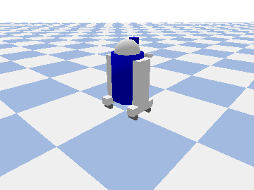
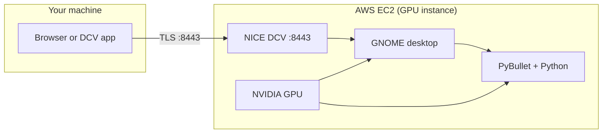
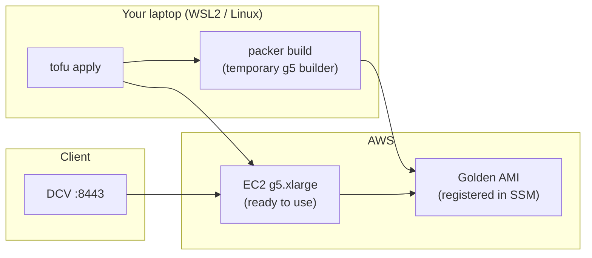
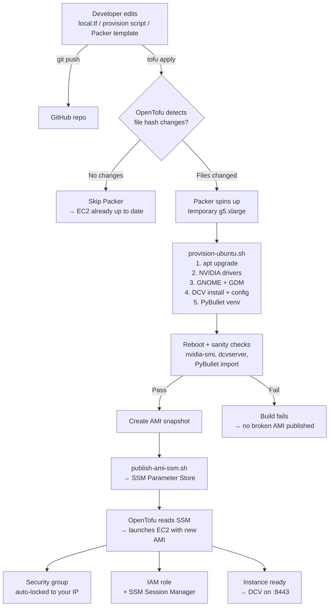
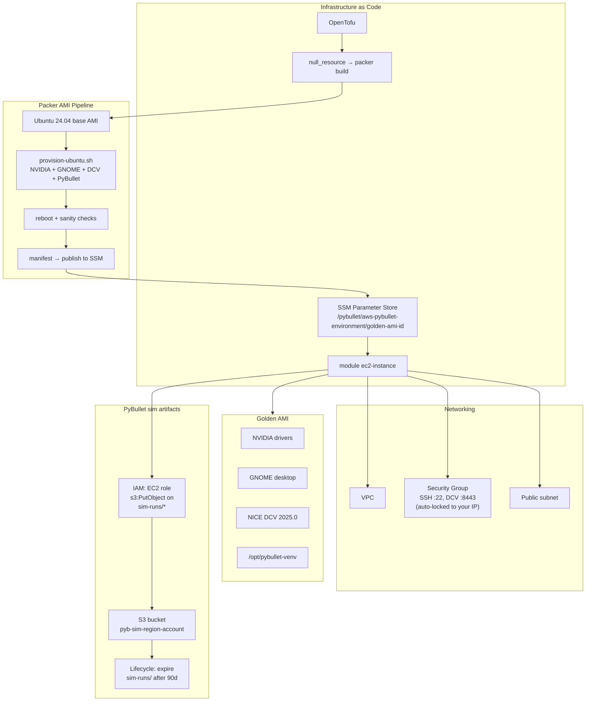
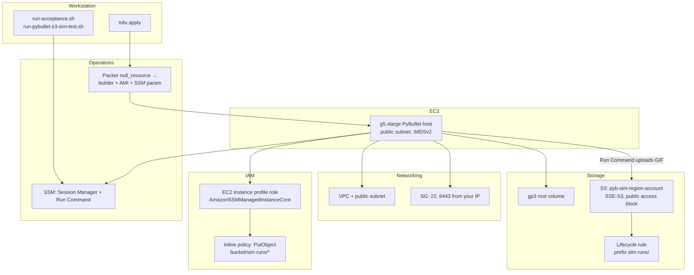

# Remote GPU workstation for PyBullet simulation on AWS

A GPU-powered cloud workstation for robotics and ML simulation. Uses **Packer** to build a golden AMI with everything pre-installed (NVIDIA drivers, GNOME desktop, **Visual Studio Code**, NICE DCV remote access, PyBullet), and **OpenTofu** to deploy it on AWS EC2. You connect from a browser or the DCV native app — no local GPU needed.

**OS:** Ubuntu 24.04 LTS | See [ROADMAP.md](ROADMAP.md) for the full changelog

## Recordings gallery

Headless PyBullet run from the GPU host: checkerboard plane, stock R2-D2 URDF, TinyRenderer capture, then upload to S3. The clip below is the checked-in sample under `recordings/`; your own pulls from `download-pybullet-sim-recording.sh` land in the same folder by default.



---

## Roadmap & status

High-level phases (detail and history in [ROADMAP.md](ROADMAP.md)):

| Phase | Focus | Status |
|-------|--------|--------|
| **0–1** | AL2023 baseline → Ubuntu 24.04 golden AMI | Done |
| **2** | VS Code on the desktop | Done |
| **3** | Acceptance testing (`run-acceptance.sh`, on-instance checks) | Done |
| **4** | **PyBullet headless sim + S3 artifacts** (GIF upload, least-privilege IAM) | **Done** |
| **5** | Production hardening (IAM roles, lifecycle, CI/CD, KMS) | Not started (was “Phase 4”) |

### Phase 4 — what is done

The sim bucket is **`pyb-sim-<region>-<account-id>`** (see `local.pybullet_sim_bucket_name` in `infrastructure/local.tf`). That replaced the older random-suffix name so you can spot the bucket in the console without guessing. IAM still allows the instance role to write only under **`sim-runs/*`**.

We also went through a messy recovery after a bad `tofu apply`: state drift, deleted instances, bucket rename. That’s sorted now—`tofu plan` is clean, acceptance and the S3 sim test both pass, and downloads land in **`recordings/`** as documented.

- OpenTofu: S3 artifacts bucket **`pyb-sim-<region>-<account-id>`**, encryption, public access block, lifecycle on `sim-runs/`, EC2 inline policy for `s3:PutObject` on `sim-runs/*` (`infrastructure/s3_pybullet_sim.tf`).
- Workstation runner: `scripts/run-pybullet-s3-sim-test.sh` (SSM Run Command, base64-safe payload).
- On-instance script: `scripts/pybullet_deep_test/run_sim_and_upload.py` (headless `DIRECT`, plane + R2-D2, TinyRenderer GIF, boto3 upload). Joint targets split so drive joints (legs, wheels, unnamed revolutes) carry most of the motion; head joints are quieter. Base `applyExternalForce` / `applyExternalTorque` plus a camera that tracks the base keeps translation and yaw readable in the GIF when URDF naming is ambiguous.
- Packer provision script installs **`boto3`** in `/opt/pybullet-venv` (no fake `pybullet_data` pip package; URDFs ship with **`pybullet`**).
- Local pulls: `scripts/download-pybullet-sim-recording.sh` writes to **`recordings/<filename>`** by default; `.gitignore` drops stray GIFs but keeps **`recordings/r2d2_plane_sim.gif`** for the README gallery.
- Documented **targeted** `tofu apply -target=…` for bucket + IAM only when you want to skip a Packer run.

### Phase 4 — optional follow-ups

- **`packer_ami_id_override`:** In `infrastructure/local.tf`, set an `ami-…` if you need to skip Packer and boot straight from a known image. The repo defaults to **`null`** so the next `tofu apply` can run Packer and refresh SSM. Expect roughly 30–60+ minutes when Packer runs.
- **GPU / `nvidia-smi`:** If acceptance warns on **`nvidia-smi`**, rebuild the golden AMI (Packer) or replace the instance so the kernel matches the NVIDIA stack (see **TROUBLESHOOTING.md**).
- **Runners:** **`scripts/lib/ec2-host-precheck.sh`** starts **stopped** instances, rejects **terminated** ids and **`…-packer-builder`**, and tolerates stale **`tofu output`** with clear errors.

### Phase 4 — troubleshooting reference

| Topic | Detail |
|--------|--------|
| **Stale `tofu output`** | Remote state can still list an old `pybullet_host_instance_id` after the `aws_instance` is gone — precheck calls **`describe-instances`** on the real API. |
| **Stopped vs terminated** | **Stopped** → can **start**; **terminated** → need a **new** instance (`tofu apply`). |
| **Packer builder** | **`…-packer-builder`** is not the DCV host (**`…-pybullet`**). |
| **SSM `sh`** | **`AWS-RunShellScript`** uses **`/bin/sh`** — remote snippets must not use **`set -o pipefail`** (see **`run-pybullet-s3-sim-test.sh`**). |


```mermaid
flowchart LR
  P3["Phase 3\nAcceptance"] --> P4["Phase 4\nSim + S3"]
  P4 --> P5["Phase 5\nProd hardening"]
```

---

## Architecture

### How it works


```mermaid
flowchart LR
  subgraph client["Your machine"]
    B["Browser or DCV app"]
  end
  subgraph aws["AWS EC2 (GPU instance)"]
    DCV["NICE DCV :8443"]
    DESK["GNOME desktop"]
    PB["PyBullet + Python"]
    GPU["NVIDIA GPU"]
  end
  B -->|"TLS :8443"| DCV
  DCV --> DESK
  DESK --> PB
  GPU --> PB
  GPU --> DESK
```

### Build and deploy pipeline


```mermaid
flowchart LR
  subgraph dev["Your laptop (WSL2 / Linux)"]
    TOFU["tofu apply"]
    PKR["packer build\n(temporary g5 builder)"]
  end
  subgraph aws["AWS"]
    AMI["Golden AMI\n(registered in SSM)"]
    EC2["EC2 g5.xlarge\n(ready to use)"]
  end
  subgraph client["Client"]
    DCVC["DCV :8443"]
  end
  TOFU --> PKR
  PKR --> AMI
  TOFU --> EC2
  EC2 --> AMI
  DCVC --> EC2
```

### DevOps flow


```mermaid
flowchart TD
  DEV["Developer edits\nlocal.tf / provision script / Packer template"]
  DEV -->|"git push"| REPO["GitHub repo"]
  DEV -->|"tofu apply"| PLAN{"OpenTofu detects\nfile hash changes?"}

  PLAN -->|No changes| SKIP["Skip Packer\n→ EC2 already up to date"]
  PLAN -->|Files changed| BUILD["Packer spins up\ntemporary g5.xlarge"]

  BUILD --> PROVISION["provision-ubuntu.sh\n1. apt upgrade\n2. NVIDIA drivers\n3. GNOME + GDM\n4. DCV install + config\n5. PyBullet venv"]
  PROVISION --> REBOOT["Reboot + sanity checks\nnvidia-smi, dcvserver,\nPyBullet import"]
  REBOOT -->|Pass| SNAPSHOT["Create AMI snapshot"]
  REBOOT -->|Fail| ABORT["Build fails\n→ no broken AMI published"]

  SNAPSHOT --> PUBLISH["publish-ami-ssm.sh\n→ SSM Parameter Store"]
  PUBLISH --> DEPLOY["OpenTofu reads SSM\n→ launches EC2 with new AMI"]

  DEPLOY --> SG["Security group\nauto-locked to your IP"]
  DEPLOY --> IAM["IAM role\n+ SSM Session Manager"]
  DEPLOY --> LIVE["Instance ready\n→ DCV on :8443"]
```

### What's inside the infrastructure


```mermaid
flowchart TB
  subgraph iac["Infrastructure as Code"]
    OT["OpenTofu"]
    NR["null_resource → packer build"]
    SSM["SSM Parameter Store\n/pybullet/aws-pybullet-environment/golden-ami-id"]
    MOD["module ec2-instance"]
  end

  subgraph packer["Packer AMI Pipeline"]
    SRC["Ubuntu 24.04 base AMI"]
    PROV["provision-ubuntu.sh\nNVIDIA + GNOME + DCV + PyBullet"]
    REBOOT["reboot + sanity checks"]
    POST["manifest → publish to SSM"]
  end

  subgraph net["Networking"]
    VPC["VPC"]
    SG["Security Group\nSSH :22, DCV :8443\n(auto-locked to your IP)"]
    SN["Public subnet"]
  end

  subgraph ami["Golden AMI"]
    NV["NVIDIA drivers"]
    GN["GNOME desktop"]
    DCVS["NICE DCV 2025.0"]
    VENV["/opt/pybullet-venv"]
  end

  subgraph obs["PyBullet sim artifacts"]
    S3B["S3 bucket\npyb-sim-region-account"]
    LC["Lifecycle: expire\nsim-runs/ after 90d"]
    IAMS3["IAM: EC2 role\ns3:PutObject on\nsim-runs/*"]
  end

  OT --> NR
  NR --> SRC
  SRC --> PROV
  PROV --> REBOOT
  REBOOT --> POST
  POST --> SSM
  SSM --> MOD
  MOD --> VPC
  MOD --> SG
  MOD --> SN
  MOD --> ami
  MOD --> IAMS3
  IAMS3 --> S3B
  S3B --> LC
```

### AWS resources (detailed)


```mermaid
flowchart TB
  subgraph iam["IAM"]
    EC2R["EC2 instance profile role\nAmazonSSMManagedInstanceCore"]
    S3POL["Inline policy: PutObject\nbucket/sim-runs/*"]
    EC2R --> S3POL
  end

  subgraph compute["EC2"]
    INST["g5.xlarge PyBullet host\npublic subnet, IMDSv2"]
    INST --> EC2R
  end

  subgraph net["Networking"]
    VPCN["VPC + public subnet"]
    SGN["SG: 22, 8443 from your IP"]
    INST --> VPCN
    INST --> SGN
  end

  subgraph storage["Storage"]
    VOL["gp3 root volume"]
    INST --> VOL
    BKT["S3: pyb-sim-region-account\nSSE-S3, public access block"]
    BKT --> LIFE["Lifecycle rule\nprefix sim-runs/"]
  end

  subgraph ops["Operations"]
    SSM["SSM: Session Manager + Run Command"]
    PKR["Packer null_resource →\nbuilder + AMI + SSM param"]
    INST --> SSM
    PKR --> INST
  end

  subgraph client2["Workstation"]
    TOFU2["tofu apply"]
    SCR["run-acceptance.sh\nrun-pybullet-s3-sim-test.sh"]
    TOFU2 --> PKR
    SCR --> SSM
  end

  INST -->|"Run Command uploads GIF"| BKT
```

---

## What you get

| Component | Details |
|-----------|---------|
| **OS** | Ubuntu 24.04 LTS |
| **GPU** | NVIDIA drivers installed for g4dn/g5/g6 instances |
| **Desktop** | GNOME with GDM, Wayland disabled |
| **Remote access** | NICE DCV 2025.0 on port 8443 (pinned + SHA256 verified) |
| **IDE** | Visual Studio Code (`code`) from Microsoft apt repo — launch from GNOME in DCV |
| **Simulation** | PyBullet in `/opt/pybullet-venv` with numpy, scipy, Pillow, matplotlib, boto3 (URDFs via bundled `pybullet_data` module) |
| **Security** | SG auto-locked to your public IP, IMDSv2, encrypted gp3 volumes |
| **Access** | SSM Session Manager for shell access (no SSH key required) |

---

## Prerequisites

You need these installed on the machine where you'll run `tofu apply`:

- **AWS CLI v2** with a configured profile (default: `personal`)
- **OpenTofu** (`tofu` CLI)
- **Packer** — see [SETUP.md](SETUP.md). It has to be on your **`PATH`** when OpenTofu runs the Packer `local-exec` (same shell as `tofu apply`).
- **Python 3** (used by the SSM publish script)

Your AWS account needs:
- A **VPC** with a `Name` tag matching `local.vpc_name` (default: `default-vpc`)
- A **public subnet** with `Name` tag containing `public`
- IAM permissions for EC2, SSM, and Packer — see [SETUP.md](SETUP.md) for details

---

## Quick Start

### 1. Configure

Edit `infrastructure/local.tf`:

| Setting | What it does |
|---------|-------------|
| `vpc_name` | Must match your VPC's `Name` tag |
| `aws_cli_profile` | Must match `provider.tf` (default: `personal`) |
| `ec2_instance_type` | GPU instance type (default: `g5.xlarge`) |
| `allowed_ingress_cidrs` | Leave empty to auto-detect your IP, or set explicit CIDRs |
| `packer_ami_id_override` | Default **`null`** (Packer + SSM golden AMI). Set to a specific `ami-…` only when you intentionally skip Packer |

### 2. Deploy

**First time** (no SSM parameter yet — Packer must run). Use this when `packer_ami_id_override` is **`null`** in `local.tf`:

```bash
cd infrastructure
tofu init
tofu apply -auto-approve -target=null_resource.packer_pybullet_ami[0]
tofu apply -auto-approve
```

**After that**, a single command is enough:

```bash
cd infrastructure
tofu apply -auto-approve
```

> The Packer build takes 30-60 minutes (it spins up a g5 to install NVIDIA drivers). The AMI is fully baked — instances boot ready to use with no cloud-init wait.

### 3. Connect

**Set the DCV password** (via SSM — this runs on the EC2 instance, not your laptop):

```bash
aws ssm start-session \
  --target "$(tofu output -raw pybullet_host_instance_id)" \
  --region "$(tofu output -raw aws_region)" \
  --profile personal
```

Then inside the SSM session:

```bash
sudo passwd ubuntu
```

**Open DCV in your browser:**

```bash
tofu output -raw pybullet_host_dcv_url
```

Go to the URL, accept the self-signed certificate, and log in as `ubuntu` with the password you just set.

### 4. Verify PyBullet

In a terminal on the remote desktop:

```bash
source /opt/pybullet-venv/bin/activate
python -c "import pybullet as p; c=p.connect(p.DIRECT); print('PyBullet OK, id =', c); p.disconnect()"
```

### 5. VS Code

Open **Activities** (top-left) and search for **Visual Studio Code**, or run in a terminal:

```bash
code
```

Extensions and settings persist in your home directory under `~/.vscode` and `~/.config/Code`.

---

## Useful Commands

The helper scripts under `scripts/` are meant to run as `./scripts/foo.sh`. If you get **Permission denied**, your checkout may have dropped the executable bit—`chmod +x` the script (or run `bash scripts/foo.sh`). **`tofu`** and **`packer`** still need to be on your `PATH` where you run those scripts.

```bash
tofu output -raw pybullet_host_dcv_url        # DCV URL
tofu output -raw pybullet_host_public_ip       # Public IP
tofu output -raw pybullet_host_instance_id     # Instance ID for SSM
tofu output -raw pybullet_sim_artifacts_bucket # S3 bucket for deep PyBullet GIF test
```

**If your IP changed** (VPN, ISP reassignment, etc.), re-apply to update the security group:

```bash
tofu apply -auto-approve
```

**Replace the instance** after a new AMI build:

```bash
tofu apply -auto-approve -replace='module.pybullet_host.aws_instance.this'
```

### Acceptance tests (Phase 3 — done)

From the **repository root**, with OpenTofu initialized. The runner defaults to `AWS_PROFILE=personal` (override if your `provider.tf` uses another profile):

```bash
./scripts/run-acceptance.sh
```

This waits for SSM, runs `scripts/acceptance/on-instance-checks.sh` on the instance (Ubuntu 24.04, DCV, VS Code, PyBullet; `nvidia-smi` on g4/g5/g6 is a **warning** unless `STRICT_ACCEPTANCE_GPU=1`), then optionally `curl`s your public DCV URL. If your laptop’s IP is not in the security group, use:

```bash
./scripts/run-acceptance.sh --skip-external
```

Hard-fail when `nvidia-smi` is missing on GPU instance types:

```bash
STRICT_ACCEPTANCE_GPU=1 ./scripts/run-acceptance.sh
```

**Deep PyBullet + S3 test (Phase 4)** — headless `DIRECT` sim, stock plane + R2-D2 URDFs, animated GIF → S3:

1. Apply OpenTofu so the artifacts bucket and EC2 `PutObject` policy exist (`infrastructure/s3_pybullet_sim.tf`). If you only added this file and want to **avoid** a Packer rebuild, apply the S3 resources in isolation:

   ```bash
   cd infrastructure
   tofu apply -auto-approve \
     -target=aws_s3_bucket.pybullet_sim \
     -target=aws_s3_bucket_public_access_block.pybullet_sim \
     -target=aws_s3_bucket_server_side_encryption_configuration.pybullet_sim \
     -target=aws_s3_bucket_lifecycle_configuration.pybullet_sim \
     -target=aws_iam_role_policy.pybullet_host_s3_sim_upload
   ```

2. Ensure the instance is **running** and SSM is Online.
3. From the repo root:

```bash
./scripts/run-pybullet-s3-sim-test.sh
```

The script uses SSM **Run Command** to run `scripts/pybullet_deep_test/run_sim_and_upload.py` on the host. Objects land under `s3://<bucket>/sim-runs/…` by default (`PYBULLET_S3_PREFIX`; IAM allows only `sim-runs/*`). To use another prefix, add `export PYBULLET_S3_PREFIX=…` to the generated command in `scripts/run-pybullet-s3-sim-test.sh` and update `infrastructure/s3_pybullet_sim.tf` accordingly. Run Command output includes the object key.

**List / download recordings (workstation, same AWS profile as `provider.tf`):**

```bash
./scripts/list-pybullet-sim-recordings.sh              # table: time, size, s3:// URI
./scripts/list-pybullet-sim-recordings.sh --uris-only  # one URI per line, newest first

./scripts/download-pybullet-sim-recording.sh 's3://bucket/sim-runs/.../r2d2_plane_sim.gif'
# Default path: recordings/<basename> under the repo root (see script help for overrides)
./scripts/download-pybullet-sim-recording.sh 'https://bucket.s3.us-east-1.amazonaws.com/sim-runs/.../file.gif' my-run.gif
```

---

## Clipboard (Windows ↔ DCV)

- **Web client**: Click the settings gear → enable bidirectional clipboard. Allow the browser permission prompt.
- **Native client**: Connection/Preferences → enable clipboard redirection.
- **GNOME terminal**: Paste with `Shift+Insert` or `Ctrl+Shift+V` (not `Ctrl+V`).

---

## Security

The security group auto-locks SSH (22) and DCV (8443) to the public IP of the machine that ran `tofu apply`. This uses `data "http"` against `checkip.amazonaws.com` — no manual IP management needed.

If auto-detection ever breaks, there's a commented `0.0.0.0/0` fallback in `local.tf`. You can also set `allowed_ingress_cidrs` to a manual list.

`.gitattributes` forces LF line endings for `.tf`, `.pkr.hcl`, and `.sh` files to prevent CRLF issues on Windows.

---

## Cost

Each Packer build runs a **g5.xlarge** for 30-60+ minutes and creates an AMI snapshot. Builder instances and snapshots are tagged with `Project` and `PyBulletPacker` so you can track costs in AWS Cost Explorer.

Clean up old AMIs and snapshots when iterating — they accumulate fast.

**Stop the instance when idle:** Stopping the VM stops **compute** billing; the root gp3 volume still costs storage. From the repo root:

```bash
./scripts/stop-pybullet-host.sh        # request stop
./scripts/stop-pybullet-host.sh --wait # wait until fully stopped
```

Same thing by hand if you prefer raw AWS CLI: `aws ec2 stop-instances` with the instance id and region from `tofu output`.

The next `tofu apply` may start the host again if the EC2 resource is supposed to be **running**. If you stopped it to save money, that’s fine—just know a full apply might wake it up.

---

## Production notes (Phase 5.5–5.6)

| Topic | Detail |
|--------|--------|
| **Builder vs runtime GPU** | Keep Packer `builder_instance_type` (`packer/pybullet-ubuntu.pkr.hcl`, default `g5.xlarge`) aligned with `ec2_instance_type` in `infrastructure/local.tf` (same **family**, e.g. g5). Mismatch can cause extra DKMS churn or driver surprises. |
| **Root volume device name** | Ubuntu golden AMI mapping uses **`/dev/sda1`** in Packer. Legacy AL2023 used **`/dev/xvda`**. The EC2 module’s `root_block_device` omits `device_name` so the **AMI’s** root device is used automatically at launch. |

---

## Rebuild Triggers

Packer re-runs automatically when `tofu apply` detects changes in:
- `packer/pybullet-ubuntu.pkr.hcl`
- `packer/scripts/provision-ubuntu.sh`
- `packer/scripts/publish-ami-ssm.sh`

Or when the SSM parameter name changes.

---

## Repository Layout

```
aws-pybullet-environment/
├── README.md                        # You're here
├── recordings/                      # Local GIFs; sample checked in for gallery; other *.gif ignored
├── SETUP.md                         # Tool installation and IAM setup
├── TROUBLESHOOTING.md               # Common issues and fixes
├── ROADMAP.md                       # What's done, what's next, dev guide
├── scripts/
│   ├── lib/
│   │   └── ec2-host-precheck.sh     # Sourced: start if stopped, wait running, reject terminated/builder
│   ├── run-acceptance.sh            # Workstation: SSM + optional DCV curl (Phase 3 ✓)
│   ├── run-pybullet-s3-sim-test.sh # Phase 4: SSM Run Command → GIF in S3
│   ├── stop-pybullet-host.sh       # Workstation: stop EC2 host (optional --wait)
│   ├── list-pybullet-sim-recordings.sh   # List GIFs in sim artifacts bucket
│   ├── download-pybullet-sim-recording.sh # Download → recordings/ by default
│   ├── pybullet_deep_test/
│   │   └── run_sim_and_upload.py   # Invoked on EC2; plane + R2-D2, Pillow GIF, boto3
│   └── acceptance/
│       └── on-instance-checks.sh    # Runs on EC2 via SSM; can also run manually
├── .gitattributes                   # LF enforcement for .tf, .pkr.hcl, .sh
│
├── infrastructure/                  # OpenTofu root module
│   ├── provider.tf                  # AWS provider + S3 backend
│   ├── local.tf                     # Settings: instance type, VPC, CIDRs
│   ├── data.tf                      # VPC lookup, subnet discovery, IP detection
│   ├── packer.tf                    # null_resource → packer build + SSM lookup
│   ├── compute.tf                   # EC2 module wiring
│   ├── s3_pybullet_sim.tf         # Sim artifacts bucket + EC2 PutObject policy
│   ├── outputs.tf                   # Public IP, DCV URL, AMI id, S3 bucket, etc.
│   └── modules/
│       └── ec2-instance/
│           ├── main.tf              # aws_instance (IMDSv2, gp3, tags)
│           ├── variables.tf         # Module inputs
│           ├── sg.tf                # Security group rules
│           ├── iam.tf               # IAM role + SSM policy
│           ├── data.tf              # Subnet discovery
│           ├── locals.tf            # Subnet coalesce logic
│           └── outputs.tf           # Module outputs
│
└── packer/                          # Golden AMI build
    ├── pybullet-ubuntu.pkr.hcl      # Packer template (Ubuntu 24.04)
    └── scripts/
        ├── provision-ubuntu.sh       # Install script (NVIDIA, GNOME, DCV, PyBullet)
        └── publish-ami-ssm.sh       # Publishes AMI id to SSM Parameter Store
```

---

## More Info

- **[SETUP.md](SETUP.md)** — How to install Packer, the SSM plugin, and what IAM permissions you need
- **[TROUBLESHOOTING.md](TROUBLESHOOTING.md)** — DCV connection issues, OpenTofu errors, SSM problems
- **[ROADMAP.md](ROADMAP.md)** — Phases 0–5, acceptance testing, sim/S3 integration, and future work
