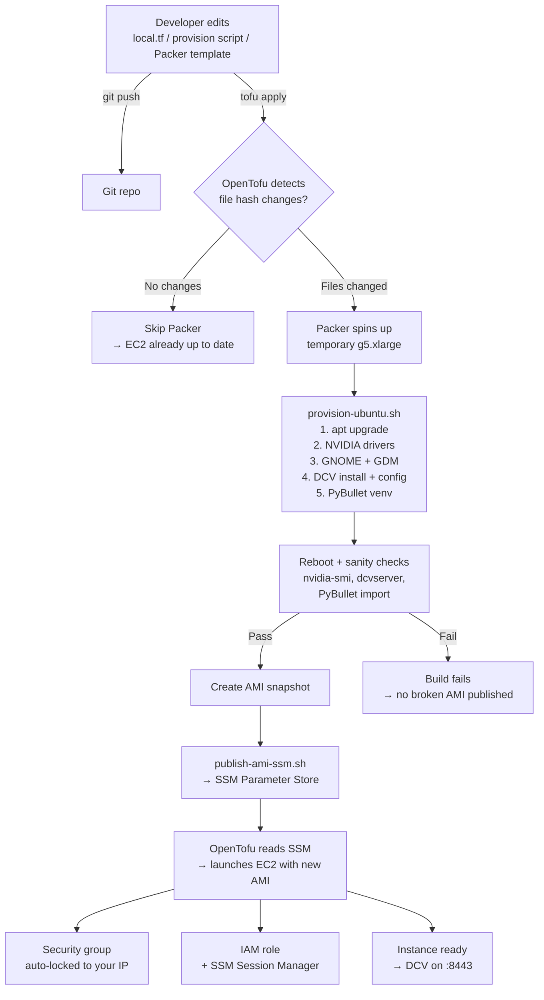
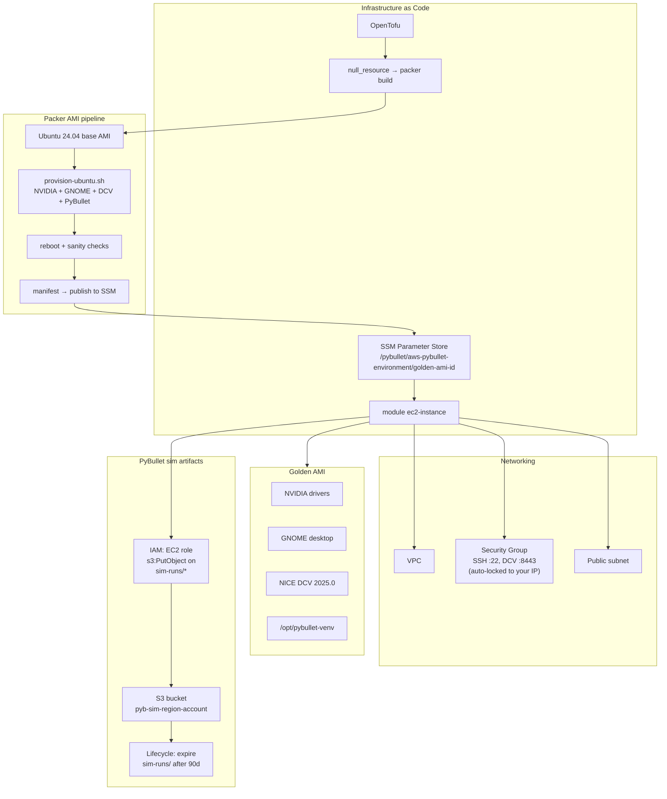
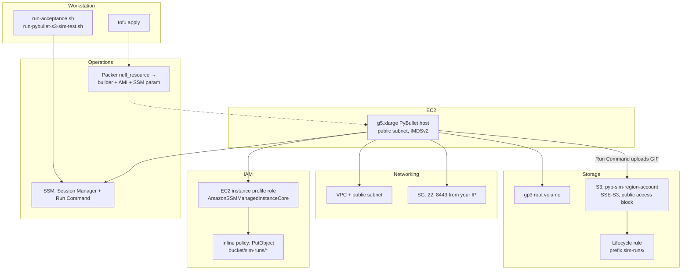

# Roadmap

This file tracks what's been done and what's coming next. Each phase builds on the previous one.

**Status labels:** DONE | PARTIAL | NOT STARTED

## At a glance

| Phase | Focus | Status |
|-------|--------|--------|
| **0–1** | AL2023 baseline → Ubuntu 24.04 golden AMI | Done |
| **2** | VS Code on the desktop | Done |
| **3** | Acceptance testing (`run-acceptance.sh`, on-instance checks) | Done |
| **4** | PyBullet headless sim + S3 artifacts (GIF upload, least-privilege IAM) | Done |
| **5** | Production hardening (IAM roles, lifecycle, CI/CD, KMS) | PENDING |


---

## Phase 0 — AL2023 Baseline (DONE)

The current working stack. Everything here is deployed and verified.

| # | What | Status |
|---|------|--------|
| 0.1 | Packer golden AMI: AL2023 + NVIDIA + GNOME + DCV 2025.0 + PyBullet venv | DONE |
| 0.2 | OpenTofu → Packer → SSM Parameter Store → EC2 pipeline | DONE |
| 0.3 | EC2 module: SG (SSH + DCV), IAM (SSM), IMDSv2, gp3, public IP | DONE |
| 0.4 | DCV pinned tarball + SHA256 verification | DONE |
| 0.5 | Golden AMI id published to SSM; OpenTofu reads it automatically | DONE |
| 0.6 | `packer_ami_id_override` to skip Packer during dev | DONE |
| 0.7 | `.gitattributes` LF enforcement for .tf, .pkr.hcl, .sh | DONE |
| 0.8 | `.gitignore` for `packer-manifest.json` | DONE |
| 0.9 | Fix: Packer `execute_command` — provision script now runs with sudo | DONE |
| 0.10 | Fix: IMDSv2 token-based metadata retrieval (was IMDSv1, silently skipped NVIDIA) | DONE |
| 0.11 | Fix: DCV auto-session hardening — creates config section if missing | DONE |
| 0.12 | Fix: kernel-devel/headers unpinned to avoid version mismatch on build | DONE |
| 0.13 | Fix: SSM parameter path changed from `/aws` (reserved) to `/pybullet` prefix | DONE |
| 0.14 | Packer `snapshot_tags`, `run_tags` for cost tracking; `ssh_timeout` for robustness | DONE |
| 0.15 | Post-reboot sanity checks: `nvidia-smi`, DCV, PyBullet import — blocks bad AMIs | DONE |
| 0.16 | Provision cleanup: DCV temp files removed, end-of-provision summary printed | DONE |
| 0.17 | EC2: root volume tagged, `delete_on_termination`, SG `create_before_destroy` | DONE |
| 0.18 | Removed legacy `user_data.sh`, reset AMI override, added output descriptions | DONE |
| 0.19 | Auto-detect public IP for SG ingress via `checkip.amazonaws.com` | DONE |
| 0.20 | Golden AMI output marked `sensitive` for SSM provider compatibility | DONE |
| 0.21 | Docs split: README (quick start) + SETUP.md + TROUBLESHOOTING.md + ROADMAP.md | DONE |
| 0.22 | Architecture flow diagrams README + ROADMAP | DONE |
| 0.23 | Full destroy + recreate verified end-to-end | DONE |

---

## Phase 1 — Ubuntu LTS Golden AMI (DONE)

Migrated from Amazon Linux 2023 to Ubuntu 24.04 LTS. Full pipeline verified end-to-end.

| # | Task | Status | Notes |
|---|------|--------|-------|
| 1.1 | Create `packer/pybullet-ubuntu.pkr.hcl` | DONE | Canonical 24.04 AMI filter, `ssh_username = "ubuntu"`, `/dev/sda1` root device |
| 1.2 | Create `packer/scripts/provision-ubuntu.sh` | DONE | `apt`-based: `ubuntu-desktop-minimal`, NVIDIA via `ubuntu-drivers`, DCV `.deb`, `/opt/pybullet-venv` |
| 1.3 | NVIDIA drivers on Ubuntu | DONE | `ubuntu-drivers install --gpgpu` + DKMS autoinstall against newest kernel |
| 1.4 | DCV for Ubuntu | DONE | Ubuntu 24.04 `.deb` packages (`nice-dcv-ubuntu2404-x86_64.tgz`), pinned SHA256, `dcv.conf` owner = `ubuntu` |
| 1.5 | Wire `infrastructure/packer.tf` to new template | DONE | Triggers point to `pybullet-ubuntu.pkr.hcl` and `provision-ubuntu.sh` |
| 1.6 | Update all `ec2-user` references to `ubuntu` | DONE | `dcv.conf`, `.bashrc`, README, TROUBLESHOOTING.md, SETUP.md |
| 1.7 | SSM agent on Ubuntu | DONE | Preinstalled on Canonical Ubuntu 24.04 AMIs; verified working |
| 1.8 | End-to-end Packer build + deploy | DONE | AMI `ami-0b3df7a8e60df839f`, ~31 min build, verified DCV + PyBullet + SSM |

### Issues fixed during migration

| Issue | Fix |
|-------|-----|
| Duplicate Packer variable error (both `.pkr.hcl` files in same dir) | `packer init` targets specific file instead of `.` |
| `ubuntu-desktop-minimal` install failed silently | Suppressed `needrestart` interactive prompts with `NEEDRESTART_MODE=a` and config |
| `libgl1-mesa-glx` removed in Ubuntu 24.04 | Replaced with `libgl1` |
| `nvidia-utils-570` conflicted with `ubuntu-drivers` (installed 595) | Removed hardcoded version — let `ubuntu-drivers` handle everything |
| NVIDIA DKMS modules not built for post-upgrade kernel | Install headers for newest kernel + `dkms autoinstall -k` against it |
| Dpkg config prompts during upgrade | Added `--force-confdef --force-confold` to all `apt-get` calls |
| Packer SSH timeout during long installs | Added `ssh_read_write_timeout = "30m"` to template |

---

## Phase 2 — VS Code (DONE)

> **Path A** chosen: desktop **Visual Studio Code** inside GNOME over DCV (no extra security group port).

| # | Task | Status | Notes |
|---|------|--------|-------|
| 2.1 | Choose install path | DONE | Path A: Microsoft `code` package via official apt repo |
| 2.2 | Install in Packer provisioner | DONE | `provision-ubuntu.sh`: keyring + `vscode.list` + `apt-get install code`; post-reboot `code --version` in Packer |
| 2.3 | SG for code-server (Path B only) | N/A | Path B not used; no TCP 8080 |

---

## Phase 3 — Quality and Testing (DONE)

> **Priority: MEDIUM**

| # | Task | Status | Notes |
|---|------|--------|-------|
| 3.1 | External smoke test after AMI build | DONE | `scripts/run-acceptance.sh` curls DCV URL (TLS, `-k`) from workstation; use `--skip-external` if SG blocks your IP |
| 3.2 | Slim golden image variant | DEFERRED | Optional cost/size win; needs a separate provision path or template (risk of breaking GNOME/DCV). Not required for Phase 3 exit |
| 3.3 | Acceptance test script | DONE | `scripts/acceptance/on-instance-checks.sh` + `scripts/run-acceptance.sh`: required checks above; GPU `nvidia-smi` warns unless `STRICT_ACCEPTANCE_GPU=1` |

---

## Phase 4 — PyBullet headless sim & S3 artifacts (DONE)

> **Priority: MEDIUM** — Deeper integration test: record a stock PyBullet scene and upload to S3 from the instance role.

| # | Task | Status | Notes |
|---|------|--------|-------|
| 4.1 | S3 bucket + EC2 `PutObject` IAM | DONE | `infrastructure/s3_pybullet_sim.tf`; prefix `sim-runs/*`; lifecycle 90d |
| 4.2 | Run Command runner + on-instance Python | DONE | `scripts/run-pybullet-s3-sim-test.sh`, `scripts/pybullet_deep_test/run_sim_and_upload.py` |
| 4.3 | Golden AMI includes `boto3` in venv | PARTIAL | `provision-ubuntu.sh` has `boto3`; current launch may use older SSM AMI — **`run_sim_and_upload.py`** can `pip install` if missing |
| 4.4 | End-to-end: GIF object visible in S3 | DONE | `./scripts/run-pybullet-s3-sim-test.sh` → `sim-runs/<instance-id>/…/r2d2_plane_sim.gif` |
| 4.5 | Sim motion: drive vs body joints, base force/torque, camera follows base | DONE | `run_sim_and_upload.py` — clearer translation/yaw in GIF when wheel naming is vague |
| 4.6 | Local recordings layout + download script | DONE | Default path `recordings/`; `.gitignore` ignores `*.gif` except `r2d2_plane_sim.gif` for README |
| 4.7 | README gallery + docs sync | DONE | Sample GIF linked at top of README; scripts list/download documented |
| 4.8 | Deterministic sim bucket name | DONE | `pyb-sim-<region>-<account-id>`; migration + empty-old-bucket note in TROUBLESHOOTING |
| 4.9 | Stop-host helper script | DONE | `scripts/stop-pybullet-host.sh` |
| 4.10 | Interactive Kuka arm script | DONE | `scripts/interactive_robot_arm.py` — GUI sliders for 7-DOF joints, live FPS, `--record` to GIF, `--s3-bucket` upload |

**Done (summary):** S3 + IAM, SSM runner, headless PyBullet + boto3, invalid `pybullet_data` pip removed; sim tuning so the droid’s base motion reads on camera; workstation helpers list and fetch objects into `recordings/`. Interactive GUI script for the Kuka arm with per-joint sliders, optional GIF recording, and S3 upload.

### Sim / S3 implementation detail

- **Bucket name:** deterministic **`pyb-sim-<region>-<account-id>`** (`local.pybullet_sim_bucket_name` in `infrastructure/local.tf`). IAM allows the instance role **`s3:PutObject`** only under **`sim-runs/*`**. Encryption, public access block, and a 90-day lifecycle on `sim-runs/` live in **`infrastructure/s3_pybullet_sim.tf`**.
- **Workstation → instance:** **`scripts/run-pybullet-s3-sim-test.sh`** sends **`scripts/pybullet_deep_test/run_sim_and_upload.py`** via SSM Run Command (payload is base64-safe).
- **On-instance script:** headless **`DIRECT`**, stock plane + R2-D2 URDF, TinyRenderer GIF, **`boto3`** upload. Joint targets favour drive joints (legs, wheels, unnamed revolutes); head joints stay quieter. **`applyExternalForce`** / **`applyExternalTorque`** on the base plus a camera tracking the base keep translation and yaw readable when URDF naming is vague.
- **Venv:** Packer installs **`boto3`** in **`/opt/pybullet-venv`**; URDF assets come from the **`pybullet`** package (**not** a separate `pybullet_data` pip).
- **Local pulls:** **`scripts/download-pybullet-sim-recording.sh`** defaults to **`recordings/<filename>`**; **`.gitignore`** ignores stray **`*.gif`** but keeps **`recordings/r2d2_plane_sim.gif`** for the README gallery.

### Optional knobs (advanced)

- **`packer_ami_id_override`** in **`infrastructure/local.tf`:** set an **`ami-…`** to skip Packer and boot from a known image. Default **`null`** means the next full apply path can rebuild via Packer (~30–60+ minutes).
- **`nvidia-smi`:** acceptance warns unless **`STRICT_ACCEPTANCE_GPU=1`** — see **TROUBLESHOOTING.md** if GPU checks fail after launch.
- **Precheck:** **`scripts/lib/ec2-host-precheck.sh`** starts a **stopped** host, rejects **terminated** ids and **`…-packer-builder`**, and uses the live API instead of trusting stale **`tofu output`** alone.
- **S3-only apply:** skip Packer when you only need bucket/IAM updates — from **`infrastructure/`**:

```bash
tofu apply -auto-approve \
  -target=aws_s3_bucket.pybullet_sim \
  -target=aws_s3_bucket_public_access_block.pybullet_sim \
  -target=aws_s3_bucket_server_side_encryption_configuration.pybullet_sim \
  -target=aws_s3_bucket_lifecycle_configuration.pybullet_sim \
  -target=aws_iam_role_policy.pybullet_host_s3_sim_upload
```

**Operational note:** `packer_ami_id_override` defaults to **`null`** so `tofu apply` can run Packer and read the AMI from SSM. Pin an `ami-…` only for a quick boot from a known image; see **TROUBLESHOOTING.md** if `-target=null_resource.packer_pybullet_ami[0]` fails while an override is set. Interrupted applies, bucket replace (`BucketNotEmpty`), and state drift are covered there too.

---

## Phase 5 — Production Hardening

> **Priority: LOW** — For shared/team use, not blocking individual dev. *(Formerly “Phase 4” in earlier docs.)*

| # | Task | Status | Notes |
|---|------|--------|-------|
| 5.1 | Dedicated Packer IAM role | NOT STARTED | Least-privilege for EC2 build + SSM PutParameter |
| 5.2 | AMI / snapshot lifecycle | NOT STARTED | Auto-deregister old AMIs, cost alerts |
| 5.3 | CI/CD for Packer builds | NOT STARTED | GitHub Actions or CodeBuild |
| 5.4 | SSM parameter hardening | NOT STARTED | `SecureString` with KMS |
| 5.5 | Builder vs runtime instance type alignment | DONE | Match Packer `builder_instance_type` to `ec2_instance_type` (same GPU family) — see **Implementation notes** below |
| 5.6 | Root device mapping validation | DONE | Ubuntu `/dev/sda1` in Packer vs AL2023 `/dev/xvda`; EC2 module uses AMI root device — see below |
| 5.7 | Optional container runtime | NOT STARTED | Docker/ECR only if needed |

### Implementation notes (5.5–5.6)

| Topic | Detail |
|--------|--------|
| **Builder vs runtime GPU** | Keep Packer `builder_instance_type` in `packer/pybullet-ubuntu.pkr.hcl` (default `g5.xlarge`) aligned with `ec2_instance_type` in `infrastructure/local.tf` (same **family**, e.g. g5). Mismatch can mean extra DKMS churn or odd driver behaviour. |
| **Root volume device name** | Ubuntu golden AMI mapping uses **`/dev/sda1`** in Packer. The EC2 module’s `root_block_device` omits `device_name` so the AMI’s root device is used at launch. |

### When Packer re-runs

OpenTofu triggers a new AMI build when these change (or when the SSM parameter name changes):

- `packer/pybullet-ubuntu.pkr.hcl`
- `packer/scripts/provision-ubuntu.sh`
- `packer/scripts/publish-ami-ssm.sh`

---

## Appendix — Detailed architecture (reference)

Skim **[README.md](README.md)** for the short diagrams. Below are the longer Mermaid views that lived in README before the split.

### OpenTofu + Packer + EC2 lifecycle



### IaC ↔ Packer ↔ network ↔ S3



### AWS resources (service-level view)



---

## Development Guide

### Where to start

1. **Deploy** — `cd infrastructure && tofu apply -auto-approve`
2. **Acceptance** — from repo root: `./scripts/run-acceptance.sh` (SSM + optional DCV TLS curl from your laptop)
3. **Headless sim + S3 GIF** — `./scripts/run-pybullet-s3-sim-test.sh` after bucket/IAM exist and instance is up
4. **Manual** — DCV login, `nvidia-smi`, PyBullet, VS Code from GNOME

### Key files

- `infrastructure/local.tf` — all configurable settings
- `infrastructure/packer.tf` — how Packer integrates with OpenTofu
- `packer/pybullet-ubuntu.pkr.hcl` — Ubuntu 24.04 AMI builder (active)
- `packer/scripts/provision-ubuntu.sh` — Ubuntu provisioner (active)
- `packer/pybullet-al2023.pkr.hcl` — AL2023 AMI builder (legacy reference)
- `packer/scripts/provision-al2023.sh` — AL2023 provisioner (legacy reference)
- `packer/scripts/publish-ami-ssm.sh` — SSM publish script (shared by both templates)
- `scripts/run-acceptance.sh` — workstation acceptance (SSM + optional DCV smoke)
- `scripts/stop-pybullet-host.sh` — stop EC2 host from tofu outputs (`--wait` optional)
- `scripts/run-pybullet-s3-sim-test.sh` — SSM Run Command → GIF upload
- `scripts/pybullet_deep_test/run_sim_and_upload.py` — on-instance headless PyBullet + boto3
- `infrastructure/s3_pybullet_sim.tf` — sim artifacts bucket + EC2 PutObject policy
- `scripts/interactive_robot_arm.py` — GUI Kuka arm sim with joint sliders and optional GIF recording + S3 upload
- `scripts/acceptance/on-instance-checks.sh` — on-instance checks (invoked by runner)
- `infrastructure/modules/ec2-instance/sg.tf` — security group rules

### Open design decisions

1. **Desktop environment** — `ubuntu-desktop-minimal` (current) vs individual GNOME packages (`gdm3`, `gnome-session`, `gnome-terminal`) for faster/lighter builds
2. **VS Code path** — Path A chosen (Microsoft apt `code`). Path B (`code-server` on :8080) still available if needed later.
3. **Keep AL2023 files?** — Keep as reference or remove to reduce clutter

### Acceptance criteria

The stack is complete when all of these are true:

| # | Criterion |
|---|-----------|
| T1 | Ubuntu LTS on the golden AMI and running EC2 instance |
| T2 | GPU available (`nvidia-smi` works) |
| T3 | NICE DCV reachable at `https://<public-ip>:8443` |
| T4 | PyBullet importable in `/opt/pybullet-venv` |
| T5 | VS Code usable from the remote environment (Path A: `code` package baked in AMI) |
| T6 | OpenTofu provisions from SSM-stored AMI id |
| T7 | SSM Session Manager works |
| T8 | Security group allows SSH :22 and DCV :8443 |
| T9 | (Phase 4) SSM Run Command completes and a `.gif` appears under `sim-runs/` in `pybullet_sim_artifacts_bucket` |
